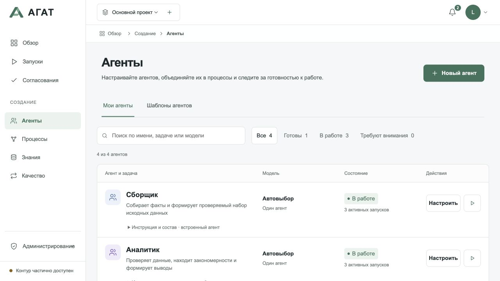

# Agat

[](https://github.com/Solutions-of-Security/Agat/actions/workflows/ci.yml)
[](../LICENSE)

**Run AI agents and visual workflows on your own infrastructure, with local models, human approvals and execution history.**

[Русский](./README.md) · [Documentation](./index.md) · [Releases](https://github.com/Solutions-of-Security/Agat/releases) · [Contributing](./CONTRIBUTING.md)



Agat connects local model servers, distributed workers and a web interface. Use it
to summarize documents, query a local knowledge base, or build a workflow requiring
human approval. Inference runs through Ollama, LM Studio, vLLM or llama.cpp.
Web search and external tools require separate configuration.

**1.7.0 is a public preview**, published as a GitHub prerelease. SQLite and one
coordinator are the local defaults. PostgreSQL, Temporal, OIDC, MCP/A2A and native
mobile workers need separate configuration and validation. The version number
does not establish production readiness. [Release notes](./releases/1.7.0.md)
and the [roadmap](./roadmap.md) are currently in Russian.

## Quick start

Install Git, **Node.js 24**, **Python 3.10+** and [Ollama](https://ollama.com/download).
Keep Ollama running. Memory requirements depend on the model and context size.

```bash
git clone --branch v1.7.0 https://github.com/Solutions-of-Security/Agat.git
cd Agat
npm ci
npm run build
npm start
```

From the same directory in another terminal:

```bash
ollama pull llama3.2:latest
python3 workers/agat_worker.py \
  --enrollment-token agat-local-enrollment \
  --models llama3.2:latest \
  --no-web
```

Open **http://127.0.0.1:8787**. The UI currently uses Russian labels:

1. Open **Создание → Агенты → Новый агент** (Create → Agents → New agent).
2. Enter `First assistant` as the name, `Summarize a note` as the role, and
   `Summarize the input in three bullet points. Preserve all numbers. Do not invent facts.` as the instruction.
3. Select `llama3.2:latest` and leave the single-agent runtime selected. Click **Создать агента**.
4. Click the agent's play button. Name the run and enter:
   `The team received 12 requests. Nine are complete. Three need approval by Friday.`
5. Continue through **Далее: цепочка** and **Далее: проверка**, then click **Запустить**.
6. The default approval gate shows **Требует решения**. Review the input and click
   **Разрешить продолжение** (Allow continuation).
7. Open the completed result. Check that it preserves 12 received, nine completed and three awaiting approval.

The local profile listens on loopback and uses a development enrollment token.
Configure separate secrets and HTTPS before exposing it to a network.
See [Docker Compose](./local-docker.md) and [other model servers](./getting-started.md).

## Development and support

Run `npm run dev:api` and `npm run dev:web` in separate terminals. Before a PR:
`npm run typecheck`, `npm test`, `npm run build` and `npm run docs:check`.
See the [contribution guide](./CONTRIBUTING.md) for browser and integration tests.

Report bugs through [Issues](https://github.com/Solutions-of-Security/Agat/issues).
Report vulnerabilities privately using [GitHub's form](https://github.com/Solutions-of-Security/Agat/security/advisories/new).
Licensed under [Apache-2.0](../LICENSE); see [NOTICE](../NOTICE).
