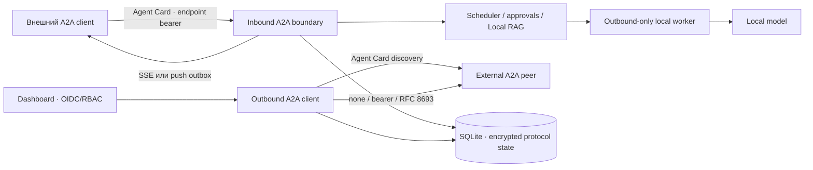

# A2A interoperability

АГАТ 1.4 расширяет project-scoped A2A boundary из релиза 0.9: coordinator остаётся A2A server для опубликованных локальных агентов и становится управляемым A2A client для внешних peers. Внутренняя очередь, approvals, Local RAG, worker leases и durable orchestration не переносятся во внешний протокол.

Реализация следует **A2A 1.0**, binding **HTTP+JSON**, и публикует adapter version **1.1.0**. Основные источники: [официальная спецификация A2A](https://a2a-protocol.org/latest/specification/), [normative protobuf](https://github.com/a2aproject/A2A/blob/main/specification/a2a.proto) и [релизы A2A](https://github.com/a2aproject/A2A/releases).

## Контур



Обе стороны используют существующий project scope и audit trace. Внешний peer никогда не получает worker token, MCP credential, system prompt, memory или прямой доступ к model endpoint.

## Версия и wire contract

- protocol version: `1.0`;
- media type: `application/a2a+json`;
- streaming media type: `text/event-stream`;
- version передаётся заголовком `A2A-Version: 1.0` либо query-параметром `A2A-Version=1.0`;
- отсутствующая версия трактуется как legacy `0.3` и отклоняется без silent downgrade;
- ошибки имеют `google.rpc.Status`-подобную форму с `google.rpc.ErrorInfo`, `reason` и bounded metadata.

## Inbound endpoints

Публичный Agent Card доступен без bearer:

```http
GET /a2a/v1/endpoints/:endpointId/agent-card.json
```

Card содержит только публичные metadata, HTTP+JSON 1.0 interface, security scheme, skill, разрешённые media types и реально включённые capabilities. System prompt, model pin, memory, MCP catalog, credentials и internal artifacts не публикуются.

Все task operations требуют отдельный endpoint bearer:

| Метод и путь | Назначение |
|---|---|
| `POST /message:send` | Создать task; вернуть сразу или дождаться terminal/interrupted state |
| `POST /message:stream` | Создать task и вернуть ordered SSE `StreamResponse` events |
| `GET /tasks/:taskId` | Получить task, history и artifacts |
| `GET /tasks` | Фильтры, cursor pagination, history и опциональные artifacts |
| `POST /tasks/:taskId:cancel` | Отменить queued/running/approval task |
| `POST /tasks/:taskId:subscribe` | Подписаться на нетерминальную task через SSE |
| `POST /tasks/:taskId/pushNotificationConfigs` | Создать push callback |
| `GET /tasks/:taskId/pushNotificationConfigs` | Перечислить callbacks |
| `GET /tasks/:taskId/pushNotificationConfigs/:configId` | Получить callback без полного auth secret |
| `DELETE /tasks/:taskId/pushNotificationConfigs/:configId` | Идемпотентно удалить callback |

`extendedAgentCard` и продолжение существующей task через `message.taskId` не реализованы и возвращают явную protocol error.

Каждый endpoint фиксирует одного project agent, skill ID, knowledge collections, input/output media types, priority, approval policy, active-task limit и отдельные switches для SSE, push и files. Изменить привязанный агент нельзя: для новой границы создаётся новый endpoint.

## Lifecycle и idempotency

Inbound task создаёт обычный одноагентный run:

| Внутренний run | A2A state |
|---|---|
| `queued` | `TASK_STATE_SUBMITTED` |
| `running` | `TASK_STATE_WORKING` |
| `waiting_approval` | `TASK_STATE_AUTH_REQUIRED` |
| `completed` | `TASK_STATE_COMPLETED` |
| `failed` | `TASK_STATE_FAILED` |
| `cancelled` | `TASK_STATE_CANCELED` |

`messageId` является idempotency key внутри endpoint. Повтор с тем же нормализованным запросом возвращает исходную task; другой payload с тем же ID получает `MESSAGE_ID_CONFLICT`. `contextId` группирует независимые tasks, но не открывает mutable conversation state.

Корректный W3C `traceparent` становится remote parent run span. Task metadata возвращает protocol/adapter versions, trace ID и root traceparent. Произвольный или некорректный trace header отклоняется.

## Streaming

`message:stream` и `tasks/:id:subscribe` сначала отправляют полный текущий `Task`, затем изменения состояния. При completion artifacts отправляются как `artifactUpdate`, после них — terminal `statusUpdate`; SSE закрывается на terminal/interrupted state. Сервер посылает heartbeat comment каждые 15 секунд и не связывает lifecycle task с жизнью одного HTTP stream.

Capabilities включаются отдельно на каждом endpoint. При выключенном `streamingEnabled` обе операции fail closed с `UNSUPPORTED_OPERATION`.

## Push notifications

Push включается отдельно на endpoint и поддерживает embedded `taskPushNotificationConfig` в `message:send`/`message:stream`, а также CRUD после создания task.

- callback URL проходит тот же SSRF-safe transport validator, что outbound peers;
- HTTPS обязателен; loopback HTTP разрешается только отдельной локальной policy;
- auth credentials поддерживают `Bearer`, шифруются AES-256-GCM и не возвращаются целиком;
- durable outbox сохраняет ordered status transitions;
- callback получает normative `StreamResponse` с `statusUpdate` и `A2A-Version: 1.0`;
- не-2xx, timeout и transport errors повторяются с exponential backoff, максимум пять попыток;
- callback и ожидающие deliveries удаляются каскадно и перестают отправляться после отключения endpoint/push capability;
- `AGAT_A2A_ENABLED=false` централизованно останавливает inbound routes и push pump.

SQLite восстанавливает записи `delivering` как `pending` после рестарта, поэтому webhook receiver обязан обрабатывать возможные дубликаты идемпотентно.

## File artifacts

Files всегда opt-in и ограничены policy endpoint:

- inbound принимает только `Part.raw` в canonical base64 с обязательными безопасными `filename` и `mediaType`;
- `inputModes` должен явно разрешать MIME type;
- лимиты: `1..8` файлов, `1 KiB..2 MB` на файл и общий HTTP body limit;
- bytes сохраняются в project Artifact Store как `a2a_input`; в run input попадает только имя, MIME, размер и SHA-256;
- `Part.url` inbound не скачивается и отклоняется, чтобы не создавать SSRF/file-fetch boundary;
- completed task публикует только agent artifacts, MIME которых объявлен в `outputModes` и укладывается в endpoint limits;
- binary output сериализуется как `raw` base64, текстовый file output — как `text` part.

Outbound validator принимает только заявленные peer output modes. Inline raw ограничен 2 MB; HTTPS URL artifact может быть отражён в protocol response, но coordinator его не разыменовывает и не скачивает.

## Outbound peers

Dashboard регистрирует peer по Agent Card URL. Discovery:

1. скачивает bounded JSON без redirects;
2. выбирает только `HTTP+JSON` с exact protocol version `1.0`;
3. проверяет interface URL тем же SSRF policy, валидирует идентификаторы и MIME types Card, затем фиксирует SHA-256, optional tenant, skill, modes и capabilities;
4. сохраняет credentials зашифрованно и возвращает только auth mode/suffix;
5. не делает автоматический downgrade и не исполняет данные из Card как code.

Outbound client реализует `message:send`, polling `GET /tasks/:id` и `POST /tasks/:id:cancel`. Если выбранный `AgentInterface` объявляет `tenant`, HTTP+JSON client использует нормативный `/{tenant}/...` binding и принудительно наследует это значение в request body для POST — dashboard payload не может его подменить. Response проверяется на `Task | Message` oneof, известный task state, обязательные message/artifact IDs, bounded parts/artifacts и заявленные MIME types. В SQLite сохраняются encrypted request/response для последующего polling, а dashboard snapshot и audit содержат только redacted task mirror, hashes/correlation и actor.

### Transport boundary

- production URL требует HTTPS;
- redirects запрещены;
- hostname разрешается перед запросом, все DNS answers проверяются, выбранный адрес pin-ится на TCP connection;
- loopback, RFC1918, link-local, carrier-grade NAT, benchmark, documentation, multicast, reserved, unique-local и IPv4-mapped IPv6 ranges блокируются;
- loopback HTTP доступен только при `AGAT_A2A_ALLOW_LOOPBACK_OUTBOUND=true` для локальных тестов;
- timeout и total response bytes ограничены server policy и более строгим peer limit;
- interface, token endpoint и callback проверяются независимо.

## Delegated authorization

Peer выбирает один transport auth mode:

| Mode | Поведение |
|---|---|
| `none` | Запрос без `Authorization` |
| `bearer` | Статический encrypted peer token |
| `oauth2_token_exchange` | RFC 8693 exchange текущего OIDC user access token на peer token |

Для token exchange coordinator отправляет `subject_token`, стандартные token type URNs, optional `audience`/`scope` и client authentication через Basic. Полученный bearer существует только в памяти одного вызова и не записывается в SQLite, audit, task mirror или logs. Client ID/secret и token endpoint сохраняются в encrypted peer credential. Создать или заменить delegated OAuth trust может только `admin`: token endpoint получает исходный dashboard bearer как `subject_token`, поэтому его origin является отдельной доверенной границей. Одобренный origin возвращается в redacted peer snapshot как `tokenEndpointOrigin` и записывается в audit вместе с audience/scopes, но без client secret или токенов.

Это deployment policy АГАТ поверх transport-level A2A authentication: сам A2A не предписывает RFC 8693. Legacy local-admin session не имеет реального user subject token и поэтому delegated invoke получает `403`.

## Dashboard API и RBAC

```http
GET    /api/v1/a2a
POST   /api/v1/a2a/endpoints
PATCH  /api/v1/a2a/endpoints/:endpointId
DELETE /api/v1/a2a/endpoints/:endpointId
POST   /api/v1/a2a/endpoints/:endpointId/token/rotate

POST   /api/v1/a2a/remotes
PATCH  /api/v1/a2a/remotes/:remoteId
DELETE /api/v1/a2a/remotes/:remoteId
POST   /api/v1/a2a/remotes/:remoteId/message:send
GET    /api/v1/a2a/remotes/:remoteId/outbound-tasks/:outboundTaskId
POST   /api/v1/a2a/remotes/:remoteId/outbound-tasks/:outboundTaskId:cancel
```

- чтение: `admin/designer/operator/viewer/auditor`;
- endpoint configuration, token rotation и peer `none`/static bearer: `admin/designer`;
- создание или замена peer auth `oauth2_token_exchange`: только `admin`; designer может выключить peer или изменить его несекретные параметры без замены auth;
- outbound invoke: `admin/designer/operator`;
- outbound polling: все read roles;
- outbound cancel: `admin/designer/operator`;
- все выборки и mutations project-scoped.

Endpoint bearer используется только на `/a2a/v1`; он не заменяет OIDC/dashboard token и не даёт доступ к `/api/v1`.

## Конфигурация

```dotenv
AGAT_A2A_ENABLED=true
AGAT_A2A_PUBLIC_BASE_URL=https://agat.internal.example
AGAT_A2A_OUTBOUND_ENABLED=true
AGAT_A2A_ALLOW_LOOPBACK_OUTBOUND=false
AGAT_A2A_OUTBOUND_TIMEOUT_SECONDS=15
AGAT_A2A_MAX_RESPONSE_BYTES=1048576
```

`AGAT_A2A_OUTBOUND_ENABLED=false` — централизованный outbound kill switch: блокирует discovery, send, poll и cancel, не выключая опубликованные inbound endpoints. `AGAT_A2A_ENABLED=false` выключает публичный inbound adapter и push delivery. Existing registry/secrets остаются в encrypted storage и становятся доступны после осознанного повторного включения.

`AGAT_A2A_PUBLIC_BASE_URL` используется только в Agent Card/UI и должен быть абсолютным URL без credentials, query и fragment. Для сетевого hostname разрешён только HTTPS.

## Короткие примеры

Streaming request:

```bash
curl -N -fsS \
  -X POST \
  -H 'Authorization: Bearer ENDPOINT_TOKEN' \
  -H 'A2A-Version: 1.0' \
  -H 'Content-Type: application/a2a+json' \
  --data '{
    "message": {
      "messageId": "case-42-v1",
      "role": "ROLE_USER",
      "parts": [{"text": "Проверь факты", "mediaType": "text/plain"}]
    },
    "configuration": {"acceptedOutputModes": ["text/plain"]}
  }' \
  'https://agat.internal.example/a2a/v1/endpoints/ENDPOINT_ID/message:stream'
```

Inline file part:

```json
{
  "raw": "JVBERi0xLjQK...",
  "filename": "source.pdf",
  "mediaType": "application/pdf"
}
```

Push config:

```json
{
  "id": "case-42-callback",
  "taskId": "TASK_ID",
  "url": "https://client.example/a2a/events",
  "authentication": {
    "scheme": "Bearer",
    "credentials": "single-purpose-callback-secret"
  }
}
```

## Проверка

```bash
npm run typecheck
node --import tsx --test apps/coordinator/test/a2a.test.ts apps/coordinator/test/a2a-interoperability.test.ts
npm run build
```

Тесты покрывают Agent Card redaction, endpoint token/project isolation, task idempotency, scheduler/approval/cancel, query/header versioning, полный SSE lifecycle, capability deny для push, encrypted push outbox и реальную callback delivery, bounded file input/output, encrypted outbound credentials, SSRF включая IPv4-mapped IPv6, tenant binding, discovery/invoke, RFC 8693 exchange, malformed peer responses и redacted task mirrors.

## Осознанные границы 1.4

- outbound client использует send + poll/cancel; consumption внешнего SSE и регистрация outbound push callback пока не реализованы;
- inbound multi-turn через `message.taskId` не реализован;
- поддерживается HTTP+JSON 1.0, но не JSON-RPC/gRPC bindings;
- push authentication на inbound callback ограничена Bearer;
- HTTPS URL artifacts от peer валидируются, но не скачиваются;
- Agent Card signature не проверяется: доверие задаётся оператором и TLS identity;
- SQLite сохраняет модель одного активного coordinator; HA требует общего PostgreSQL state store и distributed outbox/limits.
