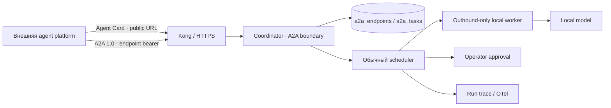

# A2A adapter

АГАТ 0.9 публикует выбранного локального агента как project-scoped A2A endpoint. Adapter является внешней границей над существующими scheduler, workers, approvals, Local RAG и trace: он не заменяет внутреннюю очередь и не переносит durable orchestration из Temporal.

Реализация следует протоколу **A2A 1.0** и binding **HTTP+JSON**. Заголовок интерфейса — `A2A-Version: 1.0`; media type — `application/a2a+json`. Актуальные первичные источники: [официальная спецификация A2A](https://a2a-protocol.org/latest/specification/), [normative protobuf](https://github.com/a2aproject/A2A/blob/main/specification/a2a.proto) и [релизы A2A](https://github.com/a2aproject/A2A/releases).

## Архитектурная граница



Один endpoint связывает:

- один агент проекта;
- один A2A skill ID;
- разрешённые input modes `text/plain` и/или `application/json`;
- набор knowledge collection snapshots;
- priority, approval policy, максимальный размер входа и лимит активных tasks;
- отдельный bearer token, который не является dashboard, OIDC, enrollment или worker token.

Для одного агента допускается один endpoint в проекте. Один и тот же built-in агент можно публиковать независимо в разных проектах.

## Discovery и интерфейс

Прямой Agent Card доступен без bearer token:

```http
GET /a2a/v1/endpoints/:endpointId/agent-card.json
```

Card содержит только публичное имя/описание, interface URL, версию, capabilities, security scheme, input/output modes и skill. System prompt, model pin, memory, MCP catalog, credentials, internal agent ID и raw artifacts туда не входят.

Аутентифицированный interface имеет базовый URL:

```text
https://agat.example/a2a/v1/endpoints/:endpointId
```

Реализованы операции:

| Метод и путь | Назначение |
|---|---|
| `POST /message:send` | Создать новую task; follow-up существующей task пока не поддержан |
| `GET /tasks/:taskId` | Получить task с входной history и финальным artifact |
| `GET /tasks` | Фильтры, cursor pagination и опциональные history/artifacts |
| `POST /tasks/:taskId:cancel` | Отменить queued/running/approval task |

`message:send` возвращает normative `SendMessageResponse` (`{"task": ...}`), а Get/Cancel — сам `Task` без дополнительной обёртки. `message:stream`, task subscription, push notification configs и extended Agent Card возвращают явную protocol error. Card объявляет эти capabilities как `false`.

## Task lifecycle

Каждая принятая A2A task создаёт обычный run ровно с одним выбранным агентом. Поэтому она использует тот же capability-aware scheduling, Local RAG, approval, retry, trace и worker isolation, что запуск из панели.

| Внутренний run | Внешний A2A state |
|---|---|
| `queued` | `TASK_STATE_SUBMITTED` |
| `running` | `TASK_STATE_WORKING` |
| `waiting_approval` | `TASK_STATE_AUTH_REQUIRED` |
| `completed` | `TASK_STATE_COMPLETED` |
| `failed` | `TASK_STATE_FAILED` |
| `cancelled` | `TASK_STATE_CANCELED` |

`returnImmediately: true` немедленно возвращает принятую task. При `false` coordinator держит HTTP response до terminal/interrupted state; reverse proxy должен иметь достаточный read timeout. Рекомендуемый интеграционный режим — `true` с polling.

Финальный ответ публикуется как один `text/plain` artifact. Внешний клиент не получает stage outputs, model/tool arguments, memory, локальные файлы или agent artifacts.

`message.messageId` является idempotency key внутри endpoint. Повтор с тем же нормализованным содержимым возвращает исходную task; повтор с другим содержимым получает `MESSAGE_ID_CONFLICT`. `contextId` группирует независимые tasks, но не открывает mutable conversation state.

## Trace correlation

Корректный входной W3C `traceparent` становится remote parent внутреннего run span. Даже при выключенном OTLP exporter внутренний run сохраняет тот же trace ID. Task metadata возвращает:

- protocol и adapter versions;
- внутренний trace ID;
- traceparent корневого run span.

Некорректный `traceparent` отклоняется как `INVALID_PARAMETER`; adapter не сохраняет и не отражает произвольное значение заголовка.

## Security policy

- Agent Card имеет unguessable UUID path, но считается публичным discovery-документом и не должен содержать секреты.
- Все task operations требуют `Authorization: Bearer <endpoint-token>` до поиска task в базе.
- Token показывается целиком только при создании/rotation; в SQLite хранится SHA-256 hash и последние шесть символов для оператора.
- Входное message хранится AES-256-GCM с `AGAT_CREDENTIALS_KEY`; обычный run input остаётся частью project-scoped execution trace и имеет соответствующую классификацию данных.
- `raw` и `url` parts запрещены. Adapter не скачивает переданный клиентом файл и не открывает произвольный URL.
- `application/json` принимается только как inline `data` part и сериализуется в ограниченный run input.
- Endpoint ограничивает размер input и число одновременно активных tasks; Kong дополнительно применяет body/rate limits.
- Knowledge выбирается оператором при публикации endpoint. Внешний клиент не может подменить collection IDs.
- Cancel аннулирует run и отзывает lease; уже начатый внешний MCP side effect не маркируется ложно отменённым: его поздний result остаётся в audit, но не возобновляет отменённую task.
- Удаление endpoint запрещено при активных tasks. Оно удаляет A2A registry/task mapping, но не удаляет уже созданные внутренние runs и audit events.
- Для публичного hostname `AGAT_A2A_PUBLIC_BASE_URL` обязан использовать HTTPS. HTTP разрешён только для loopback discovery URL.

Token следует передавать клиенту через secret manager или другой защищённый канал. Не помещайте его в URL, query, Agent Card, logs или frontend configuration.

## Управление в панели и dashboard API

Раздел **A2A** показывает endpoints, их Agent Card URL, token suffix/rotation time, policies и последние 100 tasks с переходом к внутреннему run.

Чтение разрешено ролям `admin/designer/operator/viewer/auditor`; создание, изменение, rotation и удаление — `admin/designer`:

```http
GET    /api/v1/a2a
POST   /api/v1/a2a/endpoints
PATCH  /api/v1/a2a/endpoints/:endpointId
DELETE /api/v1/a2a/endpoints/:endpointId
POST   /api/v1/a2a/endpoints/:endpointId/token/rotate
```

Dashboard API использует обычные OIDC/project headers. Никогда не используйте endpoint bearer token для `/api/v1`.

## Конфигурация

```dotenv
AGAT_A2A_ENABLED=true
AGAT_A2A_PUBLIC_BASE_URL=https://agat.internal.example
```

`AGAT_A2A_PUBLIC_BASE_URL` должен быть абсолютным HTTP(S) URL без credentials, query и fragment. Он используется в Agent Card и UI; это не bind address. Локальное значение по умолчанию — `http://127.0.0.1:<AGAT_PORT>`.

После изменения public URL перезапустите coordinator и обновите сохранённый Agent Card в клиенте. Endpoint ID и token при этом не меняются.

## Пример клиента

Получить Agent Card:

```bash
curl -fsS \
  'https://agat.internal.example/a2a/v1/endpoints/ENDPOINT_ID/agent-card.json'
```

Создать task с немедленным ответом:

```bash
curl -fsS \
  -X POST \
  -H 'Authorization: Bearer ENDPOINT_TOKEN' \
  -H 'A2A-Version: 1.0' \
  -H 'Content-Type: application/a2a+json' \
  -H 'traceparent: 00-11111111111111111111111111111111-2222222222222222-01' \
  --data '{
    "message": {
      "messageId": "crm-case-42-v1",
      "contextId": "crm-case-42",
      "role": "ROLE_USER",
      "parts": [{"text": "Проверь факты и верни краткий вывод", "mediaType": "text/plain"}]
    },
    "configuration": {
      "acceptedOutputModes": ["text/plain"],
      "historyLength": 1,
      "returnImmediately": true
    }
  }' \
  'https://agat.internal.example/a2a/v1/endpoints/ENDPOINT_ID/message:send'
```

Poll и cancel:

```bash
curl -fsS \
  -H 'Authorization: Bearer ENDPOINT_TOKEN' \
  -H 'A2A-Version: 1.0' \
  'https://agat.internal.example/a2a/v1/endpoints/ENDPOINT_ID/tasks/TASK_ID?historyLength=1'

curl -fsS \
  -X POST \
  -H 'Authorization: Bearer ENDPOINT_TOKEN' \
  -H 'A2A-Version: 1.0' \
  -H 'Content-Type: application/a2a+json' \
  --data '{}' \
  'https://agat.internal.example/a2a/v1/endpoints/ENDPOINT_ID/tasks/TASK_ID:cancel'
```

## Проверка

```bash
npm run typecheck --workspace @agat/coordinator
npm run typecheck --workspace @agat/web
node --import tsx --test apps/coordinator/test/a2a.test.ts
npm run build
```

Тесты проверяют Agent Card redaction, input boundary, token hashing/rotation, project isolation, message idempotency, scheduler mapping, W3C trace inheritance, approval/cancel/cursors и настоящий HTTP+JSON contract.

## Осознанные границы 0.9

- Реализован только inbound adapter; АГАТ пока не вызывает внешних A2A agents как client.
- Нет streaming, push notifications, subscription и extended Agent Card.
- Нет file/url artifacts и multi-modal output.
- Нет продолжения существующей task через `message.taskId`; новый запрос создаёт новую task.
- SQLite сохраняет модель одного активного coordinator. Горизонтальное масштабирование adapter требует общего PostgreSQL state store и distributed limits.
- Endpoint bearer — долгоживущий opaque secret с ручной rotation; short-lived OAuth/mTLS и delegated authorization относятся к расширенной A2A interoperability.
