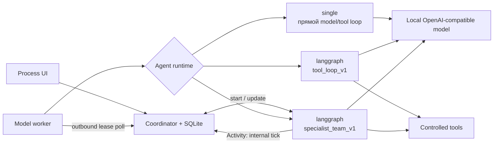

# Runtime агентов: Single и LangGraph

АГАТ разделяет две разные задачи оркестрации:

- **Temporal** удерживает верхнеуровневый бизнес-процесс: durable timers, Updates/Signals, Schedules, восстановление и Continue-As-New;
- **LangGraph** опционально управляет внутренним циклом одного агентного этапа: одиночным tool loop либо bounded supervisor/handoff-командой.

LangGraph не импортируется в Temporal Workflow и не заменяет очередь АГАТ. Он запускается model worker внутри уже выданного lease.



## Контракт агента

У агента сохраняются runtime и версионированная конфигурация. Одиночный LangGraph-agent использует:

```json
{
  "runtime": "langgraph",
  "runtimeConfig": {
    "profile": "tool_loop_v1",
    "maxIterations": 6
  }
}
```

Team использует отдельный профиль и ссылается на 2–8 обычных project-scoped агентов:

```json
{
  "runtime": "langgraph",
  "runtimeConfig": {
    "profile": "specialist_team_v1",
    "maxIterations": 4,
    "maxHandoffs": 3,
    "stateSchema": "specialist_team_state_v1",
    "specialistAgentIds": ["researcher-id", "reviewer-id"]
  }
}
```

Поддерживаются:

| Runtime | Семантика | Когда использовать |
|---|---|---|
| `single` | Существующий прямой вызов модели с ограниченным циклом web-tools | Простые роли, минимальный overhead, переносимый worker без Python-зависимостей |
| `langgraph/tool_loop_v1` | Скомпилированный `StateGraph`: `model → tools → model`, conditional edges и явное завершение | Один агент с несколькими итерациями модели и инструментов |
| `langgraph/specialist_team_v1` | Supervisor делегирует ограниченному набору pinned specialist subgraphs и завершает общий ответ | Сложная задача, для которой действительно нужны разные роли и контролируемые handoffs |

Оба профиля ограничивают число model-итераций каждого tool loop диапазоном `1..12`. Фактический предел равен меньшему из настройки team, настройки specialist и операторского `AGAT_WEB_MAX_TOOL_ROUNDS`; поэтому агент не может расширить лимит worker. Team дополнительно ограничивает число handoffs диапазоном `1..8` и принимает только схему `specialist_team_state_v1`.

Coordinator запрещает self-reference, duplicate members, system/eval agents, участников другого project и вложенные teams. При создании run каждый участник разрешается в immutable ordered snapshot со своими prompt/model/runtime и definition hashes. Последующее редактирование участника не меняет уже созданный run или replay.

## Маршрутизация по возможностям

Worker публикует `agentRuntimes` и `agentRuntimeProfiles` при регистрации и в каждом heartbeat. Минимальный worker без зависимости LangGraph публикует `['single']` и пустой список профилей; актуальный worker с установленным пакетом — `['single', 'langgraph']` и `['tool_loop_v1', 'specialist_team_v1']`. Legacy worker без нового поля считается совместимым только с `tool_loop_v1` и не получает team stage.

Scheduler выдаёт агентный stage только при выполнении обоих условий:

1. совпадает закреплённая модель либо агент использует автовыбор;
2. worker объявил runtime и точный профиль агента;
3. для team один и тот же worker объявил все pinned модели supervisor и specialists.

HTTP stages не зависят от agent runtime. В UI готовность агента и число совместимых узлов также учитывают оба условия, поэтому карточка не обещает запуск на несовместимой машине.

## Граница долговечности

Граф LangGraph компилируется **без checkpointer** и живёт только в рамках одного lease attempt. Это осознанная граница:

- SQLite остаётся источником истины для run, stage, trace, approvals и artifacts;
- Temporal остаётся владельцем долговечного lifecycle процесса;
- потеря worker возвращает весь stage в очередь после lease TTL;
- внутреннее состояние незавершённого graph attempt не переносится на другой worker.

LangGraph поддерживает checkpoints, threads и fault-tolerant resume, когда граф компилируется с checkpointer. В АГАТ это пока не включено: отдельный checkpointer создал бы третий durable state, который пришлось бы согласованно восстанавливать вместе с SQLite и Temporal. Официальное описание механизма: [LangGraph Persistence](https://docs.langchain.com/oss/python/langgraph/persistence).

Следствие at-least-once: read-only `web_search` и `web_fetch` можно безопасно повторить, а MCP tools с side effects обязаны соблюдать gateway idempotency и policy/approval до исполнения. Внутренний handoff добавляется в scope client call ID, чтобы одинаковые model-generated IDs разных specialists не столкнулись внутри одного lease. При потере worker повторяется вся team, а не отдельный subgraph.

## Установка

Docker image worker уже устанавливает закреплённый `langgraph==1.2.9` из `workers/requirements.txt`.

Для отдельного Python worker:

```bash
python3 -m pip install --requirement workers/requirements.txt
python3 workers/agat_worker.py
```

Без установки worker продолжает выполнять `single`-агентов и не рекламирует `langgraph` coordinator. Если несовместимый lease всё же получен от старого coordinator, worker возвращает явную ошибку вместо скрытого fallback на другой runtime.

Базовый пакет LangGraph требует Python 3.10+ и устанавливается отдельно от provider adapters; АГАТ продолжает вызывать локальный OpenAI-compatible endpoint собственным клиентом. См. [официальную установку LangGraph](https://docs.langchain.com/oss/python/langgraph/install) и [Graph API](https://docs.langchain.com/oss/python/langgraph/use-graph-api).

## Наблюдаемость и приватность

В `trace.input`, `stage.started` и model-call events записываются runtime/profile и безопасная runtime-конфигурация. Team добавляет member IDs/names/models/definition hashes и события `agent_handoff` без raw assignment, output или скрытого reasoning. Execution manifest v3 хранит полные immutable specialist snapshots; OTel spans получают только профиль и число специалистов. Полные tool arguments по-прежнему редактируются существующей trace policy.

АГАТ не настраивает LangSmith и не отправляет graph state во внешний сервис. Если оператор самостоятельно включает сторонний tracing через environment, он отвечает за egress, redaction и соответствие политике данных.

## Текущие ограничения

- реализованы только известные профили `tool_loop_v1` и `specialist_team_v1`, а не произвольная загрузка Python-графов пользователем;
- LangGraph graph не пересекает границу одного stage и не управляет approval/wait процесса;
- durable memory и LangGraph checkpoints не включены;
- specialist team не распределяется между несколькими workers и не допускает nested teams или динамическое изменение каталога участников.

Полный контракт состояния, handoff и эксплуатации: [LangGraph specialist teams 1.3](./langgraph-specialist-teams.md).
