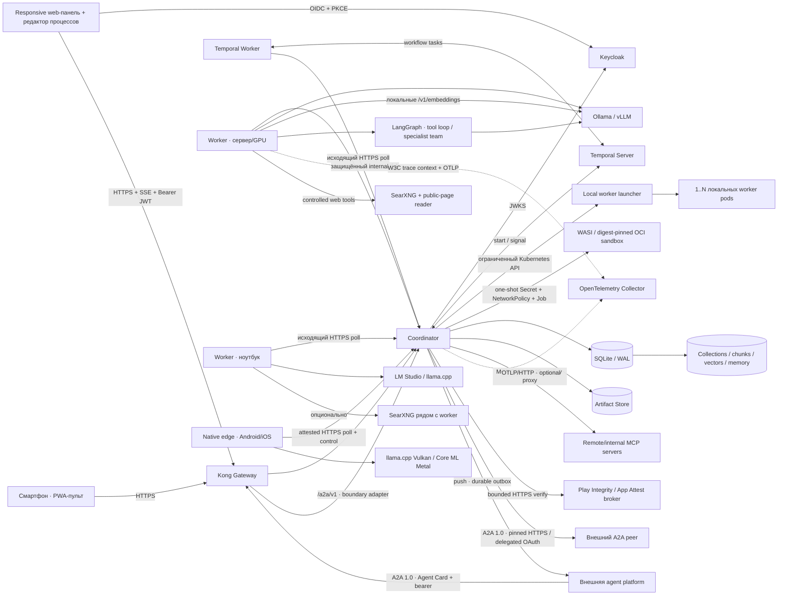
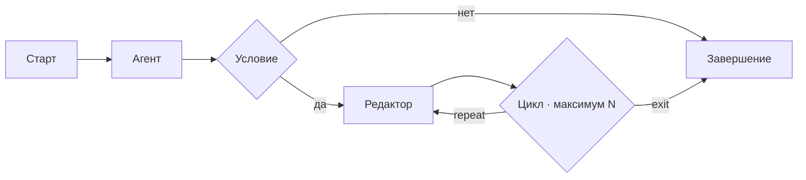
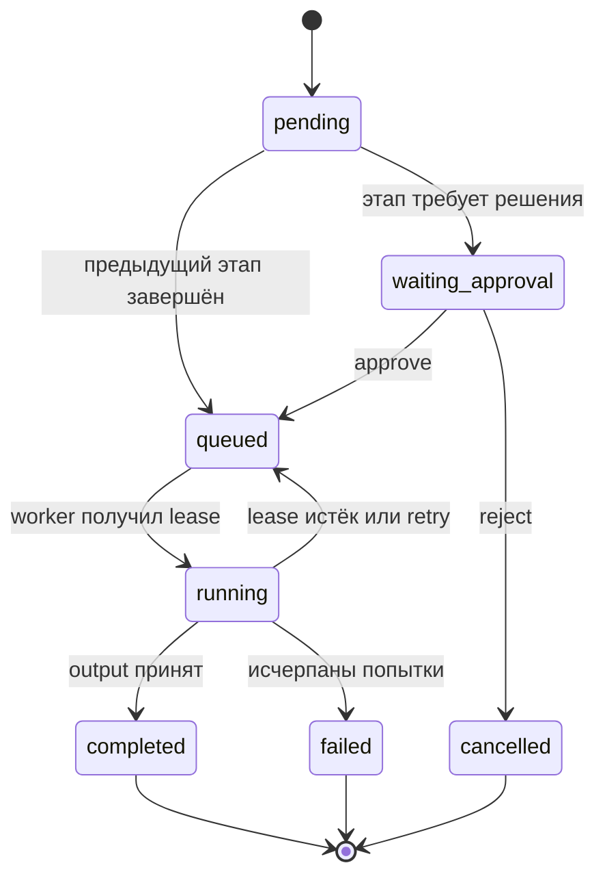

# Архитектура АГАТ

## Цели MVP

1. На слабой машине одновременно выполняется не больше одного этапа.
2. Несколько компьютеров работают как единый пул без открытия входящих портов на воркерах.
3. Потеря сети или завершение воркера не теряет задачу.
4. Локальная модель не публикуется наружу: к ней обращается только воркер на той же машине.
5. Рискованный этап можно остановить до выполнения и подтвердить с телефона.
6. Процесс с условиями и обратными переходами всегда имеет достижимое завершение и ограничение числа итераций.

## Контур

Coordinator хранит состояние очереди, но не подключается к model endpoint узла. Воркеры сами регистрируются, отправляют heartbeat и запрашивают следующий lease. Поэтому ноутбук или домашняя GPU-машина могут находиться за NAT.

## Компоненты

### Coordinator

Расположен в `apps/coordinator`; доменное состояние хранится через встроенный `node:sqlite`, а Temporal client запускает durable Workflow, отправляет подтверждаемые Updates и управляет interval/cron/calendar Schedules.

- HTTP API и статическая раздача собранной React-панели;
- project-scoped таблицы `agents`, `runs`, `stages`, `events`, `artifacts`, `credentials`, `processes`, `process_versions`, `process_instances`, `process_tokens`, `process_join_arrivals`, `process_signal_waits`, `process_subprocess_links`, `process_compensations`, `process_webhooks`, `process_webhook_receipts`, `mcp_servers`, `mcp_tool_policies`, `mcp_tool_calls`, `mcp_tool_call_approvals`, `mcp_policy_versions`, `knowledge_collections`, `knowledge_documents`, `knowledge_chunks`, `knowledge_embedding_jobs`, `knowledge_retrievals`, `memory_entries`, `prompt_registry`, `prompt_versions`, `eval_datasets`, `eval_dataset_versions`, `eval_examples`, `eval_experiments`, `eval_experiment_items`, `eval_reviews`, `a2a_endpoints`, `a2a_tasks`, `a2a_push_configs`, `a2a_push_deliveries`, `a2a_remotes`, `a2a_outbound_tasks`; fleet/edge state и глобальный MCP kill switch хранятся в `nodes`, `edge_enrollment_challenges`, `model_benchmarks` и `settings`;
- атомарная выдача работы через `BEGIN IMMEDIATE`;
- TTL lease и повторная постановка этапа при потере воркера;
- максимум три попытки этапа;
- хеширование node token через SHA-256;
- SSE-поток событий;
- полный per-run execution trace и metadata файлов с SHA-256;
- W3C trace IDs, immutable agent snapshots, execution manifest и agent-only replay/eval;
- опциональный OTLP/HTTP export технических spans без prompt/output content;
- безопасная запись stage outputs и финального результата в файловый Artifact Store;
- проверка графов, deterministic fork/join tokens, переходы по условиям, bounded loops, external signals, pinned subprocess и HTTP/transform/wait/approval/artifact/compensation activities;
- неизменяемые снимки опубликованных версий процессов;
- OIDC RS256/JWKS verifier, role/project authorization, CSP, anti-framing и CORS allowlist;
- локальный Kubernetes worker launcher: создание независимых worker-пулов, stop/start и discovery установленных моделей.
- MCP host/gateway: Streamable HTTP и static isolated catalogs, project allowlist, immutable policy-as-code и effective diff, risk-tier/four-eyes approvals, scoped credentials, persisted emergency deny, encrypted call/profile state и final-preflight proxy без раскрытия credentials workers.
- isolated tool executor: bounded WASI module либо digest-pinned OCI command, per-call non-root/read-only Kubernetes Job, default-deny exact-IP egress, ephemeral Secret cleanup и optional operator-provided gVisor/Kata RuntimeClass.
- pull-safe Model Router: hardware/model profiles, пассивный EWMA throughput/energy, глобальное ранжирование свободных узлов, SLA filters, explainable trace и fallback между попытками.
- Local RAG control plane: chunking, pull-based embedding jobs, collection snapshot запуска, cosine retrieval, provenance audit, TTL cleanup, каскадное удаление и export.
- Golden eval control plane: immutable prompt/dataset versions, batch candidate runs через обычный scheduler, append-only human/model-judge audit, knowledge fingerprint и matching promotion gate.
- A2A interoperability boundary: inbound endpoint bearer/task/SSE/push/files и outbound Agent Card discovery/send/poll/cancel с encrypted credentials, delegated RFC 8693, SSRF-safe pinned transport и redacted audit без раскрытия prompt/tools/memory.
- hardened Temporal boundary: TLS/API key или mTLS production transport, Worker Deployment Versioning, replay fixtures и scheduled parent→child workflows.
- native edge trust boundary: one-time hashed challenges, external Play Integrity/App Attest verification, hardware-attested device token lifecycle, control-only pending-wipe scope и immutable wipe audit.

SQLite предполагает один активный экземпляр coordinator. Temporal делает процесс durable при рестартах, но сам по себе не превращает SQLite state store в HA: незавершённый PostgreSQL driver fail-closed, а проект перехода описан в [PostgreSQL state-store design](./postgresql-state-store-design.md).

В Docker Desktop coordinator использует namespace-scoped service account. Launcher управляет Deployments; sandbox executor — только Jobs, Pods/log, Secrets и NetworkPolicies того же namespace. Пользователь launcher передаёт только модель, число workers, concurrency и флаг web-tools; isolated image/module/command меняет только `admin`. Подробнее: [локальный запуск нескольких workers](./local-workers.md) и [изолированное выполнение tools](./isolated-tool-execution.md).

### Worker

Файл `workers/agat_worker.py` работает на Python 3.10+. Runtime `single` без OTel сохраняет переносимый путь на стандартной библиотеке; для `langgraph` и OpenTelemetry устанавливаются закреплённые зависимости из `workers/requirements.txt`, уже включённые в Docker image.

- хранит выданный node token в файле с правами `0600`;
- поддерживает 1–32 локальных слота, по умолчанию один;
- продлевает lease во время длинного inference;
- передаёт результат предыдущих агентов следующему;
- вызывает `POST /v1/chat/completions` локального model server;
- объявляет доступные embedding models, забирает отдельные embedding leases и вызывает локальный `POST /v1/embeddings`;
- embedding-ит запрос запуска, получает от coordinator только snippets из разрешённого snapshot collections и добавляет `[K…]/[M…]` как недоверенный контекст;
- исполняет выбранный runtime/profile агента: прямой `single`, bounded `tool_loop_v1` либо supervisor + specialist subgraphs `specialist_team_v1` внутри одного lease;
- исполняет OpenAI-compatible `tool_calls` в ограниченном цикле и предоставляет опциональные `web_search`/`web_fetch` без прямого сетевого доступа модели;
- получает только effective MCP tool schemas текущего lease и вызывает их через coordinator; endpoint и upstream credentials worker не видит;
- сообщает результат или ошибку coordinator;
- сообщает наблюдаемые model/tool calls и redacted handoff metadata; provider-specific hidden reasoning, raw assignment и specialist output в audit намеренно не записываются;
- продолжает W3C trace через agent/model/tool spans и возвращает token/time metrics;
- умеет `--once --dry-run` для сквозной проверки без модели.

Web-инструменты работают на стороне конкретного worker. В Kubernetes поиск выполняет внутренний SearXNG, а чтение публичной страницы — worker с проверкой DNS/IP, redirect, content type, размера и таймаута. Поэтому удалённая машина не должна открывать model endpoint; ей нужен исходящий доступ к coordinator, локальному/общему SearXNG и выбранным публичным сайтам. Подробности: [web-доступ локальных агентов](./web-access.md).

### Native edge worker

`edge/android` и `edge/ios` используют тот же lease protocol, но получают отдельный `trustKind=hardware_attested`. Android исполняет managed GGUF через pinned llama.cpp с Vulkan/CPU; iOS — модель с bounded string contract через Core ML/Metal. Оба клиента хранят device token в OS-bound storage и не получают MCP schemas, HTTP activities, upstream credentials или embedding jobs.

Enrollment сначала связывает случайный challenge с platform/application/name, затем coordinator передаёт provider evidence HTTPS broker. Broker является единственным компонентом, который обращается к Google/Apple verification boundary; coordinator сохраняет только нормализованный verdict. Scheduler повторно применяет capability floor при каждом heartbeat и исключает edge-узел из проекта, где stage получил бы MCP tools.

Remote wipe сначала меняет server state: credential становится `wipe_pending`, узел offline, leases истекают и работа больше не принимается. Старый token остаётся действителен только в control channel, чтобы offline device мог получить command и подтвердить локальное удаление. После acknowledgement его hash заменяется и state становится `wiped`. Это даёт немедленный revoke control plane, но физическое стирание offline storage остаётся best effort до следующего соединения. Полный build/broker/runbook: [Native edge worker 1.6](./native-edge-worker.md).

### Web-панель

React + Vite в `apps/web`.

- отдельные live-разделы обзора, агентов, запусков, процессов, Knowledge, Golden eval, MCP gateway, A2A adapter, узлов и моделей;
- реальные счётчики из SQLite и worker heartbeat вместо статических карточек;
- создание и редактирование конфигураций агентов и bounded specialist teams;
- создание проектов и выбор project context;
- создание зашифрованных credentials без возврата secret values;
- совместимость `agent.model ↔ node.models` и статистика участия агента в запусках;
- создание запуска;
- отображение hardware attestation/credential state и admin-only typed-confirmation remote wipe;
- создание collections/documents/memory, наблюдение индексации, удаление/export и выбор collections при старте run/process;
- визуальный редактор процессов на React Flow с fork/join, signal, subprocess и reusable templates;
- публикация версий, structural diff, safe/live replay, BPMN 2.0 import/export, triggers, запуск и отмена экземпляров процессов;
- смена глобальной ресурсной политики;
- approval/reject;
- SSE-инвалидация с одним повторным запросом overview;
- вкладки полного trace, входов/outputs и артефактов со скачиванием по ID;
- desktop layout и отдельная мобильная компоновка.

### A2A boundary

Внешний `message:send` не создаёт новый execution engine. Adapter аутентифицирует endpoint token, нормализует разрешённые inline parts, сохраняет bounded files, фиксирует idempotency record и создаёт обычный run с одним агентом и выбранными knowledge collections. Scheduler, approvals, worker leases, Local RAG и trace после этого работают без специальной A2A-ветки. SSE читает тот же task state, а push outbox доставляет его transitions независимо от worker.

Outbound client также не становится orchestrator: он фиксирует peer из bounded Agent Card, применяет project RBAC и transport credential, отправляет task и хранит redacted mirror для polling/cancel. DNS/IP pinning и запрет redirects не позволяют Agent Card, OAuth token endpoint или push callback расширить сетевой boundary. Входной W3C `traceparent` становится родителем run span; delegated user token живёт только во время RFC 8693 exchange. Полный контракт и ограничения: [A2A interoperability](./a2a-adapter.md).

### Каталог агентов

Агент — сохраняемая конфигурация в таблице `agents`: имя, ответственность, system prompt, необязательная конкретная модель, runtime и его версионированный bounded-профиль. `specialist_team_v1` дополнительно ссылается на 2–8 обычных агентов того же project. При создании run coordinator фиксирует ordered snapshots всех участников; scheduler требует профиль и все pinned модели на одном worker. Пустая модель означает policy-driven автовыбор. Lease получает только лучший свежий свободный worker, совместимый с model pins/runtime/profile и Model Router constraints. Точное решение хранится отдельно от immutable agent snapshot.

Temporal управляет всем процессом, а LangGraph — только внутренними переходами одного agent/team stage. Team supervisor/handoffs не умеют ждать process approval, создавать durable timer или переходить на другой lease. LangGraph не импортируется в детерминированный Workflow и компилируется без собственного durable checkpointer, поэтому SQLite/Temporal не конкурируют с третьим источником истины. Подробности: [runtime агентов](./agent-runtimes.md) и [specialist teams 1.3](./langgraph-specialist-teams.md).

Local RAG также не добавляет второй orchestrator или сетевой vector service: coordinator остаётся владельцем lifecycle и provenance, а worker — владельцем model calls. Подробности: [Local RAG и управляемая память](./local-rag-and-memory.md).

Три встроенных агента остаются редактируемыми, но помечены как системные и имеют стабильный порядок `Сборщик → Аналитик → Редактор`. Пользовательские агенты создаются с UUID и сразу доступны в конструкторе цепочки.

## Процессы

Процесс — ориентированный исполняемый граф из типов `start`, `agent`, `http`, `transform`, `wait`, `approval`, `artifact`, `condition`, `loop`, `parallel_fork`, `parallel_join`, `signal`, `subprocess`, `end`. У обычного шага один переход `default`, у условия — `true/false`, у цикла — `repeat/exit`, а fork создаёт 2–16 параллельных `default`-веток. Обратная связь разрешена только как явный переход; самозамыкание запрещено.

Coordinator до сохранения проверяет ровно один старт, хотя бы одно завершение, набор обязательных веток, достижимость всех шагов и существование пути к завершению из каждого шага. Цикл имеет локальный предел `1..50`; экземпляр также ограничен 1000 переходами. Это предотвращает бесконечное выполнение даже при ошибочном результате модели.

`processes.draft_graph` хранит редактируемый draft, а `is_template` позволяет клонировать reusable process. Публикация добавляет snapshot в `process_versions`, закрепляет версии subprocess и увеличивает номер только при изменившейся схеме. `process_instances` получает копию опубликованного graph; последующее редактирование draft не меняет активную работу. Execution tokens и join arrivals хранятся отдельно, поэтому параллельные ветки восстанавливаются после рестарта. Agent/HTTP/compensation используют lease-очередь; wait/approval/signal/subprocess синхронизируются с Temporal Updates, а transform/artifact исполняются coordinator относительно сохранённого state.

Temporal Schedule запускает отдельный parent→child Workflow и поддерживает interval/cron/calendar. Public start/signal webhooks имеют собственные hashed tokens и receipt-based idempotency. Safe replay использует точную исходную process version и повторно применяет записанные HTTP/subprocess outputs; live replay создаёт новые idempotency keys. BPMN 2.0 остаётся import/export boundary, а не альтернативным engine.

Подробная модель описана в [руководстве по процессам](./processes.md) и [Process Builder 1.2](./process-builder-1.2.md), а граница Temporal — в [durable runtime](./durable-runtime.md).

## Режимы планировщика

| Режим | Правило | Для чего |
|---|---|---|
| `sequential` | Не больше `global_max_concurrency` активных lease во всём контуре; по умолчанию 1 | Один слабый компьютер, общий GPU или минимальное энергопотребление |
| `parallel` | Каждый узел берёт работу до собственного `maxConcurrency` | Несколько независимых GPU/машин |
| `auto` | Лимит узла плюс отказ от новой работы при CPU ≥ 90%, RAM ≥ 92% или батарее < 30% | Смешанный парк ноутбуков и серверов |

Линейная цепочка всегда соблюдает зависимости этапов: следующий агент получает lease только после `completed` предыдущего. В процессе coordinator добавляет следующий агентный этап только после вычисления перехода текущего узла, поэтому последовательность сохраняется и при повторном входе в шаг через цикл.

## Жизненный цикл этапа

## Доставка и согласованность

Модель доставки — **at least once**. Если worker завершил inference, но не успел отправить `complete`, lease истечёт и этап может выполниться повторно. Поэтому будущие tools с внешними эффектами должны использовать idempotency key `stage.id` или требовать approval непосредственно перед side effect.

## Trace и Artifact Store

`events` — append-only наблюдаемый журнал. При создании/постановке stage coordinator фиксирует immutable agent snapshot; при выдаче lease — точный run input, outputs предыдущих этапов, worker snapshot и W3C trace context. Worker добавляет progress, model/tool calls и метрики, а coordinator — переходы, approval, retry, output и создание файлов. Скрытая chain-of-thought не является частью модели данных.

Stage output всегда хранится в SQLite, поэтому UI не зависит от файлового хранилища. При `resultDestination=artifacts` coordinator дополнительно записывает файлы под `AGAT_ARTIFACTS_DIR`, а в SQLite оставляет относительный путь, размер, media type и SHA-256. Центральное хранилище выбрано вместо локального каталога worker, чтобы результат с любой машины можно было одинаково увидеть и скачать через coordinator.

Подробности и границы: [журнал выполнения и артефакты](./execution-traces-and-artifacts.md), [OpenTelemetry, manifest, replay/eval](./observability-replay-evals.md) и [Golden eval/prompt registry](./golden-eval-prompt-registry.md).
