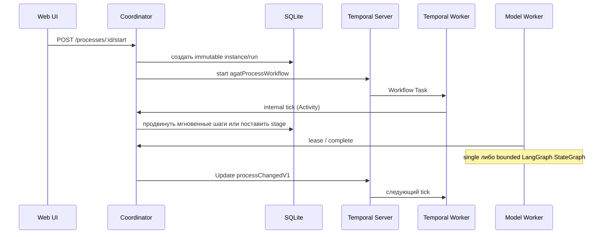

# Durable runtime процессов

В Kubernetes-контуре каждый новый экземпляр опубликованного процесса получает Temporal Workflow. SQLite остаётся источником истины для графа, run/stage, trace и артефактов, а Temporal отвечает за долговечный жизненный цикл: таймеры, сигналы, повторное выполнение Activity и восстановление после перезапуска.

## Граница ответственности

| Компонент | Ответственность |
|---|---|
| Coordinator + SQLite | опубликованный снимок графа, текущий узел, loop counters, stages, approvals, events, credentials и Artifact Store |
| Temporal Workflow | удержание экземпляра живым, durable timer для `wait`, Updates/Signals, parent/child, Continue-As-New и история оркестрации |
| Temporal Activity | идемпотентный вызов внутреннего `tick` либо создание scheduled instance в coordinator и возврат компактного состояния |
| Model worker | agent/HTTP stages через lease-очередь; `single` или LangGraph выполняются здесь, inference не выполняется внутри Workflow |



## Состояния и таймеры

- `wait` хранит `available_at` в SQLite, а Workflow ставит durable timer ровно до этого времени.
- `approval` ждёт Update/Signal; часовой timer используется как страховочная сверка состояния, а не как автоматическое одобрение.
- завершение/fail lease, approve/reject и cancel отправляют подтверждаемую Update `processChangedV1`.
- workflow из старого build получает совместимый Signal `processChanged`; при сетевой ошибке остаётся периодическая сверка.
- при большой истории Workflow использует Continue-As-New по подсказке Temporal SDK.
- при смене target worker deployment version долгоживущий workflow делает Continue-As-New с `AUTO_UPGRADE`.

Процессы, которые уже были активны до включения Temporal, сохраняют `runtime=database` и завершаются старым механизмом. Новые экземпляры получают `runtime=temporal` и `workflowId=agat-process-<instanceId>`. В таблице экземпляров метка **Temporal** ведёт на workflow в локальном Temporal UI.

## Детерминизм и обновления

Workflow-код не читает сеть, filesystem, environment или текущее время через Node API. Все внешние действия вынесены в Activity; Activity импортируются в Workflow только как TypeScript-типы. Production worker использует заранее собранный `workflow-bundle.js`.

LangGraph не входит в bundle Temporal worker и не меняет последовательность Workflow commands. Он компилируется model worker без checkpointer на время одного lease attempt. Поэтому добавление runtime не требует patch marker или новой Temporal task queue для уже запущенных executions; правила versioning ниже потребуются, только если изменится сам Workflow-код. Подробная граница: [runtime агентов](./agent-runtimes.md).

Перед несовместимым изменением Workflow следует:

1. добавить replay-тест на сохранённую историю;
2. использовать patch/version marker или сохранить replay-compatible control flow;
3. выпустить immutable Worker Deployment build и оставить старый worker до завершения pinned executions;
4. только затем удалить старую ветку кода.

Все пакеты `@temporalio/*` закрепляются одной версией. Сейчас используется ветка `1.22.x`; `npm audit --omit=dev` должен оставаться чистым.

Реальные histories проигрываются командой `npm run test:temporal`. Production transport, deployment rings и rollback подробно описаны в [руководстве production hardening](./production-durable-runtime.md).

## Расписания и child workflows

`PUT /api/v1/processes/:id/schedule` создаёт interval, cron или calendar Schedule с IANA timezone, overlap policy `SKIP`, catch-up window 5 минут и pause-on-failure. Schedule запускает `agatScheduledProcessWorkflow`; Activity создаёт обычный immutable process instance в coordinator, после чего parent запускает `agatProcessWorkflow` как child. Ручной запуск выполняется через `POST /api/v1/processes/:id/schedule/trigger`.

Schedule не является вторым источником бизнес-состояния: spec и время следующего action живут в Temporal, а graph snapshot, transitions, execution tokens, signal/subprocess/compensation state, run/stages и audit остаются в state-store АГАТ. Полный контракт 1.2: [Process Builder](./process-builder-1.2.md#triggers).

## Локальная конфигурация

```dotenv
AGAT_TEMPORAL_ENABLED=true
AGAT_TEMPORAL_TARGET=local
AGAT_TEMPORAL_TLS=false
AGAT_TEMPORAL_ADDRESS=agat-temporal:7233
AGAT_TEMPORAL_NAMESPACE=agat
AGAT_TEMPORAL_TASK_QUEUE=agat-processes-v1
AGAT_TEMPORAL_INTERNAL_TOKEN=<случайный секрет>
AGAT_TEMPORAL_VERSIONING_ENABLED=false
```

В Docker Desktop Kubernetes секрет генерирует `npm run k8s:up`. Он передаётся только coordinator и Temporal worker. Kong блокирует весь публичный префикс `/api/v1/internal`; сам endpoint дополнительно требует constant-time проверку `X-Agat-Temporal-Token`.

Проверка:

```bash
npm run k8s:status
kubectl logs -n agat deployment/agat-temporal-worker --tail=100
```

Temporal UI доступен на `http://127.0.0.1:8233`, namespace — `agat`, task queue — `agat-processes-v1`.

## Ограничение локального сервера

Манифест использует встроенный `temporal server start-dev` с persistent SQLite-файлом. Это удобно для одного Docker Desktop и переживает перезапуск pod, но не является production HA-кластером. Worker Versioning в этом профиле намеренно выключен. Для production нужен Temporal Cloud либо полноценный self-hosted Temporal с поддерживаемой внешней БД, TLS/mTLS, отдельным lifecycle, backup и мониторингом. Формат графа и API АГАТ при этом менять не требуется.

Первичные источники: [Temporal Worker Versioning](https://docs.temporal.io/production-deployment/worker-deployments/worker-versioning), [Temporal TypeScript Client](https://docs.temporal.io/develop/typescript/client/temporal-client), [Temporal CLI](https://github.com/temporalio/cli), [Temporal TypeScript SDK](https://github.com/temporalio/sdk-typescript).
