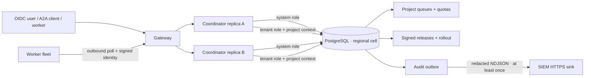

# Fleet и HA 1.7

## Резюме и итог

Релиз 1.7 переводит state plane coordinator с single-writer SQLite на поддерживаемый PostgreSQL backend и разрешает несколько coordinator replicas внутри одной региональной HA-cell. В той же транзакционной границе появились project queues/quotas, residency placement, реестр подписанных worker releases, deterministic staged rollout и durable audit outbox для SIEM.

Это release-ready реализация для локального и staging-контура. Она не объявляет одиночный PostgreSQL pod в Docker Desktop production HA, не делает active-active запись между регионами и не доказывает происхождение бинарника на недоверенном worker host.

## Границы и scope

В релиз входят:

- один authoritative PostgreSQL state store на региональную HA-cell;
- несколько stateless coordinator replicas с общими queues, leases, quotas и audit state;
- project policy `homeRegion / allowedRegions / residencyDomain / queueName / maxQueuedTasks / maxRunningTasks` с optimistic revision;
- `FOR UPDATE SKIP LOCKED` для конкурентного claim stage, embedding job и audit export;
- FORCE RLS для tenant-owned tables, отдельные system/tenant credentials и request-scoped tenant context;
- Ed25519 manifests, configured public trust roots, worker identity verification, revoke и deterministic rollout cohorts;
- SIEM export как redacted NDJSON с stable idempotency key, lease, retry и exponential backoff;
- PostgreSQL-backed artifact bytes, чтобы download не зависел от локального filesystem конкретной replica;
- responsive раздел **Fleet / HA**, Docker Compose HA profile и Docker Desktop Kubernetes с двумя coordinator replicas.

За границей релиза:

- production managed PostgreSQL topology, WAL archive/PITR и подтверждённый restore;
- автоматическая SQLite→PostgreSQL миграция существующего контура;
- synchronous multi-region writes, cross-region queue failover и global consensus;
- S3-compatible object store для крупных artifacts;
- автоматическая доставка/установка worker artifact на host;
- hardware-backed runtime attestation обычного server worker;
- vendor-specific SIEM transforms, retention и dead-letter UI.

## Источники и evidence

| ID | Источник | Версия/дата проверки | Использованный claim |
|---|---|---|---|
| SRC-1701 | [PostgreSQL 17 `SELECT`](https://www.postgresql.org/docs/17/sql-select.html) | PostgreSQL 17, проверено 2026-08-30 | locking clause поддерживает `FOR UPDATE ... SKIP LOCKED` |
| SRC-1702 | [PostgreSQL 17 Row Security Policies](https://www.postgresql.org/docs/17/ddl-rowsecurity.html) | PostgreSQL 17, проверено 2026-08-30 | RLS default-deny, `BYPASSRLS` и `FORCE ROW LEVEL SECURITY` |
| SRC-1703 | [PostgreSQL 17 Explicit Locking](https://www.postgresql.org/docs/17/explicit-locking.html) | PostgreSQL 17, проверено 2026-08-30 | row locks живут до конца транзакции; advisory locks являются application-defined |
| SRC-1704 | [node-postgres pooling](https://node-postgres.com/features/pooling) | `pg` 8.23.0, проверено 2026-08-30 | bounded pools и обязательная обработка pool errors |
| SRC-1705 | [node-postgres transactions](https://node-postgres.com/features/transactions) | `pg` 8.23.0, проверено 2026-08-30 | все statements транзакции должны выполняться на одном checked-out client |
| SRC-1706 | [Node.js Crypto](https://nodejs.org/api/crypto.html) | Node.js API, проверено 2026-08-30 | Ed25519 использует `sign/verify` без отдельного digest algorithm |
| SRC-1707 | [Kubernetes PodDisruptionBudget](https://kubernetes.io/docs/tasks/run-application/configure-pdb/) | stable API, проверено 2026-08-30 | PDB ограничивает добровольные disruptions, но не гарантирует доступность при отказе node |
| SRC-1708 | Репозиторий: `fleet-ha.test.ts`, `fleet-ha-postgres.integration.test.ts` | schema migration 20, 2026-08-30 | quotas, RLS, replicas, artifacts, SIEM claims, signing, rollout и revoke |

Внешние источники определяют семантику платформенных механизмов. Фактическое поведение Agat подтверждается кодом и тестами репозитория; production capacity и SLA из этих источников не выводятся.

## AS-IS до 1.7

- SQLite/WAL был единственным state store и требовал ровно одну coordinator replica.
- Scheduler использовал SQLite transaction serialization, а artifacts были доступны через локальный coordinator filesystem.
- Project isolation обеспечивалась OIDC/RBAC и обязательным `project_id` в application queries, но не отдельной DB role и не RLS.
- Worker version попадала в trace, но coordinator не проверял подписанный release manifest и не управлял cohorts.
- Audit events оставались в application database и не имели durable external-delivery state.
- `AGAT_STATE_STORE_DRIVER=postgresql` завершал startup fail-closed.

## Release TO-BE 1.7

### Логическая архитектура



### Физическая HA-cell

Одна cell имеет ровно одну пару `region/residencyDomain` и одну PostgreSQL database authority. Все project payloads, queue rows, artifacts и audit rows этой cell остаются в её database. Coordinator с другой парой не может создать или online-перенести project в эту cell.

Docker Desktop manifest поднимает два coordinator pods, rolling update с `maxUnavailable=0`, PDB `minAvailable=1`, preferred pod anti-affinity и отдельный PostgreSQL pod. Последний нужен для локальной проверки multi-replica semantics, но остаётся single point of failure. Production cell обязана заменить его managed/multi-AZ PostgreSQL endpoint с TLS и проверенным backup/restore.

## Архитектурные решения

Главное решение и отвергнутые варианты зафиксированы в [ADR-017](./adr-017-fleet-ha-cell.md). Коротко:

- PostgreSQL является единственным source of truth; SQLite и PostgreSQL не работают в dual-write;
- регион — это отдельная cell, а не поле, разрешающее произвольный cross-region claim;
- tenant HTTP paths используют отдельную DB role и FORCE RLS; scheduler/admin paths явно входят в system scope;
- migration 20 сериализуется transaction-level advisory lock, а business claims используют row locks;
- artifact bytes временно хранятся в PostgreSQL `BYTEA`; object store остаётся стратегическим TO-BE;
- текущий `AgatStore` сохраняет synchronous contract через worker-thread bridge к `pg`. Это совместимый release plateau, а не стратегический async repository design.

## Data authority и consistency

| State | Authority | Консистентность |
|---|---|---|
| Project policy и quotas | PostgreSQL `projects` | row lock + optimistic `fleet_revision` |
| Run/stage queue | PostgreSQL `runs/stages` | atomic transaction и `SKIP LOCKED` |
| Worker liveness/release | PostgreSQL `nodes/worker_releases/worker_rollouts` | heartbeat freshness + signature/revoke preflight |
| Artifact metadata/bytes | PostgreSQL `artifacts` | metadata, SHA-256 и bytes в одной application transaction |
| Audit event/export cursor | PostgreSQL `events/audit_export_outbox` | trigger enqueue в commit event; at-least-once delivery |
| Workflow history | Temporal | остаётся отдельной durable orchestration authority |

Каждая replica имеет bounded system и tenant pools. Транзакция закрепляет один pool client. Bridge блокирует event loop конкретной replica на время DB operation, поэтому горизонтальная replica concurrency поддерживается, но высокий single-replica throughput требует будущего async repository refactor и измерения pool saturation.

Migration выполняется coordinator startup под `pg_advisory_xact_lock(867530901)`. Это безопасно сериализует одновременный bootstrap replicas, но production least-privilege plateau всё ещё требует отдельной migration job и runtime system role без DDL.

Post-1.7 этап 2 заменил этот historical startup plateau на schema v21 Job, отдельного owner `agat_migrator`, DDL-free runtime и connection admission gate: [PostgreSQL migration Job и DDL-free runtime](./postgresql-migration-job-runtime-role.md).

## Project queues, quotas и residency

- `maxQueuedTasks` ограничивает все non-terminal runs проекта: `queued/running/waiting_approval/waiting_external/compensating`.
- Проверка quota и insert run выполняются в одной транзакции после `FOR UPDATE` project row, поэтому две replicas не могут одновременно пройти один последний слот.
- `maxRunningTasks` проверяется внутри scheduler claim transaction и ограничивает активные stages/embedding jobs проекта.
- Stage выбирается только если `run.queue_name`, `run.region`, `run.residency_domain`, worker region и текущая cell совместимы.
- Online update не переносит project между residency domains. Такой перенос является offline migration с отдельной reconciliation и новым approval gate.
- `allowedRegions` в 1.7 содержит только region текущей cell. Поле сохраняет contract для будущего контролируемого failover, но не ослабляет residency сейчас.

## Hard multi-tenant isolation

Isolation является defense in depth:

1. OIDC verifier проверяет issuer/audience/signature/roles и выбирает project из разрешённых claims.
2. Каждый HTTP request получает отдельный `AsyncLocalStorage` root; после authorization tenant scope содержит один `projectId`.
3. Tenant connection выполняет transaction-local `set_config('agat.current_project_id', project, true)`.
4. Tenant-owned tables имеют `ENABLE` и `FORCE ROW LEVEL SECURITY`; direct rows проверяют `project_id`, child rows — parent ownership.
5. Tenant role получает DML только на RLS tables, read-only на `settings/nodes/model_benchmarks` и не может изменять global control plane.
6. Startup проверяет фактические `current_user`, а не только usernames URL: роли должны различаться; tenant не может иметь `SUPERUSER/BYPASSRLS/CREATEROLE/CREATEDB/REPLICATION`, membership в такой role или `CREATE` на database/schema.
7. System role имеет `BYPASSRLS` и `CREATE` текущей schema и используется только explicit scheduler, worker protocol, migration и cross-project admin paths.
8. Database Secret отделён от general application Secret; worker pod получает только enrollment/model keys и не получает PostgreSQL credentials.

Граница защищает от ошибочного cross-project query и части application vulnerabilities. Компрометация coordinator process, который по назначению имеет system credential, остаётся cell-wide incident; hard security boundary между недоверенными tenants требует отдельных coordinator deployables/DB roles или отдельных cells.

## Signed worker releases и staged rollout

Manifest schema 1 содержит `releaseId`, version, `sha256:` artifact digest, platform families, `issuedAt`, optional expiry и bounded metadata. Coordinator нормализует поля, строит locale-independent canonical JSON, проверяет Ed25519 signature по configured public key и сохраняет immutable manifest/hash/signature.

Private key не входит в deployment. Пример подготовки:

```bash
openssl genpkey -algorithm Ed25519 -out worker-release-private.pem
openssl pkey -in worker-release-private.pem -pubout -out worker-release-public.pem
shasum -a 256 workers/agat_worker.py
npm run fleet:sign-worker -- manifest.json worker-release-private.pem release-root-2026
```

JSON из последней команды передаётся в `POST /api/v1/fleet/releases`. Public PEM задаётся в `AGAT_WORKER_RELEASE_PUBLIC_KEYS` как JSON map. Обычный shared-token worker получает четыре значения из зарегистрированного release: ID, digest, key ID и base64 signature. При `AGAT_REQUIRE_SIGNED_WORKER_RELEASES=true` отсутствие/expiry/revoke/mismatch немедленно исключают такой worker.

Rollout существует на `(project, region, ring)`. Первый release ring обязан быть 100%. При смене target предыдущий release становится fallback; bucket `sha256(project:node:rollout) % 100` стабильно определяет cohort. Scheduler выдаёт работу только worker с ожидаемым target/fallback release. Изменение rollout использует revision; revoke переводит связанные nodes offline и снимает verification без ожидания heartbeat.

Это admission rollout, а не updater: Agat не загружает и не устанавливает бинарник. Обычный worker host может заявить чужой digest; для stronger provenance нужны OCI signature verification плюс runtime attestation. Hardware-attested Android/iOS nodes не входят в server-worker cohorts: их application release/signing контролируют Play/App Store и существующий Play Integrity/App Attest broker. Они сохраняют control/wipe и bounded agent scheduling при `AGAT_REQUIRE_SIGNED_WORKER_RELEASES=true`, но не получают MCP/HTTP/embedding work.

## SIEM audit export contract

Insert в `events` тем же DB commit добавляет `audit_export_outbox`. Любая replica может claim batch; `SKIP LOCKED` и `locked_by/lock_expires_at` исключают одновременную обработку, а истёкший lease возвращается в `pending`.

Exporter выполняет HTTPS `POST` с `Content-Type: application/x-ndjson`, `X-Agat-Audit-Batch: firstId-lastId` и optional Bearer. Каждая строка имеет:

- `schemaVersion=1`, numeric event ID и `idempotencyKey=agat-audit-ID`;
- project, timestamp, level, event type, run/stage/node IDs, constant safe message и SHA-256 исходного message;
- allowlisted redacted metadata;
- SHA-256 исходного `data_json` и optional reason, но не raw reason/arguments/prompts/outputs/secrets;
- delivery attempt.

HTTP redirect запрещён. Timeout или non-2xx не означает недоставку: batch возвращается в pending с bounded exponential backoff. Sink обязан дедуплицировать по `idempotencyKey`. Delivered rows сохраняются для reconciliation; retention пока является открытым production решением.

## Конфигурация и deployment

Основные параметры:

| Переменная | Назначение |
|---|---|
| `AGAT_STATE_STORE_DRIVER=postgresql` | включает PostgreSQL authority |
| `AGAT_POSTGRES_URL` | system role URL; scheduler/admin/migrations |
| `AGAT_POSTGRES_TENANT_URL` | отдельная non-BYPASSRLS tenant role URL |
| `AGAT_POSTGRES_POOL_MAX` | connections на pool одной replica |
| `AGAT_POSTGRES_*_TIMEOUT_MS` | connect/idle/statement bounds |
| `AGAT_POSTGRES_SSL_MODE` | `disable` только local; remote — `require/verify-full` |
| `AGAT_REGION`, `AGAT_RESIDENCY_DOMAIN` | identity HA-cell |
| `AGAT_WORKER_RELEASE_PUBLIC_KEYS` | JSON map public Ed25519 trust roots |
| `AGAT_REQUIRE_SIGNED_WORKER_RELEASES` | fail-closed worker admission |
| `AGAT_SIEM_ENABLED`, `AGAT_SIEM_URL` | exporter switch и HTTPS sink |
| `AGAT_SIEM_BEARER_TOKEN` | optional scoped sink credential |

Локальный Compose PostgreSQL profile:

```bash
AGAT_STATE_STORE_DRIVER=postgresql \
docker compose --profile ha up --build
```

Compose сохраняет SQLite default, чтобы обычный single-process developer path не требовал PostgreSQL. Kubernetes Docker Desktop 1.7, напротив, использует PostgreSQL и две coordinator replicas по умолчанию; `AGAT_K8S_COORDINATOR_REPLICAS` может увеличить число replicas, но значение меньше двух снимает HA acceptance.

## Эксплуатационные NFR и ownership

| Область | Release criterion | Владелец роли |
|---|---|---|
| Queue correctness | один stage lease, quota не превышается при двух replicas | Platform runtime owner |
| Residency | project payload не claim-ится другой cell | Data/platform owner |
| Tenant isolation | cross-project read/mutation скрыты RLS; global mutation запрещена tenant role | Security owner |
| Release safety | неизвестный/expired/revoked release fail-closed | Release owner |
| SIEM | committed event остаётся pending до 2xx и повторяется | Security operations owner |
| Database | backup age, replication lag, pool saturation, deadlocks | Database/SRE owner |
| Incident | system credential compromise считается cell-wide | Incident commander |

Production SLO, RPO и RTO не утверждены этим релизом. До production gate владельцы должны зафиксировать workload/capacity, измерить p95/p99, выбрать RPO/RTO, включить multi-AZ/PITR и провести timed restore/region-loss exercise. Локальный single-node PostgreSQL не является evidence для этих значений.

## Переход и rollback

1. Снять согласованный SQLite backup и остановить writes.
2. Выполнить canonical offline export/import в staging toolchain и сверить counts, IDs, hashes и foreign keys.
3. Поднять одну PostgreSQL replica, выполнить application smoke и artifact download.
4. Проверить backup/restore PostgreSQL и SIEM dedup/replay.
5. Увеличить coordinator до двух replicas и выполнить concurrency/failure tests.
6. Включить signed release enforcement после регистрации baseline release на 100% каждого ring.

Автоматического import tool в 1.7 нет. Поэтому существующий stateful контур нельзя переключать одной переменной без maintenance procedure. Rollback после начала PostgreSQL writes не означает возврат на stale SQLite; требуется stop writes и проверенный обратный export либо восстановление последнего согласованного snapshot.

Post-1.7 production-readiness этап добавил canonical offline migrator с reconciliation, verify и rehearsal rollback: [Offline SQLite → PostgreSQL migration](./sqlite-postgresql-migration.md). Абзац выше сохраняет историческую границу самого релиза 1.7.

## Риски и открытые вопросы

| ID | Риск / открытая работа | Текущий контроль | Production gate |
|---|---|---|---|
| RISK-1701 | Local PostgreSQL — single point of failure | честная маркировка local/staging | managed multi-AZ + failover test |
| RISK-1702 | Startup role в 1.7 выполняла DDL | post-1.7 schema v21 Job и DDL-free runtime закрыли риск | закрыто; regression gate остаётся обязательным |
| RISK-1703 | Synchronous DB bridge ограничивает throughput replica | bounded statements/pools и scale-out | async repositories + load test |
| RISK-1704 | PostgreSQL artifact bytes увеличивают DB/WAL | SHA-256, bounded API payloads | object store + lifecycle policy |
| RISK-1705 | Нет автоматической SQLite migration | offline documented plateau | canonical migrator + reconciliation report |
| RISK-1706 | Worker digest не является host attestation | signed registry + revoke | OCI provenance/runtime attestation |
| RISK-1707 | Нет cross-region automatic failover | cell rejects online relocation | approved residency-aware DR runbook |
| RISK-1708 | Delivered audit rows не имеют retention/DLQ UI | retry/backoff/status | retention, poison-event policy, sink-specific conformance |

## Проверка и acceptance evidence

Обязательные сценарии:

- две stores видят один committed run и две replicas отражаются ready;
- project outstanding/running quotas остаются точными при конкурентном claim;
- tenant видит только свой project, не меняет foreign project и не пишет global settings;
- artifact, созданный replica A, материализуется из PostgreSQL replica B;
- два exporters не claim-ят один audit event; payload не содержит secret/raw data;
- Ed25519 manifest принимается, rollout сохраняет fallback, revoked release немедленно fail-closed;
- Docker Compose, Kustomize, TypeScript/Python builds и полный test suite проходят.

Команды:

```bash
npm run typecheck
npm test
npm run build
PYTHONPATH=workers python3 -m unittest discover -s workers -p 'test_*.py'
kubectl kustomize deploy/k8s/docker-desktop >/dev/null
bash -n scripts/*.sh
```

PostgreSQL integration test включается только с disposable database:

```bash
AGAT_POSTGRES_MIGRATION_URL='postgresql://MIGRATION_ROLE@127.0.0.1:55432/agat' \
AGAT_POSTGRES_URL='postgresql://RUNTIME_ROLE@127.0.0.1:55432/agat' \
AGAT_TEST_POSTGRES_URL='postgresql://RUNTIME_ROLE@127.0.0.1:55432/agat' \
AGAT_POSTGRES_TENANT_URL='postgresql://TENANT_ROLE@127.0.0.1:55432/agat' \
AGAT_TEST_POSTGRES_TENANT_URL='postgresql://TENANT_ROLE@127.0.0.1:55432/agat' \
node --import tsx --test apps/coordinator/test/fleet-ha-postgres.integration.test.ts
```

## Quality status

Release implementation и local/staging acceptance считаются выполненными только при зелёных проверках выше. Production readiness остаётся условной до закрытия `RISK-1701`, `RISK-1702`, `RISK-1705` и документированного RPO/RTO/restore evidence; этот документ не является production approval.
