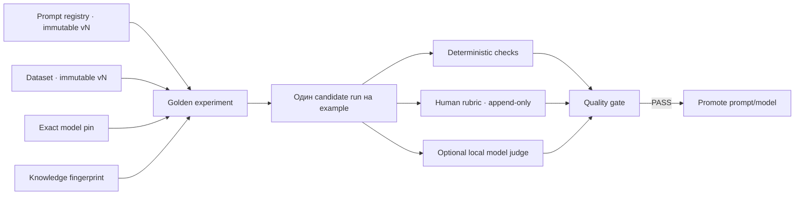

# Golden eval и prompt registry

АГАТ 0.8 добавляет измеримый release gate для изменений prompt, model pin и Local RAG. Главная гарантия этапа: эксперимент всегда ссылается на конкретные версии dataset и prompt, а активная конфигурация агента не меняется, пока соответствующий experiment не завершён и не прошёл все gates.

Обычный replay остаётся инструментом ad-hoc сравнения latency и tokens. Golden eval — отдельный project-scoped lifecycle для регрессии качества.

## Архитектура



SQLite остаётся источником истины. Coordinator хранит:

- `prompt_registry` и неизменяемые `prompt_versions`;
- `eval_datasets`, неизменяемые `eval_dataset_versions` и их `eval_examples`;
- `eval_experiments` и связь каждого example с отдельным обычным run;
- append-only `eval_reviews` для human и model-judge оценок;
- SHA-256 prompt, dataset, output и knowledge snapshot.

Все старые видимые agents автоматически получают project-specific registry и `v1` из прежнего `system_prompt`. Встроенные agents также имеют отдельный active alias для каждого проекта: promotion не меняет глобальный builtin row.

## Prompt registry

Версия содержит полный prompt, SHA-256, комментарий, автора и время создания. Она не редактируется и не удаляется из UI. `activeVersion` и `activeModel` — единственные перемещаемые aliases.

При создании нового custom agent его initial prompt/model сразу становятся `v1`; начальная конфигурация не требует gate. Для существующего agent поля prompt/model в обычном диалоге read-only. Изменение выполняется так:

1. создать candidate prompt version;
2. запустить experiment с exact `promptId`, `promptVersion` и model;
3. получить `overall=pass`;
4. выполнить promotion, сославшись на этот experiment.

Promotion отклоняется, если experiment использовал другой prompt, version, model или bound agent. Благодаря этому model pin также нельзя поменять без измеренного результата. Уже созданные runs сохраняют прежний execution snapshot; новые runs получают active registry version.

Agent snapshot и execution manifest обновлены до schema `v2` и дополнительно содержат `registryPromptId` и `registryPromptVersion`. Старые snapshot schema `v1` читаются и нормализуются без потери прежних hashes.

## Golden datasets

Dataset version — полный immutable snapshot:

- один или несколько examples;
- input и необязательный reference output;
- явные `must contain` и `must not contain` phrases;
- human rubric из максимум 20 weighted criteria;
- список Local RAG collections для каждого example;
- fingerprint collection settings, documents и chunk hashes.

Reference output сам по себе не превращается в автоматический similarity score. Он служит контекстом для human reviewer и model judge. Это намеренное ограничение: длина или лексическое совпадение не должны выглядеть как семантическое качество.

При создании experiment АГАТ повторно вычисляет knowledge fingerprint. Если collection, document, chunk, embedding model или retrieval settings изменились, stale dataset не запускается: нужно явно создать новую dataset version. Fingerprint проверяется снова при чтении результата, поэтому drift делает gate `knowledge=fail` даже при изменении во время batch.

## Batch execution

Один experiment создаёт обычный agent-only run на каждый example. Каждый run имеет:

- точный input example;
- один agent stage без approval;
- prompt content выбранной immutable version;
- exact model pin либо явный `null` для Model Router;
- knowledge collection IDs из example;
- отдельные trace ID, events, metrics и output;
- ссылку обратно на experiment/item в trace.

Scheduler, leases, retry, routing, RAG provenance и worker isolation остаются теми же, что у production runs. Поэтому eval проверяет реальный execution path, а не отдельный синтетический model client в coordinator.

## Scoring и gates

Источники score хранятся раздельно. Для release gate используется следующий приоритет на каждом item:

1. последняя human review;
2. последняя успешно разобранная model-judge review;
3. deterministic score, только если example содержит явные phrase checks;
4. `N/A`, если ни один источник не дал score.

Human review с rubric обязана содержать score 0–100 для каждого criterion. Итог вычисляет coordinator как weighted mean; переданный клиентом aggregate не принимается на доверии. Повторная review добавляет новую запись, а не обновляет старую.

| Gate | Условие |
|---|---|
| `completion` | все candidate runs завершены; failed/cancelled даёт `fail` |
| `quality` | каждый item имеет score, а среднее не ниже `minQualityScore` |
| `knowledge` | текущий fingerprint совпадает с dataset snapshot |
| `overall` | все три gate имеют `pass` |

Experiment остаётся `scoring`, пока хотя бы одному завершённому item нужна human или judge оценка. Quality `fail` — нормальный завершённый experiment, но promotion по нему запрещён.

## Optional model judge

Judge запускается только после завершения candidate batch и только на выбранной локальной модели. Coordinator создаёт отдельный run служебного агента `__agat_eval_judge__`; coordinator сам не подключается к model endpoint.

Judge получает input, reference, candidate output, hashes и rubric и должен вернуть JSON:

```json
{
  "scores": { "correctness": 92 },
  "overallScore": 92,
  "rationale": "Краткое объяснение"
}
```

Для versioned rubric coordinator повторно вычисляет weighted mean из criterion scores и игнорирует model aggregate как источник истины. Audit record содержит model, scores, rationale, judge run ID и SHA-256 сырого output; сам raw output доступен в обычном authenticated trace.

Чтобы judge input оставался в лимите coordinator, длинные поля ограничены: input 12 000, reference 24 000 и candidate output 60 000 символов. Payload явно содержит flags `truncated` и hashes полных значений. Для критичных длинных ответов используйте human review либо разбивайте golden example.

## HTTP API

Все пути ниже имеют prefix `/api/v1`, используют активный `x-agat-project-id` и прежнюю OIDC/legacy-admin авторизацию.

| Метод | Путь | Назначение |
|---|---|---|
| `GET` | `/evals` | prompts, datasets, experiment summaries и counts |
| `GET` | `/evals/experiments/:id` | detail с outputs, checks и review audit trail |
| `POST` | `/evals/prompts` | standalone registry с initial `v1` |
| `POST` | `/evals/prompts/:id/versions` | новая immutable prompt version |
| `POST` | `/evals/prompts/:id/promote` | promotion после matching PASS experiment |
| `POST` | `/evals/datasets` | новый dataset и immutable `v1` |
| `POST` | `/evals/datasets/:id/versions` | новый полный dataset snapshot |
| `POST` | `/evals/experiments` | batch run по dataset examples |
| `POST` | `/evals/experiments/:id/judge` | локальный model-judge batch |
| `POST` | `/evals/items/:id/reviews` | append-only human review |

Пример experiment:

```json
{
  "name": "Юрист v3 · qwen3:14b",
  "datasetId": "dataset-uuid",
  "datasetVersion": 2,
  "agentId": "agent-uuid",
  "promptId": "prompt-uuid",
  "promptVersion": 3,
  "model": "qwen3:14b",
  "minQualityScore": 85
}
```

Пример promotion:

```json
{
  "version": 3,
  "model": "qwen3:14b",
  "experimentId": "passing-experiment-uuid"
}
```

## UI

Раздел **Golden eval** загружается отдельным frontend chunk и содержит три вкладки:

- **Experiments** — batch status, gates, outputs, deterministic checks, human review и judge;
- **Datasets** — immutable versions, examples, rubric и knowledge snapshot;
- **Prompt registry** — version history, hashes, active alias и promotion по найденному PASS experiment.

На узком экране registries становятся горизонтальными списками, item input/reference/output складываются в одну колонку, а editors открываются bottom-sheet поверхностью.

## Роли и чувствительные данные

- читать evals могут все прежние read roles;
- создавать prompt/dataset versions и выполнять promotion могут `admin` и `designer`;
- запускать candidates/judge могут `admin`, `designer`, `operator`;
- human review могут добавлять также `auditor`;
- все mutations в legacy-token режиме требуют admin token.

Prompt, golden inputs, references и outputs могут содержать конфиденциальные данные. Они остаются в project-scoped SQLite и не экспортируются в OpenTelemetry, но доступны через authenticated API. Model judge безопасен только при действительно локальном и контролируемом model endpoint.

## Осознанные границы 0.8

- dataset version фиксирует RAG fingerprint, но не дублирует весь chunk text: при drift запуск блокируется вместо молчаливого использования новых данных;
- scorer phrases проверяет нормализованное case-insensitive вхождение, а не семантическую эквивалентность;
- один experiment оценивает одного agent и одну prompt/model configuration; side-by-side достигается двумя experiments по одной dataset version;
- model judge не считается независимой истиной и уступает human review;
- автоматический online evaluation production traffic, статистические confidence intervals и pairwise ranking ещё не реализованы.

## Сверка с индустриальными контрактами

Разделение dataset → evaluators → experiment следует официальной модели [LangSmith evaluation](https://docs.langchain.com/langsmith/evaluation); immutable snapshots согласуются с [dataset versioning](https://docs.langchain.com/langsmith/manage-datasets). Типы deterministic/human/model judge не смешиваются, как и в описании [LangSmith evaluation types](https://docs.langchain.com/langsmith/evaluation-types).

Prompt versions и active alias повторяют проверяемый lifecycle, описанный в [MLflow Prompt Registry](https://mlflow.org/genai/prompt-registry), но хранятся локально в АГАТ. Набор отдельных graders и явные thresholds согласуется с официальными [OpenAI Graders API](https://platform.openai.com/docs/api-reference/graders?api-mode=chat) и [Evals API](https://platform.openai.com/docs/api-reference/evals/deleteRun?lang=python). Это архитектурная сверка, а не сетевые зависимости: runtime АГАТ не вызывает эти сервисы.

В 0.9 [A2A adapter](./a2a-adapter.md) опубликовал только выбранную active-конфигурацию агента, а 1.0 закрыл [production hardening durable runtime](./production-durable-runtime.md) с replay gate и versioned rollout. Релизы 1.1–1.4 добавили MCP policy, process/team runtime и расширенную A2A interoperability; promotion gate по-прежнему не ослабляет их policy boundaries.
