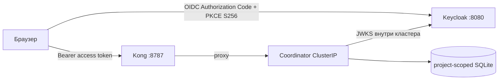

# Identity, проекты и API Gateway

Локальный Kubernetes-контур использует Keycloak для OIDC-входа и Kong Gateway как единственную публичную точку доступа к панели/API. Coordinator остаётся `ClusterIP` и не публикуется напрямую.

## Поток запроса



Keycloak realm `agat`, public client `agat-web` и локальный пользователь `agat-admin` импортируются при первом старте. Регистрация пользователей и Resource Owner Password flow отключены. Пароль демонстрационного администратора не хранится в Git:

```bash
npm run --silent k8s:keycloak-password
```

Для production удалите demo-user, подключите корпоративный IdP, включите TLS и запускайте оптимизированный Keycloak вместо `start-dev`. Realm import во время startup пропускает уже существующий realm; последующие изменения делайте через Admin API/Console или осознанную миграцию, а не удалением PVC без backup. Официальная модель импорта: [Keycloak Importing and exporting realms](https://www.keycloak.org/server/importExport).

## Роли

| Роль | Доступ |
|---|---|
| `admin` | проекты, scheduler, локальные worker-пулы, MCP emergency deny и все операции |
| `designer` | агенты, scoped credentials, MCP server/tool и policy preview/activation, prompt/dataset versions и promotion, черновики/публикация процессов, запуск и тест шага |
| `operator` | запуск/отмена, golden candidate/judge runs, test node и решения stage/MCP approval |
| `viewer` | read-only состояние проекта |
| `auditor` | read-only состояние, trace/артефакты и append-only human eval review |

Coordinator принимает только подписанные `RS256` access tokens, проверяет `kid`, подпись по JWKS, `iss`, `aud/azp`, `sub`, `exp`, `nbf` и наличие хотя бы одной роли АГАТ. JWKS кэшируется и перечитывается при неизвестном `kid`.

## Проекты

Заголовок `X-Agat-Project-Id` выбирает активный проект. Не-admin пользователь видит только ID из claim `agat_projects`; если claim отсутствует, используется `default`. Admin может создать проект из UI и работать с любым существующим проектом.

Agents, processes/versions/instances, runs/stages/events, credentials, MCP servers/policy versions/calls и artifacts фильтруются по проекту на backend. Выбор проекта из `localStorage` не считается полномочием: coordinator повторно проверяет access token и существование проекта. Emergency deny намеренно глобален для одного coordinator и доступен только `admin`.

Four-eyes использует неизменяемый OIDC claim `sub`, а не display name: один субъект не может подтвердить critical/destructive MCP call дважды. Legacy local mode представляет все admin-token запросы одним субъектом `local-admin`, поэтому для критических approvals нужны как минимум две отдельные OIDC-учётные записи.

## Kong

Kong работает в DB-less режиме по declarative config. В локальном профиле включены:

- `correlation-id` с `X-Request-ID`;
- ограничение body в 1 MiB;
- rate limit 600 запросов/минуту на IP;
- Prometheus metrics;
- длинный upstream timeout для SSE;
- полный запрет `/api/v1/internal` до catch-all route;
- выключенные Admin API, Manager и stream listeners.

Проверить, что localhost обслуживает именно Gateway, а не забытый host-процесс:

```bash
curl -sSI http://127.0.0.1:8787/api/v1/health
```

В ответе должны быть `Server: kong/...`, `X-Request-ID` и rate-limit headers. `npm run k8s:status` выполняет эту проверку автоматически. Declarative mode описан в [официальной документации Kong](https://developer.konghq.com/gateway/db-less-mode/).

Локальный rate limiter хранит counters в памяти одного Kong pod. Для нескольких replicas нужен Redis-backed policy; для внешней публикации также обязательны TLS, доверенная proxy-chain и отдельные сетевые политики.
