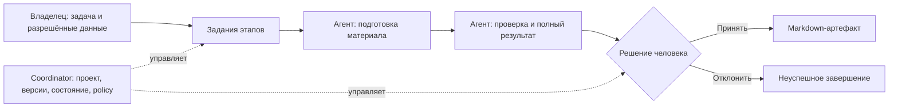

# Анализ процессов с участием LLM-агентов

## Вывод и границы

Agat уже содержит строительные блоки управляемых процессов. Требуется соединить их с понятными рабочими задачами: входом, ответственным, результатом и критериями проверки. Для текущей поставки выбраны **7 категорий и 13 процессов** из существующего продуктового плана. Их схемы создаются из каталога за один сценарий интерфейса, после выбора задачи и назначения ролей.

Дата: 11.09.2026. База исследования: рабочее дерево Agat, HEAD `de27ed0`, включая уже существовавшие незакоммиченные исследования от 08.09.2026. Аудитория — владелец продукта, проектировщик процесса, разработчик и владелец бизнес-результата. Разрешённый объём — анализ, документация и локальная реализация шаблонов/создания; deployment и изменение внешних систем не выполнялись. `/docs` означает директорию документации в корне этого репозитория.

Уверенность высокая для проверенного контракта кода, ограниченная для ценности процессов: интервью, фактические частоты операций, production-телеметрия, подтверждённые SLA и экономический эффект не предоставлены. Категории — проектное предложение для Agat, не универсальный отраслевой стандарт. Приоритеты наследуют предыдущий roadmap; это не новая оценка рынка.

## Что является процессом

**Процесс** имеет триггер, вход, последовательность/ветвление действий, владельца, результат и правило завершения. **LLM-агент** выполняет ограниченную роль: интерпретирует материалы, выбирает разрешённые инструменты или предлагает решение. **Модель** генерирует ответ; **workflow** управляет шагами; **шаблон** — переиспользуемое определение; **экземпляр** — один запуск с входом и версией. Эти объекты не взаимозаменяемы.

Система правил или SQL предпочтительнее LLM для известных формул, схем, идентификаторов и разрешений. LLM полезна там, где нужно понять неструктурированный текст, сопоставить неоднозначные сведения или сформулировать материал. В справочном описании Anthropic разделены предопределённые workflows и агенты с динамическим выбором действий; усложнение предлагается оценивать по результату, задержке и стоимости. Здесь это основание для ограниченной последовательной схемы, а не утверждение о превосходстве конкретной модели. [Первичный источник](https://www.anthropic.com/engineering/building-effective-agents).

## AS-IS до изменения

| Наблюдение | Подтверждение | Значение для задачи |
|---|---|---|
| Процессы состоят из 14 типов узлов, включая agent, transform, approval, artifact, условия, цикл, HTTP, fork/join, signal и subprocess | [process-engine.ts](../../apps/coordinator/src/process-engine.ts), [типы](../../apps/coordinator/src/types.ts) | Новая система оркестрации не нужна |
| Есть draft/published, неизменяемые опубликованные графы и экземпляры на версии | [database.ts](../../apps/coordinator/src/database.ts), [процессы](../processes.md) | Шаблон можно копировать в обычный draft |
| `isTemplate`/`templateId` копировали пользовательский шаблон; выбор в UI — простой select | [database.ts](../../apps/coordinator/src/database.ts), [ProcessDialogs.tsx](../../apps/web/src/components/ProcessDialogs.tsx) в исходном HEAD | Повторное использование было, но не было поставляемого каталога бизнес-процессов |
| Базовая схема привязывала collector/editor и цикл по слову «доработать» | [defaultProcessGraph](../../apps/coordinator/src/process-engine.ts) | Это пример графа, а не предметный бизнес-процесс и не объективная оценка качества |
| Есть 13 шаблонов **агентов** | [agentMarketplace.ts](../../apps/web/src/agentMarketplace.ts) | Установка роли не создаёт процесс, источники, коннекторы и eval |
| Поддерживаются управляемые интеграции, replay, Temporal, RAG и eval | [Process Builder](../process-builder-1.2.md), [RAG](../local-rag-and-memory.md), [eval](../golden-eval-prompt-registry.md) | Возможности платформы не доказывают готовность каждого бизнес-сценария |

Существующий отчёт приоритетов перечислял желаемые runnable packs. Последующее исследование использования уточнило, что упаковка, коннекторы, приёмка и пилот не завершены. Это разные уровни утверждения: **возможности платформы** и **готовность решения**. В этой работе прежние записи roadmap не объявляются закрытыми.

## Категории по результату

Один процесс получает одну основную категорию по своему результату. Например, сравнение поставщиков относится к аналитике, анализ условий договора — к документам, подготовка ответа на инцидент — к сервисным операциям. Домен «финансы» или «HR» и способ оркестрации задают дополнительные характеристики, не конкурирующие категории.

| Категория | Тип результата | Процессы | Где нужна LLM | Что проверяется вне LLM |
|---|---|---|---|---|
| Исследования и знания | Обоснованный ответ | Исследование → отчёт | Поиск связей, синтез, объяснение противоречий | Доступность/версии источников, review утверждений |
| Документы и согласования | Карточка/редакция документа | Документ → карточка; договор → замечания | Извлечение и интерпретация текста | Форматы, обязательные поля, применимый playbook, решение владельца |
| Аналитика и решения | Обоснование на данных | Отклонение → отчёт; финансовая сверка; сравнение КП | Интерпретация, классификация расхождений, объяснение выбора | Формулы, суммы, периоды, критерии и веса |
| Сервисные операции | Ответ/план разрешения события | IT-инцидент; поддержка; сигнал ИБ | Триаж, гипотезы, выбор из runbooks | Права, состояние системы, допустимость и результат действия |
| Разработка и изменения | Проверяемое изменение | Задача → пакет изменения | План, предложение кода, review | Diff, сборка, тесты, политика выпуска |
| Коммуникации и сопровождение | Согласуемый материал/план | RFP → предложение; онбординг/офбординг | Адаптация информации к контексту | Обязательства, адресат, матрица доступов, факт исполнения |
| Жизненный цикл агентов | Решение о версии | Eval → заключение о готовности | Разбор evidence и исключений | Версии, результаты испытаний, численные gates, полномочия выпуска |

Описание, требования и метрики каждой категории, а также полные паспорта процессов находятся в [генерируемом каталоге](./catalog.md).

## Отдельная ось: схема исполнения

| Схема | Применимость | Реализация Agat / ограничение |
|---|---|---|
| Последовательная подготовка → review | Заранее известны этапы и результат | Встроенные 13 шаблонов: transform → agent, затем approval → artifact |
| Маршрутизация по категории/состоянию | Разные обработчики обращений и документов | condition; строковая проверка LLM-текста не заменяет классификационный валидатор |
| Параллельные независимые проверки | Независимые аспекты сравнения или evidence | parallel_fork/join; критерий слияния и полноты обязателен |
| Доработка до порога с лимитом | Есть проверяемая рубрика и измеримая польза повторов | loop с пределом; исчерпание лимита не доказывает принятие результата |
| Ожидание человека/внешнего события | Approval, callback, длинная операция | approval/signal/wait; триггеры и права отдельно от определения роли |
| Контролируемая транзакция с восстановлением | Подтверждённое изменение внешней системы | HTTP/MCP, идемпотентность, compensation и сверка; не включено в базовые 13 схем |
| Динамическая команда специалистов | План зависит от результата исследования | specialist_team/A2A как отдельная настройка; требуется доказать выигрыш перед простой схемой |

Это проектное сопоставление с имеющимися узлами. Документация Microsoft рассматривает последовательную, конкурентную и другие схемы как способы координации агентов; выбор зависит от зависимостей и границ задачи. Она не задаёт бизнес-категории Agat. [Первичный источник](https://learn.microsoft.com/en-us/azure/architecture/ai-ml/guide/ai-agent-design-patterns).

Диаграмма описывает логический процесс. Инструкции роли не являются механизмом авторизации. Инструменты выбранного агента требуют собственного ограничения policy; последующее approval результата не предотвращает ранее разрешённый tool call.

## Решение и альтернативы

| Вариант | Польза | Ограничение | Решение |
|---|---|---|---|
| Ручной процесс + документы | Минимум изменений, полезный baseline | Все графы и назначения собираются вручную | Сохранить для сравнения качества/времени |
| Только инструкции и копируемые JSON-файлы | Быстро подготовить каталог | Нет удобного выбора, легко разойтись с UI | JSON оставить как генерируемый формат, добавить UI/API |
| Каталог в coordinator + копия в обычный draft | Один источник, версии, единый валидатор и существующий runtime | Нужна настройка реальных исполнителей/данных | **Выбрано для этой поставки** |
| Новый runtime и полностью автономные packs | Возможная автоматизация действий | Неизвестны коннекторы, права, eval и владельцы | За пределами задачи создания каталога; отдельные gates roadmap |

Решение обратимо: можно убрать вход в каталог, сохранив созданные обычные процессы и версии. Миграция БД не требуется. Стоимость и срок пилота пока не рассчитаны; количество шаблонов не служит метрикой внедрения.

## TO-BE и переход

**Реализовано локально:** каталог и паспорта, фильтрация, назначения, независимый draft, проверка версии запроса и проекта агента, provenance создания в событии, генерация документов. Схемы завершаются reviewed-материалом. Результаты проверок указаны в [validation.md](./validation.md).

**Целевой рабочий процесс:** назначить владельца → собрать допустимые реальные примеры → измерить ручной baseline → адаптировать ближайший шаблон → проверить инструменты и выходной контракт → выполнить eval → провести пилот → решить о расширении. Первым кандидатом остаётся `SP-102`, как в [исследовании использования](../product-usage-research-2026-09-08.md). Это предложение порядка, не подтверждение спроса.

**Стратегическое продолжение:** выполнить предметные части packs, в частности детерминированную schema validation, реальные коннекторы, внешние подтверждения результата и выпуск/rollback агента. Общая платформа может поддерживать соответствующий механизм, но его необходимо квалифицировать для выбранного сценария.

| Открытый факт / риск | Ответственный (роль, назначение ещё требуется) | Evidence и gate | Поведение до закрытия |
|---|---|---|---|
| Нет подтверждённой частоты/ценности операций | Product + владелец процесса | Ручной baseline и критерий успеха до пилота | Приоритет P0/P1/P2 остаётся гипотезой |
| Нет конкретных источников и владельца данных | Владелец данных | Реестр источников, ACL, актуальность, retention до реальных данных | Учебные данные / ограниченный отчёт |
| Нет подтверждения качества выбранной модели | Владелец eval | Представительный набор, отрицательные случаи, повторные trials до допуска | Не называть шаблон production-ready |
| Текстовый результат не проходит машинную схему | Разработчик интеграции | Валидатор и контрактные тесты до передачи результата в API | Ручная проверка; не интерпретировать текст как команду |
| Выбранному агенту уже разрешены write-tools | Администратор policy | Фактический allowlist и отказ запрещённых вызовов до пилота | Использовать профиль подготовки/чтения |
| Неизвестны владельцы и условия внешних операций | Владелец системы записи | Preview, approvals, idempotency, сверка, возврат до автоматизации записи | Согласованный план/материал, без обещания выполненного действия |
| Требования обслуживания/стоимости не определены | Runtime owner + владелец процесса | Пороги времени, затрат и эскалации до регулярного использования | Не заявлять SLA или экономию |

Остановка пилота: качество ниже согласованного порога, необъяснимые/запрещённые действия, потеря evidence, либо трудозатраты на review устраняют выигрыш перед baseline. Численные пороги выбираются на реальных задачах до пилота, не выводятся из общей популярности LLM.

## Источники и provenance

Все внешние страницы ниже открыты 11.09.2026. Наблюдения AS-IS проверены по локальному коду; текущие ссылки на изменённые файлы показывают уже новую реализацию, исходный срез доступен в HEAD `de27ed0`.

| ID | Источник | Что подтверждает / ограничение |
|---|---|---|
| SRC-01 | [Движок](../../apps/coordinator/src/process-engine.ts), [store](../../apps/coordinator/src/database.ts), [контракты](../../apps/coordinator/src/types.ts) | Реализованные узлы, draft/publish, копирование, видимость агента; не состояние production |
| SRC-02 | [Диалоги](../../apps/web/src/components/ProcessDialogs.tsx), [готовность](../../apps/web/src/processReadiness.ts), [каталог агентов](../../apps/web/src/agentMarketplace.ts) | Пользовательский путь и различие agent/process template |
| SRC-03 | [Приоритеты](../agent-process-priorities-2026.md), [roadmap](../roadmap.md) | Состав 13 процессов и исходные приоритеты; экспертный план |
| SRC-04 | [Исследование 08.09](../product-usage-research-2026-09-08.md) | Наблюдаемые пробелы и первый пилот; не adoption analytics |
| SRC-05 | [Anthropic: Building effective agents](https://www.anthropic.com/engineering/building-effective-agents) | Различие workflow/agent и выбор сложности; историческая статья, продуктовые детали не используются |
| SRC-06 | [Microsoft: Agent orchestration patterns](https://learn.microsoft.com/en-us/azure/architecture/ai-ml/guide/ai-agent-design-patterns) | Паттерны координации; не классификатор бизнес-процессов |
| SRC-07 | [Anthropic: Demystifying evals](https://www.anthropic.com/engineering/demystifying-evals-for-ai-agents) | Различие task/trial/trajectory/outcome, несколько способов оценки; не доказательство качества Agat |
