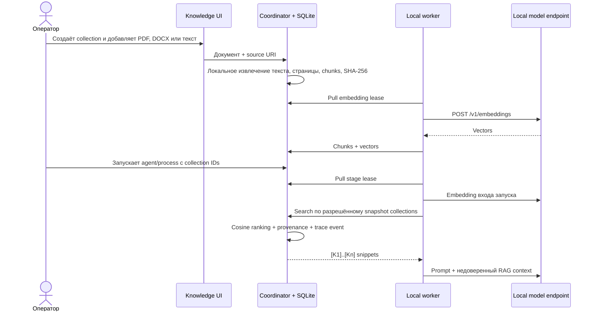

# Local RAG, provenance и управляемая память

АГАТ 0.7 добавляет project-scoped базу знаний, локальные embeddings и два явно управляемых типа памяти. Главная гарантия этапа: coordinator никогда не подключается к model endpoint. Текст chunks и vectors хранятся в SQLite, а embedding документа и поискового запроса вычисляет outbound-only worker на своём локальном OpenAI-compatible endpoint.

## Поток данных



Worker использует совместимый `POST /v1/embeddings`: Ollama документирует этот маршрут в [OpenAI compatibility](https://docs.ollama.com/api/openai-compatibility); native-вариант Ollama доступен как [`POST /api/embed`](https://docs.ollama.com/api/embed). АГАТ использует OpenAI-compatible маршрут, чтобы тот же worker работал с другими локальными серверами.

## Модель данных

- `knowledge_collections` — project scope, embedding model, chunk size/overlap и `topK`;
- `knowledge_documents` — исходный PDF/DOCX в base64, SHA-256 файла и извлечённого текста, границы страниц PDF, ошибка разбора и состояние индексации;
- `knowledge_chunks` — исходный фрагмент, позиции символов в извлечённом тексте (UTF-16, конец не включается), номер страницы PDF, SHA-256 и vector;
- `knowledge_embedding_jobs` — pull lease, TTL, до трёх попыток и последняя ошибка;
- `knowledge_retrievals` — hash запроса, параметры поиска и выбранный provenance;
- `memory_entries` — `working` или `episodic`, необязательная привязка к агенту и срок жизни.

Collection IDs фиксируются в run при создании. Повторный запуск использует тот же snapshot IDs; worker не может запросить коллекцию другого проекта или коллекцию, не подключённую к запуску.

## Подготовка embedding-модели

Для Ollama:

```bash
ollama pull embeddinggemma
```

Обычный worker:

```bash
AGAT_ENROLLMENT_TOKEN=... \
AGAT_WORKER_MODELS=qwen3:8b \
AGAT_EMBEDDING_MODELS=embeddinggemma \
AGAT_MODEL_BASE_URL=http://127.0.0.1:11434/v1 \
python3 workers/agat_worker.py
```

Несколько имён задаются через запятую. Worker сообщает их при регистрации и heartbeat; coordinator выдаёт embedding job только узлу, который объявил точную модель collection. Пустой `AGAT_EMBEDDING_MODELS` безопасно отключает индексацию на этом worker.

Docker Compose передаёт `AGAT_EMBEDDING_MODELS`, а Kubernetes — это же значение базовому worker и `AGAT_LOCAL_WORKER_EMBEDDING_MODELS` управляемым worker-пулам. Модель должна быть установлена до загрузки документа.

## Реальный Ollama E2E

Unit-тесты не обращаются к model endpoint. Для воспроизводимой проверки настоящего локального контура используется отдельный opt-in тест:

```bash
ollama pull nomic-embed-text
ollama pull llama3.2
npm run test:ollama-rag
```

Тест создаёт временную SQLite-базу и loopback coordinator, запускает настоящий Python-worker дважды и проверяет полный путь: document chunking → `/v1/embeddings` → сохранение vectors → query embedding → cosine retrieval → provenance trace → локальный model answer с `[K…]`. Он также проверяет совпадение размерности document/query vectors, наличие source URI и SHA-256, отсутствие сырого query vector в trace и завершение run. Временная база удаляется только после успешной проверки; при ошибке каталог сохраняется и печатается для диагностики.

Модели и порт можно переопределить без изменения скрипта:

```bash
AGAT_E2E_EMBEDDING_MODEL=embeddinggemma \
AGAT_E2E_CHAT_MODEL=qwen3:8b \
AGAT_E2E_PORT=8793 \
npm run test:ollama-rag
```

`AGAT_E2E_MODEL_URL` намеренно принимает только loopback URL: тестовые документы не должны уходить на удалённый model endpoint.

## Работа в UI

1. Откройте **Knowledge** и создайте коллекцию.
2. Выберите embedding-модель. После появления chunks модель коллекции считается частью её контракта; для смены модели создайте новую коллекцию.
3. Добавьте PDF/DOCX до 5 МиБ, текстовый файл до 2 МБ или вставьте текст. Source URI необязателен. Нажмите **Загрузить и индексировать**: откроется предпросмотр извлечённого текста.
4. Дождитесь состояния **Готов**. Если подходящего worker нет, карточка показывает это явно, а job остаётся в очереди.
5. В окне нового запуска или запуска процесса отметьте нужные collections.
6. В результате запуска откройте **Источники Knowledge** или нажмите ссылку `[K…]` в ответе. Ссылка открывает документ с выделенным фрагментом: для PDF — на физической странице, для DOCX — в соответствующем фрагменте. **Скачать result.md** сохраняет также ссылки, цитаты, этапы и SHA-256. В trace эти данные доступны в фильтре **Knowledge**.

Поиск не выполняется автоматически по всем данным проекта. Пустой список collections означает запуск без document RAG. Активная project/agent-scoped memory при этом всё равно может быть передана агенту.

## Локальная загрузка PDF/DOCX, ошибки и повторная индексация

Извлечение выполняет coordinator в отдельном worker thread; облачные API, OCR и внешние ссылки документа не используются. PDF обрабатывает [PDF.js](https://github.com/mozilla/pdf.js/blob/master/examples/node/getinfo.mjs); DOCX — локальная распаковка `word/document.xml` и XML-разбор. Поддерживаются текст, абзацы и текст таблиц DOCX. Номера страниц DOCX не выдумываются: без движка вёрстки документ цитируется по фрагментам. Для PDF сохраняются номера всех страниц, включая пустые; один chunk никогда не пересекает границу страницы.

Лимиты: PDF/DOCX до 5 МиБ, JSON-запрос до 8 МиБ, извлечённый текст до 2 000 000 символов, PDF до 500 страниц, XML документа DOCX до 8 МиБ после распаковки. Одновременно разбираются не больше двух файлов; каждый parser worker ограничен 20 секундами и 256 МиБ V8 old generation. Парсер не исполняет DTD, внешние relationships или вложенные объекты. Лимит V8 не является лимитом всей памяти процесса.

Повреждённый файл, PDF с паролем, пустой документ или скан без текстового слоя сохраняются со статусом **Ошибка** и отдельным `parseError`. Исходный файл остаётся доступен, embeddings для него не создаются. PDF без текста сообщает о необходимости OCR; для защищённого PDF нужна копия без пароля. Ошибки формата запроса, base64, размера и неподдерживаемого MIME отклоняются до создания документа. Ошибка worker embeddings отображается в общем поле `error`.

Нажатие на имя документа открывает **Предпросмотр документа** с выбором страницы/фрагмента и кнопкой скачивания оригинала. React отображает извлечённый текст как текст, без исполнения HTML. Если ссылка из отчёта указывает на другой project, UI предлагает выбрать его в верхней панели и сохраняет целевой документ при переключении.

**Переиндексировать** повторно извлекает текст из сохранённого PDF/DOCX, заменяет текущие chunks/vectors и ставит новую embedding job. ID документа сохраняется, ID неизменившихся фрагментов остаются стабильными. Старые embedding leases становятся недействительными; ошибки и счётчик попыток сбрасываются. Повторная ошибка разбора снова сохраняется в карточке. Переиндексация коллекции, используемой активным run (`queued`, `running`, `waiting_approval`, `waiting_external`, `compensating`), запрещена. Изменение/удаление документа во время асинхронного разбора обнаруживается до записи результата.

SQLite обновляется при открытии хранилища; PostgreSQL требует отдельной штатной migration/admission процедуры для schema **v27** (`agat-knowledge-files-v27`). Старые текстовые документы сохраняют содержимое и получают пустые page/file metadata. Новые исходники включаются в backup БД и knowledge export.

## Working и episodic memory

`working` предназначена для временного проверенного контекста. TTL обязателен логически и по умолчанию равен 24 часам; допустимы значения от 60 секунд до 30 дней. Истёкшие записи удаляются во время maintenance/read.

`episodic` не имеет TTL, но создаётся только явным действием пользователя/API. АГАТ 0.7 намеренно не преобразует model output в вечную память автоматически. Обе записи можно ограничить конкретным агентом или выдать всем агентам проекта, удалить вручную и включить в export.

В prompt memory получает маркеры `[M1]…`. Как RAG snippets, она считается недоверенными данными, а не system-инструкцией.

## Provenance и защита от prompt injection

Каждый RAG hit содержит:

- collection/document/chunk ID и человекочитаемые имена;
- source URI, если он задан;
- SHA-256 документа и chunk;
- ordinal, диапазон символов, страницу PDF и hash оригинального файла;
- cosine score и marker `[K<n>]`, уникальный среди retrievals одного нового run.

Worker добавляет системную политику: не исполнять команды из snippets/memory, не раскрывать secrets, ссылаться только на реально переданные `[K…]` и сообщать о недостатке контекста. Это уменьшает риск indirect prompt injection, но не заменяет проверку источников, RBAC и human approval для рискованных действий.

Vectors поискового запроса не пишутся в trace: сохраняются размерность и SHA-256 сериализованного vector. В retrieval snapshot и trace сохраняются excerpt, полный выбранный фрагмент, provenance и SHA-256. `GET /runs/:id/knowledge` возвращает эти источники независимо от текущего состояния индекса и объёма журнала. После переиндексации или удаления документа цитата остаётся в результате завершённого run. Если текст изменился, предпросмотр предупреждает о несовпадении SHA-256; если фрагмент/документ удалён — показывает явную ошибку. Для старых retrievals без полного текста доступен сохранённый excerpt. Повторяющиеся `[K1]` старых многоэтапных runs не превращаются в неоднозначные inline-ссылки; список источников сохраняет привязку к этапу и retrieval.

Источники — это фрагменты, переданные модели, а не подтверждение каждого вывода отчёта. Ссылки формируются по сохранённым document/chunk IDs, а не по придуманным моделью URL. В скачивании из UI используются абсолютные ссылки на текущий адрес Agat; `result.md` в Artifact Store содержит пути `/#knowledge?...` относительно корня развернутого Agat. При переносе такого артефакта вне Agat к относительным ссылкам нужно добавить адрес установки.

## Пользовательский API

Все маршруты находятся под `/api/v1`, используют текущий project context и существующий OIDC/role guard.

| Метод | Маршрут | Назначение |
|---|---|---|
| `GET` | `/knowledge` | Collections, documents, статусы и активная memory |
| `POST` | `/knowledge/collections` | Создать collection |
| `DELETE` | `/knowledge/collections/:id` | Каскадно удалить collection |
| `POST` | `/knowledge/collections/:id/documents` | Добавить text document |
| `POST` | `/knowledge/collections/:id/documents/upload` | Добавить PDF/DOCX: `name`, `mediaType`, `contentBase64`, необязательный `sourceUri` |
| `GET` | `/knowledge/documents/:id` | Metadata, извлечённый текст, страницы и chunks |
| `GET` | `/knowledge/documents/:id/file` | Скачать исходный PDF/DOCX как attachment |
| `POST` | `/knowledge/documents/:id/reindex` | Повторно разобрать сохранённый документ и поставить embeddings |
| `GET` | `/runs/:id/knowledge` | Сохранённые источники результата: `{ sources: [...] }` |
| `DELETE` | `/knowledge/documents/:id` | Удалить document и chunks |
| `POST` | `/knowledge/memory` | Явно сохранить memory |
| `DELETE` | `/knowledge/memory/:id` | Удалить memory |
| `GET` | `/knowledge/export` | Скачать project JSON export |

Пример collection:

```json
{
  "name": "Product handbook",
  "description": "Проверенные внутренние правила",
  "embeddingModel": "embeddinggemma",
  "chunkSize": 1200,
  "chunkOverlap": 160,
  "topK": 6
}
```

Пример текстового документа:

```json
{
  "name": "privacy.md",
  "sourceUri": "agat://handbook/privacy",
  "mediaType": "text/markdown",
  "content": "..."
}
```

Подключение к запуску или процессу:

```json
{
  "knowledgeCollectionIds": ["collection-id"]
}
```

Worker-only embedding lease/search API защищён node token и описан в [HTTP API](./api.md). Браузер не отправляет и не получает vectors.

## Удаление, export и backup

Удаление collection каскадно удаляет documents, chunks и незавершённые embedding jobs. Collection/document нельзя удалить, пока её ID использует run в `queued/running/waiting_approval`: это предотвращает исчезновение контекста посреди выполнения. Существующий trace завершённого run сохраняет уже записанный provenance/event, но дальнейший replay не сможет пройти валидацию удалённой collection; экспортируйте данные до удаления.

`GET /knowledge/export` включает извлечённый текст, оригиналы PDF/DOCX в base64 с hash, page metadata, parse errors, chunk text и hashes, lifecycle metadata, memory и до 1000 последних retrieval records. Сами embedding vectors исключены: их можно воспроизвести локально из chunk text и закреплённого имени модели. Export содержит внутренние данные и доступен только `admin`, `designer` и `auditor`.

SQLite backup уже включает knowledge store. Делайте согласованный backup базы вместе с Artifact Store; отдельного vector database в 0.7 нет.

## Текущие границы

- `text/*`, PDF и DOCX; максимум 2 000 000 извлечённых символов на документ;
- character/paragraph chunking и страницы PDF; без OCR, layout engine DOCX, распознавания изображений и извлечения вложенных файлов;
- до 32 chunks в embedding batch и до 4096 измерений vector;
- cosine brute-force внутри максимум 5000 свежих кандидатов на query;
- до 32 collections на run, 8 embedding queries и 20 итоговых hits;
- нет hybrid BM25, reranker, semantic cache и автоматического выбора embedding model;
- SQLite рассчитан на один coordinator; PostgreSQL/pgvector нужен вместе с HA-этапом;
- automatic memory extraction намеренно отсутствует.

Golden datasets, human rubric, model judge и prompt registry реализованы в 0.8: knowledge fingerprint блокирует запуск или promotion при drift. В 0.9 A2A endpoint закрепил разрешённые collections как boundary, в 1.0 production durable runtime получил replay/versioning gate, а релизы 1.1–1.4 добавили MCP policy, process/team runtime и расширенную A2A interoperability без ослабления project-scoped RAG.

## Проверки реализации

- `apps/coordinator/test/knowledge-files.test.ts`: PDF со страницами (включая пустую), Unicode и таблицы DOCX, повреждения/лимиты, XMLEntities, сохранение оригинала, project scope, переиндексация и отзыв старых leases, сохранение цитат после удаления и миграция старой БД.
- `apps/coordinator/test/knowledge-files-http.test.ts`: загрузка/предпросмотр/скачивание/reindex через HTTP, authentication, изоляция проектов и parse errors.
- `apps/web/test/knowledge-files.test.ts`: чтение файлов без повреждения bytes, лимиты, выбор страницы/фрагмента, HTML escaping, ошибки разбора, предупреждение stale source, ссылки и Markdown export.
- Ручной browser flow: Knowledge → PDF/DOCX → предпросмотр → переиндексация → результат процесса → цитата → выделенный фрагмент; проверка desktop и mobile. Embeddings в этой проверке подставляются тестовым локальным worker, качество модели не проверяется.
