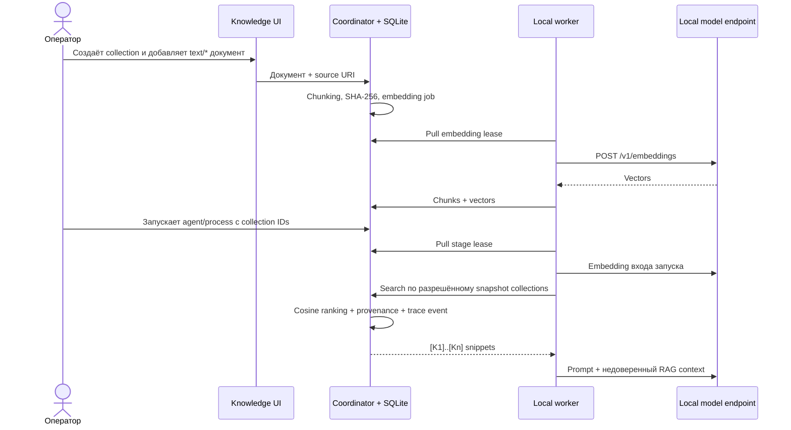

# Local RAG, provenance и управляемая память

АГАТ 0.7 добавляет project-scoped базу знаний, локальные embeddings и два явно управляемых типа памяти. Главная гарантия этапа: coordinator никогда не подключается к model endpoint. Текст chunks и vectors хранятся в SQLite, а embedding документа и поискового запроса вычисляет outbound-only worker на своём локальном OpenAI-compatible endpoint.

## Поток данных



Worker использует совместимый `POST /v1/embeddings`: Ollama документирует этот маршрут в [OpenAI compatibility](https://docs.ollama.com/api/openai-compatibility); native-вариант Ollama доступен как [`POST /api/embed`](https://docs.ollama.com/api/embed). АГАТ использует OpenAI-compatible маршрут, чтобы тот же worker работал с другими локальными серверами.

## Модель данных

- `knowledge_collections` — project scope, embedding model, chunk size/overlap и `topK`;
- `knowledge_documents` — источник, media type, SHA-256 и состояние индексации;
- `knowledge_chunks` — исходный фрагмент, позиции символов, SHA-256 и vector;
- `knowledge_embedding_jobs` — pull lease, TTL, до трёх попыток и последняя ошибка;
- `knowledge_retrievals` — hash запроса, параметры поиска и выбранный provenance;
- `memory_entries` — `working` или `episodic`, необязательная привязка к агенту и срок жизни.

Collection IDs фиксируются в run при создании. Повторный запуск использует тот же snapshot IDs; worker не может запросить коллекцию другого проекта или коллекцию, не подключённую к запуску.

## Подготовка embedding-модели

Для Ollama:

```bash
ollama pull embeddinggemma
```

Обычный worker:

```bash
AGAT_ENROLLMENT_TOKEN=... \
AGAT_WORKER_MODELS=qwen3:8b \
AGAT_EMBEDDING_MODELS=embeddinggemma \
AGAT_MODEL_BASE_URL=http://127.0.0.1:11434/v1 \
python3 workers/agat_worker.py
```

Несколько имён задаются через запятую. Worker сообщает их при регистрации и heartbeat; coordinator выдаёт embedding job только узлу, который объявил точную модель collection. Пустой `AGAT_EMBEDDING_MODELS` безопасно отключает индексацию на этом worker.

Docker Compose передаёт `AGAT_EMBEDDING_MODELS`, а Kubernetes — это же значение базовому worker и `AGAT_LOCAL_WORKER_EMBEDDING_MODELS` управляемым worker-пулам. Модель должна быть установлена до загрузки документа.

## Реальный Ollama E2E

Unit-тесты не обращаются к model endpoint. Для воспроизводимой проверки настоящего локального контура используется отдельный opt-in тест:

```bash
ollama pull nomic-embed-text
ollama pull llama3.2
npm run test:ollama-rag
```

Тест создаёт временную SQLite-базу и loopback coordinator, запускает настоящий Python-worker дважды и проверяет полный путь: document chunking → `/v1/embeddings` → сохранение vectors → query embedding → cosine retrieval → provenance trace → локальный model answer с `[K…]`. Он также проверяет совпадение размерности document/query vectors, наличие source URI и SHA-256, отсутствие сырого query vector в trace и завершение run. Временная база удаляется только после успешной проверки; при ошибке каталог сохраняется и печатается для диагностики.

Модели и порт можно переопределить без изменения скрипта:

```bash
AGAT_E2E_EMBEDDING_MODEL=embeddinggemma \
AGAT_E2E_CHAT_MODEL=qwen3:8b \
AGAT_E2E_PORT=8793 \
npm run test:ollama-rag
```

`AGAT_E2E_MODEL_URL` намеренно принимает только loopback URL: тестовые документы не должны уходить на удалённый model endpoint.

## Работа в UI

1. Откройте **Knowledge** и создайте коллекцию.
2. Выберите embedding-модель. После появления chunks модель коллекции считается частью её контракта; для смены модели создайте новую коллекцию.
3. Добавьте `text/*` файл до 2 МБ или вставьте текст, укажите стабильный source URI.
4. Дождитесь состояния **Готов**. Если подходящего worker нет, карточка показывает это явно, а job остаётся в очереди.
5. В окне нового запуска или запуска процесса отметьте нужные collections.
6. В trace откройте фильтр **Knowledge**: событие `knowledge.retrieved` содержит `[K1]…`, score, document/chunk IDs, позиции и SHA-256.

Поиск не выполняется автоматически по всем данным проекта. Пустой список collections означает запуск без document RAG. Активная project/agent-scoped memory при этом всё равно может быть передана агенту.

## Working и episodic memory

`working` предназначена для временного проверенного контекста. TTL обязателен логически и по умолчанию равен 24 часам; допустимы значения от 60 секунд до 30 дней. Истёкшие записи удаляются во время maintenance/read.

`episodic` не имеет TTL, но создаётся только явным действием пользователя/API. АГАТ 0.7 намеренно не преобразует model output в вечную память автоматически. Обе записи можно ограничить конкретным агентом или выдать всем агентам проекта, удалить вручную и включить в export.

В prompt memory получает маркеры `[M1]…`. Как RAG snippets, она считается недоверенными данными, а не system-инструкцией.

## Provenance и защита от prompt injection

Каждый RAG hit содержит:

- collection/document/chunk ID и человекочитаемые имена;
- source URI, если он задан;
- SHA-256 документа и chunk;
- ordinal и диапазон символов;
- cosine score и стабильный marker `[K<n>]`.

Worker добавляет системную политику: не исполнять команды из snippets/memory, не раскрывать secrets, ссылаться только на реально переданные `[K…]` и сообщать о недостатке контекста. Это уменьшает риск indirect prompt injection, но не заменяет проверку источников, RBAC и human approval для рискованных действий.

Vectors поискового запроса не пишутся в trace: сохраняются размерность и SHA-256 сериализованного vector. В trace попадает только короткий excerpt каждого выбранного chunk; полный текст уже хранится в project-scoped knowledge store.

## Пользовательский API

Все маршруты находятся под `/api/v1`, используют текущий project context и существующий OIDC/role guard.

| Метод | Маршрут | Назначение |
|---|---|---|
| `GET` | `/knowledge` | Collections, documents, статусы и активная memory |
| `POST` | `/knowledge/collections` | Создать collection |
| `DELETE` | `/knowledge/collections/:id` | Каскадно удалить collection |
| `POST` | `/knowledge/collections/:id/documents` | Добавить text document |
| `DELETE` | `/knowledge/documents/:id` | Удалить document и chunks |
| `POST` | `/knowledge/memory` | Явно сохранить memory |
| `DELETE` | `/knowledge/memory/:id` | Удалить memory |
| `GET` | `/knowledge/export` | Скачать project JSON export |

Пример collection:

```json
{
  "name": "Product handbook",
  "description": "Проверенные внутренние правила",
  "embeddingModel": "embeddinggemma",
  "chunkSize": 1200,
  "chunkOverlap": 160,
  "topK": 6
}
```

Пример документа:

```json
{
  "name": "privacy.md",
  "sourceUri": "agat://handbook/privacy",
  "mediaType": "text/markdown",
  "content": "..."
}
```

Подключение к запуску или процессу:

```json
{
  "knowledgeCollectionIds": ["collection-id"]
}
```

Worker-only embedding lease/search API защищён node token и описан в [HTTP API](./api.md). Браузер не отправляет и не получает vectors.

## Удаление, export и backup

Удаление collection каскадно удаляет documents, chunks и незавершённые embedding jobs. Collection/document нельзя удалить, пока её ID использует run в `queued/running/waiting_approval`: это предотвращает исчезновение контекста посреди выполнения. Существующий trace завершённого run сохраняет уже записанный provenance/event, но дальнейший replay не сможет пройти валидацию удалённой collection; экспортируйте данные до удаления.

`GET /knowledge/export` включает исходный текст документов, chunk text и hashes, lifecycle metadata, memory и до 1000 последних retrieval records. Сами embedding vectors исключены: их можно воспроизвести локально из chunk text и закреплённого имени модели. Export содержит внутренние данные и доступен только `admin`, `designer` и `auditor`.

SQLite backup уже включает knowledge store. Делайте согласованный backup базы вместе с Artifact Store; отдельного vector database в 0.7 нет.

## Осознанные границы 0.7

- только `text/*`, максимум 2 000 000 символов на документ;
- character/paragraph chunking, без PDF/OCR и структурных loaders;
- до 32 chunks в embedding batch и до 4096 измерений vector;
- cosine brute-force внутри максимум 5000 свежих кандидатов на query;
- до 32 collections на run, 8 embedding queries и 20 итоговых hits;
- нет hybrid BM25, reranker, semantic cache и автоматического выбора embedding model;
- SQLite рассчитан на один coordinator; PostgreSQL/pgvector нужен вместе с HA-этапом;
- automatic memory extraction намеренно отсутствует.

Golden datasets, human rubric, model judge и prompt registry реализованы в 0.8: knowledge fingerprint блокирует запуск или promotion при drift. В 0.9 A2A endpoint закрепил разрешённые collections как boundary, в 1.0 production durable runtime получил replay/versioning gate, а релизы 1.1–1.4 добавили MCP policy, process/team runtime и расширенную A2A interoperability без ослабления project-scoped RAG.
