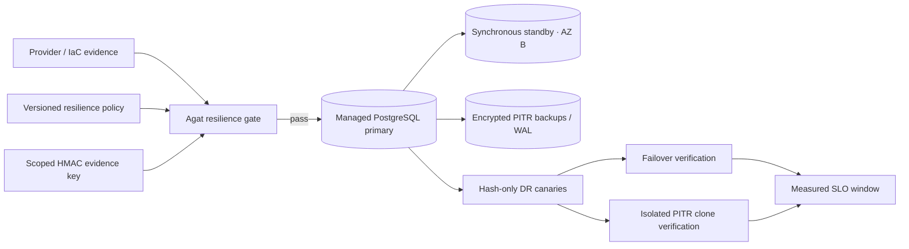

# Managed PostgreSQL: multi-AZ, PITR и измеримый DR

## Решение и границы scope

Production HA-cell использует внешний managed PostgreSQL 17 как единственный state authority. Release gate принимает endpoint только при свежем provider evidence о нескольких availability zones, хотя бы одном здоровом synchronous standby, automatic failover, private encrypted endpoint и непрерывном PITR. Репозиторий не изображает облачного control plane: provision/failover/restore выполняет выбранный managed provider, а Agat независимо проверяет topology, application schema, фактические canaries и измеренные RPO/RTO/SLO.

Этап включает executable contract, DR canaries, введённые schema v22 и сохранённые в текущей v25, HMAC-sealed evidence, Kubernetes preflight Job и физический disposable rehearsal. Он не объявляет конкретный production cluster квалифицированным без provider snapshot и выполненных именно на нём restore/failover drills. Такой cluster остаётся deployment gate, а не скрытым допущением релиза.

## AS-IS

После этапа DDL-free runtime Agat умел запускать несколько coordinator replicas, применять schema отдельной ролью и проверять connection budget. Docker Desktop всё ещё имел один PostgreSQL pod/PVC в одном failure domain. Не существовало machine-readable требования к managed topology, PITR freshness, restore boundary, primary change, RPO/RTO или SLO approval; локальный `haReady` отражал replicas coordinator, но не availability database.

## TO-BE architecture



`deploy/k8s/production/postgres-resilience-policy.json` является canonical policy. `apps/coordinator/src/postgres-resilience.ts` валидирует provider snapshot и database observation, создаёт hash-only checkpoints, доказывает failover/restore и подписывает reports HMAC-SHA256. Kubernetes Job `agat-postgres-resilience-gate-v25` получает только runtime URL, CA, provider evidence и отдельный evidence key; admin/migration/tenant credentials ему не нужны.

## Source и evidence register

| Источник | Версия / дата проверки | Claim scope |
|---|---|---|
| `apps/coordinator/src/postgres-resilience.ts` | evidence schema v1 | topology/PITR/SLO policy, checkpoint и verification semantics |
| `deploy/k8s/production/postgres-resilience-policy.json` | policy v1 | production objectives и approval roles |
| `scripts/test-postgres-physical-dr.sh` | PostgreSQL 17.6 | actual streaming promotion и named restore-point PITR rehearsal |
| `agat_schema_migrations` | schema v25 | runtime manifest/admission contract |
| `agat_dr_canaries` | introduced v22, current schema v25 | global, tenant-inaccessible restore/failover checkpoints |
| [PostgreSQL 17 continuous archiving и PITR](https://www.postgresql.org/docs/17/continuous-archiving.html) | проверено 2026-08-30 | base backup + непрерывная WAL sequence, recovery target и timelines |
| [PostgreSQL 17 recovery targets](https://www.postgresql.org/docs/17/runtime-config-wal.html#RUNTIME-CONFIG-WAL-RECOVERY-TARGET) | проверено 2026-08-30 | named/time/LSN target, target action и timeline |
| [PostgreSQL 17 replication monitoring](https://www.postgresql.org/docs/17/monitoring-stats.html#MONITORING-PG-STAT-REPLICATION-VIEW) | проверено 2026-08-30 | sender state и write/flush/replay observations |
| [PostgreSQL 17 standby operation](https://www.postgresql.org/docs/17/hot-standby.html) | проверено 2026-08-30 | recovery/read-only standby boundary |

PostgreSQL указывает, что logical `pg_dump` не заменяет physical base backup для WAL replay/PITR. Поэтому production evidence принимает только provider PITR, а локальный drill использует `pg_basebackup`, архив WAL и `recovery.signal`, не logical dump.

## Архитектурное решение и альтернативы

| Вариант | Плюсы | Ограничения | Решение |
|---|---|---|---|
| PostgreSQL pod/PVC в application cluster | простой local bootstrap | один node/storage/control-plane failure domain, нет managed PITR SLA | только developer/staging |
| встроить один cloud-specific provisioner | автоматизация одного provider | lock-in, новые cloud credentials в coordinator, ложная переносимость | отклонён |
| provider-neutral evidence contract + provider-managed lifecycle | не передаёт cloud admin authority приложению; одинаковые acceptance gates | IaC adapter обязан сформировать truthful snapshot | выбран |
| application active-active writes в двух регионах | потенциально низкий regional RTO | split-brain, конфликт durable state и residency | отклонён; рассматривается только single-authority DR |

Решение пересматривается, если provider не выдаёт operation identity/timestamps, primary instance identity или latest restorable point. Такой сервис нельзя «допустить по документу»: требуется read-only adapter с эквивалентным snapshot, попадающим в HMAC-sealed final report, либо другой managed offering.

## Production policy и утверждение SLO

Canonical objectives:

| Objective | Значение | Как измеряется |
|---|---:|---|
| RPO | `≤ 60 s` | разница incident/recovery target и последнего доказанного checkpoint; canary обязан присутствовать |
| planned failover RTO | `≤ 300 s` | provider operation `completedAt - startedAt`, затем read/write и primary-change verification |
| isolated PITR restore RTO | `≤ 14 400 s` | создание clone до успешной schema/invariant/write verification |
| monthly database availability | `≥ 99.9%` | `1 - unavailableSeconds / eligibleSeconds`, окно не короче 672 часов |
| PITR retention | `≥ 168 h` | provider oldest/latest restorable points и declared retention |
| topology evidence freshness | `≤ 900 s` | signed release report включает exact provider snapshot hash |
| DR drill freshness | `≤ 90 days` | SLO report ссылается на passing failover и restore report hashes |

SLO не считается утверждённым одной записью в Git. Provider evidence должно ссылаться на exact policy SHA-256 и содержать минимум два разных OIDC subject: роли `service-owner` и `platform-operations`. Один человек с двумя ролями не проходит distinct-subject gate. Новый policy digest требует нового approval change record.

Canonical digest для change record выводится parser’ом, а не hash сырого форматирования JSON:

```bash
npm run fleet:postgres-resilience -- policy-digest \
  --policy deploy/k8s/production/postgres-resilience-policy.json
```

Availability не вычитает planned maintenance: пользовательский impact остаётся в error budget. `requestSuccessPercent` сохраняется как диагностический показатель, но database availability и DR objectives проверяются отдельно, чтобы большой объём успешных запросов не скрыл длительное полное отключение.

## Managed topology contract

Provider/IaC adapter формирует bounded JSON без credentials:

- stable provider/service/cluster/primary instance identities;
- region, residency domain, primary zone и distinct zone list;
- PostgreSQL major version;
- automatic failover, synchronous standby и число healthy standbys;
- PITR flag, configured retention, oldest/latest restorable points и last successful backup;
- TLS `verify-full`, encryption at rest и `publicEndpoint=false`;
- exact SLO policy digest, change ID и approver subjects/roles;
- для drill — immutable operation ID, source/target cluster и primary identities, start/completion и recovery target.

Gate дополнительно наблюдает сам runtime endpoint: read-write primary, TLS session, data checksums, `wal_level`, durable `synchronous_commit`, DDL-free role, schema v25/admission marker и `agat_dr_canaries`. Provider assertion не может заменить database observation, а database observation не может доказать provider topology — нужны обе стороны.

`AGAT_DR_ALLOW_INSECURE_LOCAL=true` существует только для disposable CLI integration и принимается лишь для `localhost`, `127.0.0.1` или `::1`. Report сохраняет фактический `databaseObservation.tls=false`; production Job не задаёт override и всегда использует `verify-full` с mounted CA.

## Evidence integrity и security boundary

`AGAT_DR_EVIDENCE_KEY_PATH` указывает на отдельный файл минимум 32 bytes без world permissions. Kubernetes Secret проецируется `0440` в pod с dedicated `fsGroup`; coordinator Deployment и provider adapter не получают этот key одновременно без явного operational design. Reports содержат canonical payload SHA-256 и HMAC-SHA256, но не URLs, passwords, CA private material или canary nonce.

`agat_dr_canaries` хранит UUID, kind, region/residency, timestamp и SHA-256 случайного payload. Runtime system role может читать/писать таблицу; tenant role не получает ни одного privilege. Restore/failover report связывает provider evidence hash, checkpoint hashes, schema observation и objectives. Изменение JSON после подписи обнаруживается до SLO evaluation.

HMAC обеспечивает integrity внутри operational trust domain, но не non-repudiation между организациями. Если evidence покидает этот domain, envelope заменяется внешней KMS asymmetric signature без ослабления payload schema.

## Release preflight runbook

1. Provider/IaC создаёт свежий evidence JSON и SLO approval для exact policy digest.
2. Runtime schema v25 уже применена отдельной migration Job; coordinator replicas ещё не получают traffic.
3. Создайте отдельный evidence key и Kubernetes Secrets `agat-postgres-secrets`, `agat-postgres-resilience-evidence`, ConfigMap `agat-production-cell`.
4. Примените production gate и сохраните immutable Job log/HMAC report в change evidence.
5. Только passing report разрешает coordinator rollout. `haReady` приложения не заменяет этот gate.

Standalone CLI:

```bash
export AGAT_POSTGRES_URL='postgresql://agat_system@managed-db.example/agat'
export AGAT_POSTGRES_SSL_MODE='verify-full'
export AGAT_POSTGRES_CA_CERT_PATH='/run/secrets/postgres-ca.pem'
export AGAT_DR_EVIDENCE_KEY_PATH='/run/secrets/postgres-dr-evidence.key'
export AGAT_REGION='eu-prod-1'
export AGAT_RESIDENCY_DOMAIN='eu'

npm run fleet:postgres-resilience -- preflight \
  --policy deploy/k8s/production/postgres-resilience-policy.json \
  --provider-evidence /secure/evidence/provider-snapshot.json \
  --report /secure/evidence/postgres-preflight.json
```

Kubernetes base намеренно использует non-resolvable `registry.invalid/agat/coordinator:1.7.0` и default-deny egress: environment overlay обязан заменить image на approved immutable digest и добавить только DNS/private PostgreSQL egress выбранного CNI/provider. Это предотвращает случайный production запуск локального/плавающего image и выдачу evidence key pod’у с unrestricted network. После overrides:

```bash
kubectl kustomize deploy/k8s/production
kubectl apply -k /secure/agat-production-overlay
kubectl wait --for=condition=Complete job/agat-postgres-resilience-gate-v25 \
  --namespace agat --timeout=300s
kubectl logs --namespace agat job/agat-postgres-resilience-gate-v25
```

Production overlay намеренно не создаёт managed cluster или Secrets. Они принадлежат provider IaC/secret manager и проходят организационный change control.

## Фактический failover drill

1. Убедитесь, что topology preflight pass и нет migration Job.
2. Не более чем за 60 секунд до failover создайте checkpoint:

```bash
npm run fleet:postgres-resilience -- checkpoint \
  --kind failover-before \
  --policy deploy/k8s/production/postgres-resilience-policy.json \
  --provider-evidence /secure/evidence/provider-before.json \
  --report /secure/evidence/failover-before.json
```

3. Запустите planned failover средствами provider. Не меняйте DNS вручную до provider completion и не переводите standby SQL-командой, если managed API является source of truth.
4. Сформируйте post-operation evidence: тот же cluster ID, новый primary instance ID, timestamps и operation ID.
5. Запустите verification:

```bash
npm run fleet:postgres-resilience -- verify-failover \
  --policy deploy/k8s/production/postgres-resilience-policy.json \
  --provider-evidence /secure/evidence/provider-failover.json \
  --must-exist /secure/evidence/failover-before.json \
  --report /secure/evidence/failover-report.json
```

Pass требует: старый canary присутствует, source/target cluster совпадают, primary identity изменилась, endpoint read-write, schema/admission intact, новый `failover-after` canary записан, checkpoint interval укладывается в RPO и provider duration — в failover RTO.

## Фактический PITR restore drill

PITR всегда восстанавливается в новый изолированный cluster/namespace. Нельзя перезаписывать production cluster, подключать production workers или отправлять внешние side effects из clone.

1. Создайте `restore-before` checkpoint.
2. Зафиксируйте recovery target timestamp сразу после его commit.
3. Подождите не меньше точности provider timestamp и создайте `restore-after` checkpoint.
4. В provider API восстановите новый cluster точно на target между этими checkpoints.
5. Provider evidence обязан иметь другой target cluster ID, target primary ID, target time и operation timestamps.
6. Подключите CLI runtime URL к clone и выполните:

```bash
npm run fleet:postgres-resilience -- verify-restore \
  --policy deploy/k8s/production/postgres-resilience-policy.json \
  --provider-evidence /secure/evidence/provider-restore.json \
  --must-exist /secure/evidence/restore-before.json \
  --must-not-exist /secure/evidence/restore-after.json \
  --report /secure/evidence/restore-report.json
```

Pass требует присутствие `restore-before`, отсутствие `restore-after`, exact target boundary, новый clone identity, read-write/schema checks и успешную запись `restore-verified`. После сохранения evidence clone удаляется provider workflow; production authority не меняется.

## SLO evaluation runbook

Monitoring pipeline экспортирует агрегат окна без labels высокой cardinality и без connection URLs:

```json
{
  "schemaVersion": 1,
  "windowStart": "2026-08-01T00:00:00.000Z",
  "windowEnd": "2026-08-29T00:00:00.000Z",
  "eligibleSeconds": 2419200,
  "unavailableSeconds": 120,
  "requestsTotal": 1000000,
  "requestsFailed": 10,
  "failoverReportSha256": "64 lowercase hex characters",
  "restoreReportSha256": "64 lowercase hex characters"
}
```

Сначала metrics запечатываются evidence key, затем evaluator проверяет окно и ссылки на свежие passing drills:

```bash
npm run fleet:postgres-resilience -- seal-metrics \
  --input /secure/evidence/postgres-slo-metrics.json \
  --report /secure/evidence/postgres-slo-metrics.signed.json

npm run fleet:postgres-resilience -- evaluate-slo \
  --policy deploy/k8s/production/postgres-resilience-policy.json \
  --metrics /secure/evidence/postgres-slo-metrics.signed.json \
  --failover-report /secure/evidence/failover-report.json \
  --restore-report /secure/evidence/restore-report.json \
  --report /secure/evidence/postgres-slo-report.json
```

## Failure semantics, restore и rollback

| Failure | Fail-closed effect | Recovery / rollback |
|---|---|---|
| stale/invalid provider evidence | preflight report `success=false`, rollout запрещён | обновить evidence из provider API; не редактировать timestamps вручную |
| меньше двух zones/нет sync standby | production gate закрыт | исправить managed topology или выбрать service tier |
| PITR lag/retention/backup age вне policy | rollout и SLO gate закрыты | восстановить backup policy, дождаться fresh restorable point, rerun |
| TLS/checksum/WAL/schema/DDL check | endpoint не допускается | исправить service/config/schema Job; runtime role не расширять |
| canary до failover отсутствует | RPO failure даже при быстром DNS recovery | incident analysis, replication/durability fix, повторный drill |
| restore содержит after-canary | восстановлена неверная точка | clone удалить, проверить timezone/target/timeline и повторить |
| restore не содержит before-canary | measured RPO breach или неполный WAL | сохранить evidence, incident; не продвигать clone |
| failover primary identity не изменилась | операция не доказана | запросить authoritative provider operation evidence |
| SLO window/drill stale | SLO report fail | не обнулять error budget; провести drills/получить полное окно |
| новый policy digest | старое approval недействительно | два distinct approver подтверждают exact digest |

Rollback application release выполняется только на schema-compatible v25 и не откатывает managed failover. После PITR clone production traffic остаётся на source; promote clone в authority относится к отдельному [region-loss/corruption incident runbook](./region-loss-dr.md). Нельзя dual-write source и clone.

## Operations, NFR и observability

- **Availability:** coordinator multi-replica SLO зависит от database SLO; одна живая application replica не делает database multi-AZ.
- **Durability:** data checksums, physical PITR и synchronous standby обязательны; async replica сама по себе не доказывает RPO 60 секунд.
- **Consistency:** failover сохраняет один cluster authority; restore создаёт isolated clone. Active-active payload writes запрещены.
- **Security:** private endpoint, TLS `verify-full`, encryption at rest, DDL-free runtime и tenant denial на canaries являются release checks.
- **Evidence:** reports atomic mode `0600`, canonical SHA-256 + HMAC; central evidence retention настраивается вне pod filesystem.
- **Capacity:** stage-2 connection admission повторяется после topology/tier/pool изменения и после failover, если provider меняет limits.
- **Telemetry:** alert’ы минимум на endpoint availability, connection saturation, latest-restorable lag, backup age, replica health и SLO error budget.

## Ownership и RACI

| Activity | Service owner | Platform/SRE | DBA/provider owner | Security | Incident commander |
|---|---|---|---|---|---|
| SLO policy change | A | R | C | C | I |
| managed topology/PITR | C | R | A | C | I |
| schema/admission Job | A | R | C | C | I |
| scheduled failover/restore drill | C | R | A | C | I |
| evidence key/retention | I | R | C | A | I |
| breach/authority decision | C | R | C | C | A |

`A` — accountable, `R` — responsible, `C` — consulted, `I` — informed. SLO approval gate отдельно требует distinct service-owner и platform-operations subjects.

## Риски и открытые вопросы

| ID | Риск | Контроль | Exit / owner |
|---|---|---|---|
| RISK-1801 | provider snapshot сформирован вручную или неполон | strict schema, signed final report, adapter review | automated read-only provider adapter / Platform |
| RISK-1802 | synthetic canary interval больше RPO | verify вычисляет interval до incident/target | scheduled heartbeat ≤ RPO / SRE |
| RISK-1803 | HMAC key holder может подписать ложный evidence | scoped key, immutable logs, distinct provider/change approval | KMS asymmetric signing / Security |
| RISK-1804 | managed restore работоспособен, но слишком медленен на полном объёме | actual clone drill и measured RTO | quarterly production-sized drill / DBA |
| RISK-1805 | provider failover меняет limits/endpoint CA | post-operation DB observation и admission rerun | provider-specific automation / Platform |
| RISK-1806 | local physical drill принимают за managed certification | docs/report явно маркируют disposable scope | per-cell provider evidence mandatory / Release owner |

## Acceptance и quality assurance

Обязательные repository gates:

```bash
npm run typecheck --workspace @agat/coordinator
node --import tsx --test apps/coordinator/test/postgres-resilience.test.ts
npm run fleet:test-postgres-dr
kubectl kustomize deploy/k8s/production >/dev/null
kubectl kustomize deploy/k8s/docker-desktop >/dev/null
python3 /Users/mdavliatshin/.codex/skills/it-architect/scripts/architecture_audit.py \
  docs/managed-postgresql-resilience.md --profile architecture-pack
```

Фактический disposable rehearsal 2026-08-30 на `postgres:17.6-alpine` подтвердил streaming standby, primary stop + promotion, наличие pre-failover canary и post-promotion write; measured failover RTO — 1 секунда. Physical base backup + archived WAL восстановлены до named restore point: before-canary присутствует, after-canary отсутствует, clone writable; measured RPO — 1 секунда, restore RTO — 2 секунды.

Отдельный schema v22 E2E до additive v23 artifact migration подтвердил 7 704 admission operations, p99 1.193 ms, checksums/WAL/synchronous commit/DDL-free runtime/schema marker, HMAC checkpoint и ожидаемый `permission denied` tenant role на `agat_dr_canaries`. Эти числа являются test evidence, не production SLO.

Production acceptance завершается только после passing HMAC reports от реального managed cluster: preflight, failover, isolated PITR restore и полного SLO window. Отсутствие cloud credentials в repository не заменяется вымышленным «успешным» report.
