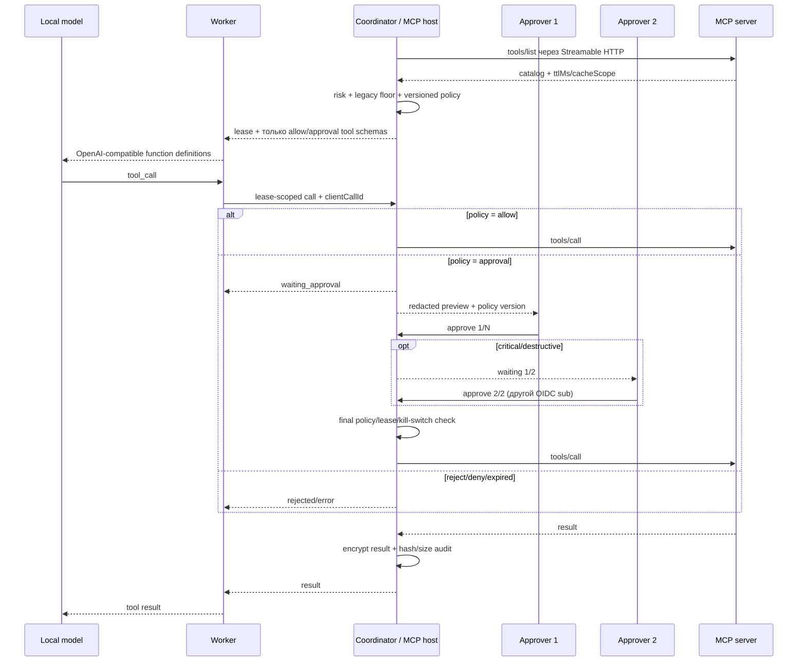

# MCP gateway и risk policy

АГАТ 1.5 подключает внешние и изолированные инструменты через центральный MCP gateway. Coordinator является единственным MCP client/host: endpoint, executable profile и credentials никогда не передаются worker-узлам, а модель получает только схемы инструментов, разрешённых для текущего проекта и lease. Базовый gateway 0.5 дополнен risk tiers, immutable policy-as-code, preview diff, distinct four-eyes approvals, scoped credentials, глобальным emergency deny и одноразовыми WASI/OCI sandbox Jobs.

Реализация использует официальный TypeScript SDK `@modelcontextprotocol/client` 2.x и закрепляет ревизию протокола `2026-07-28`. Эта ревизия использует stateless core, request-scoped Streamable HTTP, `Mcp-Method`/`Mcp-Name`, cache hints и усиленную authorization model. Источники: [анонс MCP 2026-07-28](https://blog.modelcontextprotocol.io/posts/2026-07-28/), [tools](https://modelcontextprotocol.io/specification/2026-07-28/server/tools), [Streamable HTTP](https://modelcontextprotocol.io/specification/2026-07-28/basic/transports/streamable-http), [authorization](https://modelcontextprotocol.io/specification/2026-07-28/basic/authorization), [официальный TypeScript SDK](https://github.com/modelcontextprotocol/typescript-sdk).

## Контур выполнения

Worker не открывает соединение к MCP server. Его node token разрешает вызвать только tool, который coordinator уже включил в конкретный активный lease. Повтор одного `clientCallId` внутри lease возвращает сохранённое состояние и не запускает upstream повторно.

## Policy model

Аннотации MCP считаются недоверенными по умолчанию. Переключатель **Доверять annotations** допустим только для сервера, чей владелец, транспорт и процесс публикации проверены оператором.

| Сигнал trusted server | Risk |
|---|---|
| `destructiveHint=true` | `destructive` |
| `readOnlyHint=true` | `read` |
| `idempotentHint=true` без read-only | `write` |
| Нет однозначного сигнала или annotations не trusted | `unknown` |

Сначала server default и явная per-tool policy формируют совместимую legacy-границу. Затем активная project-scoped policy-as-code назначает tier/effect/число approvals. Legacy `deny` остаётся жёстким запретом, legacy `approval` — минимум одним подтверждением. Глобальный emergency deny применяется последним.

| Risk | Базовый tier | Базовый effect | Approvals |
|---|---|---|---:|
| `read` | `low` | `allow` | 0 |
| `write` | `elevated` | `approval` | 1 |
| `unknown` | `high` | `approval` | 1 |
| `destructive` | `critical` | `approval` | 2 |

Любой `tier=critical` и любой `risk=destructive` можно только запретить либо провести через два подтверждения разных OIDC-субъектов. Ни server override, ни policy rule не могут ослабить этот инвариант. Полный JSON-контракт, порядок rules и модель публикации: [Risk-tier approvals и emergency deny](./mcp-risk-tier-approvals.md).

## Policy preview и immutable версии

`admin/designer` сначала выполняет preview кандидата по текущим catalog tools, получает before/after effective decisions и SHA-256, затем активирует документ с `baseSha256`. Изменение активной policy между этими операциями отклоняет публикацию. Версии project-scoped и immutable; audit сохраняет actor, hash и summary diff.

Ожидающий call проверяется по актуальной policy при каждом approval. Перед фактическим upstream `tools/call` coordinator ещё раз проверяет policy, число distinct approvals, lease, доступность server/tool и глобальный kill switch. Ужесточение policy не оставляет старому call ранее выданное право.

## Добавление сервера

1. Создайте credentials в разделе процессов или из кнопки **Credentials** на MCP-странице. Поддерживаются Bearer API key и произвольный HTTP header; для production выберите MCP scope и ограничьте namespaces, tool patterns, risks, catalog injection и срок действия.
2. Откройте **MCP** → **MCP-сервер**.
3. Укажите уникальные в проекте название и namespace.
4. Укажите Streamable HTTP endpoint. HTTPS обязателен; HTTP включается отдельным флагом только для контролируемой локальной сети.
5. Оставьте default policy `deny` для первичной проверки.
6. Синхронизируйте каталог, изучите tools и назначьте per-tool policy.

Namespace преобразует upstream tool в OpenAI-compatible public name. Например, `find/customer` сервера `crm` получает стабильное имя вида `crm__find_customer_<hash>`. Это исключает коллизии между серверами и не меняет upstream `tools/call` name.

### Isolated transport

`admin` может вместо HTTP выбрать один из статических catalog transports:

- `wasi` — зашифрованный bounded WebAssembly module, Wasmtime fuel, без preopened filesystem и network capability;
- `container` — OCI image только по полному digest, exec-array, read-only/non-root Job и exact public-IP/TCP egress allowlist.

Оба транспорта создают ровно один catalog tool из admin-reviewed schema/annotations и проходят тот же policy/approval path. Module и ephemeral scoped credential монтируются через one-shot Kubernetes Secret; profile bytes не возвращаются API. Полный контракт, CNI fail-closed gate и runtime variables: [Изолированное выполнение MCP tools](./isolated-tool-execution.md).

## Approval и lease

Approval создаётся непосредственно перед upstream side effect. Worker продолжает renew lease каждые 45 секунд и опрашивает состояние вызова; стандартный предел ожидания — 690 секунд, то есть больше server-side approval TTL и максимального upstream timeout. Coordinator не выполнит approval, если lease уже завершён, потерян или истёк. Если worker прекращает ждать раньше из-за пользовательской настройки, он атомарно отменяет ещё не подтверждённый вызов. Завершить lease при уже выполняющемся MCP-вызове coordinator не разрешает.

Для critical/destructive первый approver оставляет call в `waiting_approval` со счётчиком `1/2`; второй distinct OIDC `sub` переводит его в `executing`. Один субъект не может проголосовать повторно, смена display name это не обходит, а `reject` терминален. Поэтому legacy local mode с единственным субъектом `local-admin` не предназначен для критических approvals.

Operator preview содержит redacted arguments и безопасный diff. Для контрактов с `before/after` или `current/desired` это операции верхнего уровня `add/remove/replace`; для прочих — ограниченный `invoke` snapshot. Preview отражает намерение вызова, а не подтверждённое состояние внешней системы.

Если `write/destructive/unknown` вызов перешёл в `executing`, `completed` или `failed`, автоматический retry всего stage блокируется. Это защищает от повторного внешнего эффекта, когда upstream успел выполнить операцию, но ответ потерялся. Для бизнес-критичных write tools всё равно нужен upstream idempotency key; gateway не может доказать семантическую идемпотентность чужого сервера.

## Данные и audit

Schema migration v18 сохраняет в SQLite:

- `mcp_servers` — project-scoped connection, encrypted sandbox profile и redacted catalog metadata;
- `mcp_tool_policies` — явные per-tool overrides;
- `mcp_tool_calls` — lifecycle, transport/profile hash, risk tier, immutable policy snapshot, preview diff, decision, result hash и timestamps;
- `mcp_tool_call_approvals` — distinct решения по OIDC subject;
- `mcp_policy_versions` — immutable project-scoped JSON policy и SHA-256;
- `credentials.scope_json` и `settings.mcp_emergency_deny` — credential boundary и persisted global switch.

Credentials, полные arguments и полный result шифруются AES-256-GCM тем же operator key `AGAT_CREDENTIALS_KEY`. Overview и events получают только ограниченный preview: чувствительные ключи (`token`, `secret`, `password`, `authorization`, `credential`, `apiKey`) редактируются; result представлен SHA-256 и размером. Полный result возвращается только аутентифицированному worker, которому принадлежит lease. OTel span дополняется tier, required approvals, policy version/hash, но не secret или полным payload.

## Scoped credentials

Scope `project` сохранён для совместимости. Scope `mcp` fail-closed проверяет точный namespace при binding, tool glob/risk/expiry перед secret injection и флаг `allowCatalog` при `tools/list`. MCP-scoped credential нельзя использовать в HTTP process step. Внешний token всё равно должен иметь минимальные upstream IAM-права; gateway scope не делает широкополномочный token узким на стороне MCP server.

## Emergency deny

Persisted switch глобален для coordinator и доступен только `admin`. Включение с обязательной причиной отклоняет все ожидающие calls во всех проектах, запрещает новые/stale-lease calls и срабатывает в final preflight. Catalog и audit остаются доступны. Уже отправленный upstream request отозвать нельзя; UI показывает число `executing` calls для ручного разбора. Отключение не возобновляет ранее отклонённые calls. Runbook: [аварийная блокировка MCP](./operations.md#аварийная-блокировка-mcp).

## Сетевые ограничения

- только HTTP(S) endpoint без embedded username/password и URL fragment;
- secret/token/password/authorization query-параметры endpoint отклоняются;
- HTTPS по умолчанию; HTTP требует `allowInsecureHttp=true`;
- redirect запрещён;
- request timeout и максимальный размер ответа применяются к JSON и SSE stream;
- bearer/header credentials добавляет только coordinator;
- transport-owned headers (`Mcp-Protocol-Version`, `Mcp-Method`, `Mcp-Name`, session/content routing) нельзя переопределить через credentials;
- interactive OAuth и token passthrough не поддерживаются;
- произвольный host `stdio`/subprocess не поддерживается; native execution разрешён только через admin-managed digest-pinned Kubernetes Job;
- isolated egress отделён от coordinator egress и требует exact-IP NetworkPolicy; native container fail-closed без подтверждённого CNI enforcement.

MCP endpoint является доверенной operator configuration и может указывать на внутренний сервис. Для hard multi-tenant deployment дополнительно ограничьте egress coordinator через NetworkPolicy/firewall и отдельные project gateways.

## Конфигурация

| Переменная | Default | Назначение |
|---|---:|---|
| `AGAT_MCP_ENABLED` | `true` | Включает API, каталог и proxy |
| `AGAT_MCP_REFRESH_SECONDS` | `30` | Частота поиска каталогов с истёкшим TTL |
| `AGAT_MCP_REQUEST_TIMEOUT_SECONDS` | `60` | Таймаут одного upstream request |
| `AGAT_MCP_MAX_RESPONSE_BYTES` | `4194304` | Лимит полного MCP response stream |
| `AGAT_MCP_APPROVAL_TTL_SECONDS` | `600` | Срок жизни запроса решения в coordinator |
| `AGAT_MCP_APPROVAL_TIMEOUT_SECONDS` | `690` | Сколько worker ждёт approval; значение по умолчанию превышает server TTL и максимальный upstream timeout |

Sandbox variables и runtime contract вынесены в [отдельный runbook](./isolated-tool-execution.md#конфигурация).

Catalog `ttlMs` и `cacheScope` сохраняются в coordinator. После истечения TTL фоновая синхронизация обновляет catalog; при временной ошибке последний успешный каталог остаётся видимым, но UI показывает ошибку. Отключённый сервер немедленно перестаёт выдавать tools в новые lease.

## Текущие границы

- только `tools/list` и `tools/call`; resources/prompts пока не проксируются;
- только закреплённая современная ревизия `2026-07-28`, без silent downgrade;
- `input_required` не выполняется автоматически: интерактивные elicitation/sampling flows отклоняются;
- schema передаётся model server как OpenAI-compatible function definition; выбранная модель должна поддерживать tool calling;
- catalog refresh, policy activation и global switch работают в одном coordinator process; HA потребует общего PostgreSQL state/locking.

Эти ограничения намеренные: MCP-контур даёт управляемые tools без появления удалённого shell, неявной OAuth-сессии или второго источника durable state.
