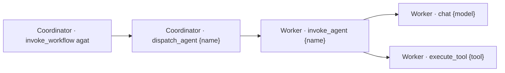

# OpenTelemetry, execution manifest, replay и eval

АГАТ 0.4 добавляет сквозную наблюдаемость и безопасный replay для обычных agent-only запусков. Это два связанных, но независимых слоя:

- SQLite trace — обязательный project-scoped audit log с точными входами, outputs, событиями и execution manifest;
- OpenTelemetry — опциональный экспорт технических spans и метрик через OTLP/HTTP без prompt/output content.

Даже при выключенном exporter каждый run получает валидный 32-символьный `traceId`, а каждый lease — W3C `traceparent`. Поэтому локальный trace, manifest и replay не зависят от наличия внешнего observability backend.

## Топология spans



Coordinator передаёт контекст worker через W3C `traceparent`; worker продолжает тот же trace и также передаёт контекст OpenAI-compatible model endpoint. Используются актуальные имена операций GenAI semantic conventions: `invoke_agent`, `chat` и `execute_tool`. Coordinator `dispatch_agent` остаётся внутренним span АГАТ и не имитирует второй GenAI agent invocation.

В spans передаются безопасные технические атрибуты:

- run, stage, agent и node ID;
- agent runtime, model/provider и номер попытки;
- latency, число model/tool calls;
- input/output token usage, только если provider вернул `usage`;
- статус и `error.type`.

`gen_ai.input.messages`, `gen_ai.output.messages`, system prompt, tool payload и model output не экспортируются. Официальный registry OpenTelemetry прямо предупреждает, что message-атрибуты могут содержать PII; точный контент остаётся только в защищённом SQLite trace АГАТ.

Ссылки на используемые спецификации:

- [OpenTelemetry GenAI agent spans](https://github.com/open-telemetry/semantic-conventions-genai/blob/main/docs/gen-ai/gen-ai-agent-spans.md);
- [OpenTelemetry GenAI OpenAI spans](https://github.com/open-telemetry/semantic-conventions-genai/blob/main/docs/gen-ai/openai.md);
- [OpenTelemetry GenAI attributes registry](https://opentelemetry.io/docs/specs/semconv/registry/attributes/gen-ai/).

GenAI conventions пока имеют development status. Поэтому schema manifest АГАТ версионируется отдельно, а custom-атрибуты имеют namespace `agat.*`.

## Включение OTLP

Exporter использует OTLP/HTTP protobuf. Для `OTEL_EXPORTER_OTLP_ENDPOINT` АГАТ добавляет `/v1/traces`; `OTEL_EXPORTER_OTLP_TRACES_ENDPOINT` считается полным signal-specific URL и используется как есть.

```dotenv
AGAT_OTEL_ENABLED=true
OTEL_EXPORTER_OTLP_ENDPOINT=http://127.0.0.1:4318
OTEL_EXPORTER_OTLP_HEADERS=authorization=Bearer%20example
AGAT_OTEL_COORDINATOR_SERVICE_NAME=agat-coordinator
AGAT_OTEL_WORKER_SERVICE_NAME=agat-worker
```

Для запуска из исходников worker должен иметь optional-зависимости:

```bash
python3 -m pip install --requirement workers/requirements.txt
```

Docker image уже содержит их. В Compose переменные из `.env` передаются обоим сервисам. В Docker Desktop Kubernetes:

```bash
AGAT_OTEL_ENABLED=true \
OTEL_EXPORTER_OTLP_ENDPOINT=http://otel-collector.observability:4318 \
npm run k8s:up
```

Скрипт обновляет обе ConfigMap, а managed worker-пулы наследуют worker-конфигурацию. Endpoint должен быть достижим из pod, поэтому `127.0.0.1` внутри контейнера обычно неверен.

Если `AGAT_OTEL_ENABLED` не задан при обычном запуске, наличие OTLP endpoint автоматически включает exporter. Compose и Kubernetes имеют явный безопасный default `false`, поэтому там задайте `AGAT_OTEL_ENABLED=true`.

## Execution manifest

При постановке agent stage в очередь сохраняется неизменяемый snapshot:

- имя, роль и system prompt;
- model pin;
- `single | langgraph` runtime и bounded config;
- SHA-256 `promptVersion` и `definitionVersion`;
- worker version, модели, runtime capabilities и tool schema на фактическом lease;
- explainable Model Router decision отдельно от исходного model pin;
- immutable список `knowledgeCollectionIds`, подключённых к run, и provenance retrieval в trace events;
- измеренные model/tool calls, latency, tokens и опциональную energy estimate.

`GET /api/v1/runs/:id/trace` возвращает `manifest` с `inputSha256`, hash входа каждого stage и `manifestSha256`. Редактирование агента после создания run не меняет уже сохранённый snapshot или replay.

У старых stage snapshot создаётся во время миграции с `source=migration_backfill`. UI показывает предупреждение: такой snapshot соответствует конфигурации на момент миграции и не доказывает историческую конфигурацию до обновления.

Manifest не содержит credentials. При этом он содержит system prompt, а обычный trace — точные input/output, поэтому endpoint остаётся authenticated и project-scoped.

## Безопасный replay

Replay разрешён только если одновременно выполняются условия:

- исходный run находится в `completed`, `failed` или `cancelled`;
- это не экземпляр визуального процесса;
- все его stage имеют kind `agent`;
- у каждого stage есть execution snapshot.

Такой предел намеренно исключает повторное выполнение HTTP/process side effects. Agent может снова вызвать read-only web tools, но их ответы и состояние модели недетерминированы; replay означает одинаковый input/config manifest, а не побитово одинаковый output.

Ad-hoc replay переносит тот же список knowledge collection IDs. Содержимое collection остаётся управляемым live-ресурсом, поэтому изменённый документ может изменить ответ. Golden eval 0.8 отдельно фиксирует fingerprint collection settings, documents и chunk hashes в dataset version и блокирует запуск либо promotion при drift. Полный chunk text не дублируется в каждый run.

Одна операция создаёт одну или две версии:

```http
POST /api/v1/runs/:runId/replay
Content-Type: application/json

{
  "variants": [
    { "name": "Manifest replay" },
    {
      "name": "qwen3:14b",
      "modelOverrides": {
        "collector": "qwen3:14b",
        "analyst": "qwen3:14b",
        "editor": "qwen3:14b"
      }
    }
  ]
}
```

Новые runs получают точный исходный input, stage snapshots исходного запуска, отдельные trace IDs и общий `evaluationGroupId`. Approval выключен, destination принудительно равен `history`. `modelOverrides` может изменить только model pin известного snapshot-агента; prompt/runtime не меняются.

## Eval comparison

После replay поле `comparison` того же trace endpoint содержит baseline и кандидатов. UI показывает:

- terminal status;
- wall-clock и сумму worker durations;
- model/tool call count;
- input/output tokens, если provider их сообщил;
- длину и SHA-256 финального output.

Автоматические gates первой версии:

| Gate | Правило |
|---|---|
| Completion | candidate завершён успешно |
| Latency | сумма worker stage durations, а при отсутствии метрик wall-clock; не больше `1.25×` baseline |
| Output token budget | не больше `1.25×` baseline |
| Quality | `N/A` для ad-hoc replay; golden experiment использует отдельный versioned quality gate |

Длина ответа и hash не считаются качеством. Для измеримого score используйте immutable golden dataset, human rubric, explicit deterministic checks или локальный model judge. Полный lifecycle описан в [Golden eval и prompt registry](./golden-eval-prompt-registry.md).

## UI

Откройте **Запуски → запуск → Replay / Eval**. Вкладка показывает hashes manifest, provenance snapshot, сравнение кандидатов и форму:

- без выбора модели — replay точного manifest;
- с одной моделью — model override для всех stage;
- с A/B — два независимых кандидата в одной evaluation group.

После создания UI выбирает первый кандидат; данные comparison обновляются существующим SSE/trace refresh без отдельного polling-контура.

Для regression/release gate откройте отдельный раздел **Golden eval**. Candidate run trace показывает experiment, dataset/prompt versions, score source и gates; model judge хранится отдельным связанным run.

## Эксплуатационные границы

- SQLite trace — источник истины; потеря OTLP collector не останавливает выполнение.
- Незавершённые spans в памяти exporter могут быть потеряны при аварийном завершении процесса; при штатном SIGINT/SIGTERM выполняется flush/shutdown.
- Token gates остаются `pending`, если model provider не вернул usage.
- Цена не вычисляется: локальные модели не имеют универсальной стоимости запроса.
- Replay визуальных процессов реализован отдельно от agent-run replay: `safe` переиспользует записанные HTTP/subprocess outputs, `live` выполняет их с новыми deterministic idempotency keys; оба режима закреплены на исходной process version. Произвольный replay MCP/write-tools по-прежнему не разрешён.
- Trace/output retention и автоматическая очистка пока не реализованы; включайте backup и ограничивайте доступ по ролям.

Официальные инструкции по exporter: [OpenTelemetry JavaScript](https://opentelemetry.io/docs/languages/js/exporters/) и [OpenTelemetry Python](https://opentelemetry.io/docs/languages/python/exporters/).
