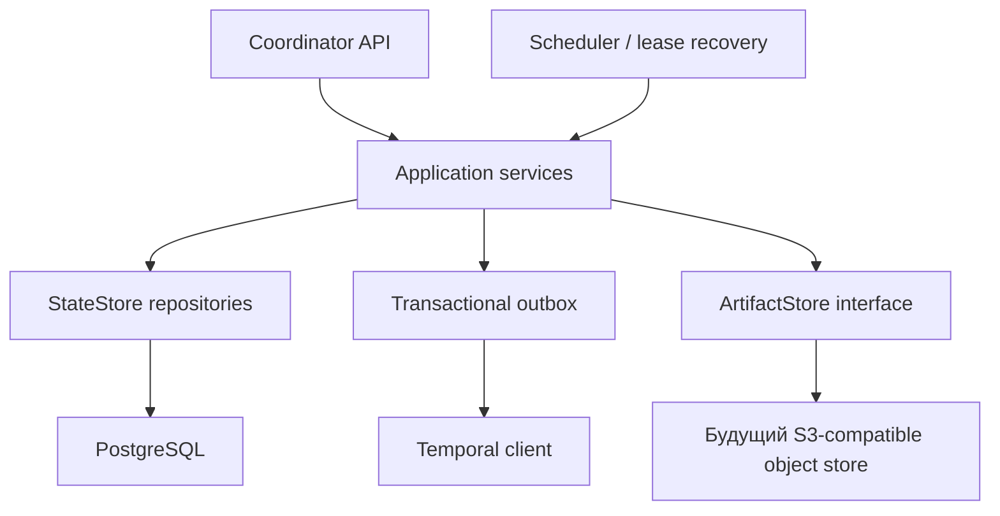

# Проект PostgreSQL state-store adapter

## Решение

PostgreSQL — целевой state-store для нескольких coordinator, но релиз 1.0 не включает ни driver, ни HA. `AGAT_STATE_STORE_DRIVER=postgresql` сейчас намеренно завершает coordinator с ошибкой: это не feature flag для незаконченного пути и не обещание безопасной dual-write миграции.

Цель проекта — заменить локальные SQLite-транзакции на проверяемый repository boundary, сохранив project isolation, leases, idempotency, immutable versions и audit trail.

## Текущие ограничения

- один процесс coordinator владеет SQLite-файлом и scheduler loop;
- PVC и backup файла подходят для локального/одиночного deployment, но не для нескольких replicas;
- Temporal хранит workflow history, однако catalog, runs, leases, approvals, knowledge metadata и audit остаются в state-store АГАТ;
- увеличение replicas до реализации PostgreSQL создаст конкурирующие scheduler loops и недостоверное состояние;
- artifacts пока лежат в локальном filesystem/PVC и требуют отдельного object-store этапа.

## Целевая граница

Application layer не должен импортировать SQL driver. Предлагаемый минимальный набор интерфейсов:

- `CatalogRepository`: projects, agents, prompts, models, processes и immutable versions;
- `ExecutionRepository`: runs, stages, process instances/transitions, approvals и replay lineage;
- `FleetRepository`: nodes, models, leases, heartbeats и benchmark observations;
- `KnowledgeRepository`: collections, documents/chunks metadata и memory lifecycle;
- `IntegrationRepository`: credentials metadata, MCP, A2A и endpoint policy;
- `AuditRepository`: append-only events и export cursor;
- `OutboxRepository`: committed state changes, которые ещё не доставлены Temporal/OTel;
- `ArtifactStore`: metadata в PostgreSQL, bytes вне SQL.

Это логические границы, а не требование создать восемь сетевых сервисов.

## Транзакционные правила

### Выдача stage lease

Одна транзакция выбирает готовые stages через `SELECT … FOR UPDATE SKIP LOCKED`, проверяет online/capability/budget policy, создаёт lease и меняет status. Уникальное ограничение не допускает более одного активного lease на stage. Worker completion обновляет stage только при совпадении `lease_id` и `lease_generation`.

### Recovery

Просроченные leases выбираются небольшими batches через `SKIP LOCKED`. Recovery увеличивает generation, пишет audit event и либо возвращает stage в очередь, либо завершает run по retry policy. Операция идемпотентна: повторный recovery старой generation ничего не меняет.

### Optimistic concurrency

Изменяемые aggregates получают integer `revision`. API update имеет условие `WHERE id = $1 AND project_id = $2 AND revision = $3`; ноль обновлённых строк означает conflict, а не silent overwrite. Immutable published versions никогда не обновляются.

### Project isolation

Каждый tenant-owned primary/unique key включает либо проверяет `project_id`. Repository methods требуют project ID отдельным аргументом; super-admin cross-project операции отделены. Дополнительный RLS можно включить после repository migration, но он не заменяет application authorization.

### Outbox

Изменение DB и запись outbox event происходят в одной транзакции. Dispatcher захватывает события `FOR UPDATE SKIP LOCKED`, отправляет Update/Signal/telemetry и отмечает delivery. У каждого события стабильный idempotency key; network timeout не трактуется как доказанная недоставка. Dual write «commit в БД, затем best-effort Temporal call» в HA-профиле запрещён.

### Locks

Row locks используются для бизнес-состояния. PostgreSQL advisory lock допустим только для singleton maintenance jobs — schema maintenance, retention и редких reconciliations. Он не должен быть основным механизмом stage scheduling.

## Схема и индексы

Семантика текущих таблиц сохраняется, но миграция обязана добавить или проверить:

- composite indexes `(project_id, id)` для project-scoped lookup;
- partial indexes queued/leased stages и non-terminal runs;
- unique active-lease constraint;
- уникальные idempotency keys для start/replay/A2A/outbox;
- `TIMESTAMPTZ` в UTC и server-side timestamps;
- `JSONB` только для bounded snapshots; поля маршрутизации и lifecycle остаются typed columns;
- foreign keys с осознанными delete policies, без неограниченного cascade на audit/history;
- append-only published versions, manifests, eval results и audit events;
- partition/retention план для событий и traces до включения большой нагрузки.

Credentials и sensitive payloads остаются application-encrypted. PostgreSQL TLS, disk encryption и backup encryption обязательны, но не заменяют field-level boundary.

## Этапы реализации

### 0. Зафиксировать contract

- создать contract tests на текущем SQLite store для project isolation, leases, approvals, retries, migrations и idempotency;
- записать query/transaction semantics, а не копировать SQLite SQL буквально;
- определить SLO, RPO/RTO, retention и ожидаемый peak concurrency.

### 1. Выделить interfaces

- перенести HTTP/scheduler orchestration из прямых SQL-вызовов на repositories;
- оставить SQLite единственной реализацией;
- сравнить API snapshots и существующий полный test suite.

### 2. Реализовать PostgreSQL в shadow test environment

- migrations выполняются отдельной job под advisory migration lock;
- application role не имеет DDL и cross-database privileges;
- contract suite запускается для обоих drivers;
- concurrency tests доказывают single lease, recovery и optimistic conflicts.

### 3. Перенос данных

- остановить writes на согласованном maintenance window;
- сделать проверенный SQLite backup;
- экспортировать canonical records, загрузить PostgreSQL в dependency order;
- сверить row counts, IDs, hashes immutable JSON и referential integrity;
- не переносить ephemeral expired leases как активные;
- включить coordinator только после независимой reconciliation.

Dual-write migration не планируется: она увеличивает число failure modes и усложняет rollback.

### 4. Canary одного coordinator

- запустить одну replica на PostgreSQL;
- оставить Temporal workers совместимыми и наблюдать scheduler, outbox lag, API/error latency;
- выполнить backup и фактический restore test;
- rollback означает stop writes, возврат на сохранённый SQLite snapshot либо новый обратный export по заранее проверенной процедуре — не переключение на stale DB.

### 5. HA activation отдельным релизом

- минимум две stateless coordinator replicas;
- readiness зависит от DB и migration compatibility;
- scheduler/recovery concurrency soak test;
- shared object storage для artifacts;
- connection pool и database admission limits;
- rolling deploy, failure injection, PITR/restore и region-loss runbook.

Только после этого `AGAT_STATE_STORE_DRIVER=postgresql` становится поддерживаемым production mode, а replica count может быть больше одного.

## Наблюдаемость

До canary обязательны metrics:

- pool saturation и connection acquisition latency;
- transaction duration, deadlocks и serialization retries;
- queued stages, lease age, duplicate completion rejection;
- outbox oldest age, attempts и dead letters;
- scheduler batch latency;
- DB size, WAL/replication lag, backup age и last restore verification;
- project-boundary authorization denials.

Ни SQL parameters, ни encrypted credential payloads, ни Temporal API keys не пишутся в logs.

## Acceptance gate

- [ ] один contract suite проходит на SQLite и PostgreSQL;
- [ ] конкурентная выдача не создаёт двойной активный lease;
- [ ] lost coordinator восстанавливается другой replica без потери committed state;
- [ ] duplicate API/worker/Temporal delivery идемпотентна;
- [ ] cross-project property tests не находят чтение или mutation чужих данных;
- [ ] миграционная reconciliation совпадает по counts, IDs и hashes;
- [ ] backup restore проверен на чистом окружении;
- [ ] outbox выдерживает недоступность Temporal и доставляет после восстановления;
- [ ] artifacts доступны всем replicas;
- [ ] runbook rollout/rollback выполнен в staging;
- [ ] только после всех проверок снят fail-closed guard для `postgresql`.

## Не входит в 1.0

- реализация PostgreSQL driver;
- несколько coordinator replicas;
- автоматическая SQLite→PostgreSQL миграция;
- dual writes;
- S3-compatible Artifact Store;
- multi-region consensus или active-active deployment.
