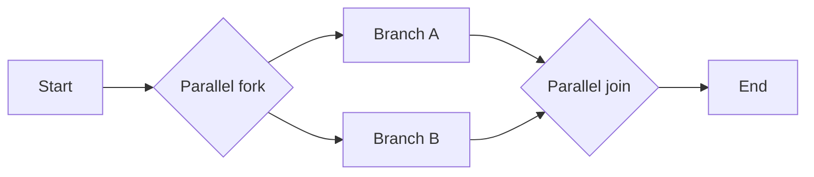
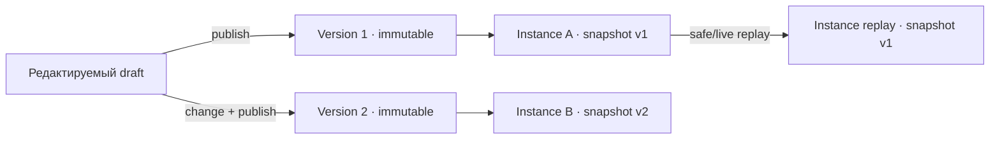

# Визуальные процессы и циклы

АГАТ 1.2 позволяет собрать исполняемый graph на canvas, опубликовать неизменяемую версию и запустить её на распределённом пуле workers. Редактор использует знакомые BPMN-паттерны, а BPMN 2.0 XML служит интеграционным форматом; runtime остаётся компактной, проверяемой моделью АГАТ.

## Что доступно в интерфейсе

Раздел `Процессы` содержит:

- библиотеку обычных процессов и переиспользуемых шаблонов;
- React Flow canvas с drag-and-drop, minimap, поиском, picker и вставкой шага в связь;
- undo/redo, autosave draft, test node и запуск с выбранного шага;
- inspector узла, публикацию immutable version и запуск последней версии;
- release-панель для interval/cron/calendar Schedules, start/signal webhooks, version diff и BPMN import/export;
- список instances с активными узлами, ожидаемыми signals, compensation status и ссылкой в Temporal UI;
- safe/live replay terminal instance, переход в связанный run и отмену активного instance;
- выбор сохранения результата в history либо вместе с Artifact Store.

На смартфоне canvas, palette, inspector и release-панель перестраиваются в вертикальный операторский layout.

## Исполняемая модель

| Шаг | Назначение | Исходящие ветки |
|---|---|---|
| `start` | Единственная точка входа | `default` |
| `agent` | Создаёт stage выбранного агента | `default` |
| `http` | Ставит управляемый публичный HTTP(S)-запрос в worker queue | `default` |
| `transform` | Формирует output ограниченным шаблоном без `eval` | `default` |
| `wait` | Durable timer | `default` |
| `approval` | Ждёт решения оператора | `default` |
| `artifact` | Сохраняет файл в Artifact Store | `default` |
| `condition` | Проверяет последний output | `true`, `false` |
| `loop` | Выполняет bounded feedback loop | `repeat`, `exit` |
| `parallel_fork` | Создаёт execution token для каждой ветки | 2–16 `default` |
| `parallel_join` | Ждёт все ветки парного fork | `default` |
| `signal` | Ждёт именованное внешнее событие | `default` |
| `subprocess` | Запускает закреплённую версию дочернего процесса | `default` |
| `end` | Завершает token и, после остальных веток, instance | нет |

Условия поддерживают `contains`, `not_contains`, `equals`, `not_equals` и `always`. Можно проверять последний результат целиком или отдельное поле JSON, например `form.decision` из ответа человека. Проверка может быть регистрозависимой. Отсутствующее поле или некорректный JSON дают ложное условие.

`transform`, HTTP, compensation, signal correlation, subprocess input и artifact поддерживают только `{{ input }}`, `{{ lastOutput }}`, `{{ json }}`, безопасные пути `{{ json.field.subfield }}` и `{{ loop.nodeId }}`. JavaScript, функции, прототипы и произвольный доступ к объектам не исполняются.

HTTP credentials зашифрованы AES-256-GCM и не возвращаются через API. Worker разрешает только публичные HTTP(S) адреса и порты 80/443, повторно проверяет DNS и redirects, запрещает hop-by-hop headers и ограничивает body, response и timeout.

Каждый non-GET HTTP visit получает стабильный `Idempotency-Key`; retry сохраняет его. Настроенная compensation регистрируется только после успешного source call и при failure/cancel выполняется в обратном порядке. Подробная семантика, triggers и примеры приведены в [Process Builder 1.2](./process-builder-1.2.md).

## Parallel fork/join



Fork создаёт дочерний token для каждой исходящей edge. Join принимает только tokens своего `forkId`, сохраняет каждое прибытие ровно один раз и продолжает родительский token после всех веток. Объединённый JSON-output упорядочен по fork edges, поэтому результат воспроизводим независимо от скорости workers.

## Формы для согласования и дополнения вводных

1. Добавьте шаг **Подтверждение** и выберите действие: **Согласовать** или **Дополнить вводные**. Форму также можно добавить к шагу агента с включённым **Подтверждением оператора**.
2. В блоке **Форма для человека** нажмите **Добавить поле**. Доступны текст, многострочный текст, число, дата, список выбора и флажок.
3. Задайте название, уникальный ключ, подсказку и обязательность. Для списка укажите варианты по одному в строке. Поля можно переставлять и удалять, результат виден в **Предпросмотре формы**.
4. Сохраните и опубликуйте процесс. Когда он дойдёт до шага, форма появится в **Согласованиях** и в карточке запуска. Оператор увидит входные данные шага и заполнит форму перед продолжением. Отклонение требует причины, но не требует заполнения формы и останавливает процесс.

Форма содержит до 20 полей; список — до 50 вариантов. Обязательный флажок должен быть установлен. Сервер проверяет обязательность, типы, варианты и корректность даты, даже при прямом вызове API. Неизвестные поля отклоняются. Режим **Дополнить вводные** требует непустую форму при публикации.

После отправки результат шага имеет вид:

```json
{
  "input": "Исходный материал",
  "form": { "decision": "Доработать", "details": "Добавить источники" }
}
```

`input` сохраняет предыдущий результат (JSON сохраняется как объект/значение, обычный текст — как строка); для первого шага используются исходные вводные запуска. Ответы доступны следующему шагу через `{{ json.form.decision }}`, `{{ json.form.details }}`. Шаг агента получает тот же объект в своём входе после подтверждения. Шаг без формы сохраняет прежнее поведение.

Схема формы закреплена в версии процесса и не меняется при редактировании нового черновика. Ожидание и ответы сохраняются после перезапуска coordinator. Ответы доступны в результате шага и истории решения; повторная отправка одного согласования не возобновляет процесс повторно.

## Циклы

В настройках шага **Цикл** выберите **Заданное число повторов** или **Пока условие истинно**, затем задайте **Повторять с шага** и **После цикла перейти к**. Редактор создаст связи `repeat` и `exit`; последний шаг повторяемого фрагмента нужно соединить с циклом. В режиме заданного числа используется условие `always`.

1. Coordinator вычисляет условие.
2. Если оно истинно и выполнено меньше `maxIterations`, выбирается `repeat`.
3. Иначе выбирается `exit`.
4. Каждый повторный вход в agent/HTTP создаёт отдельный stage и новый visit.

`maxIterations = 3` означает не более трёх обратных переходов; исходное прохождение не входит в счётчик.

Например, соберите `Старт → Форма проверки → Цикл`, где `repeat` ведёт к форме, а `exit` — к завершению. В форме создайте обязательный список с ключом `decision` и вариантами **Доработать**, **Готово**. В цикле выберите **Поле JSON / ответ формы**, путь `form.decision`, условие **Равно**, значение **Доработать**. Каждый повтор создаёт новое согласование. Ответ **Готово** или достижение лимита продолжает процесс по ветке выхода. Для повторного выполнения работы направьте `repeat` на первый рабочий шаг перед формой проверки.

## Проверка graph

Публикация отклоняется, если нарушено хотя бы одно правило:

- не ровно один `start`, отсутствует `end` или связь входит в start;
- node/edge IDs повторяются, связь ссылается на неизвестный node или замыкает его на себя;
- обязательная branch отсутствует либо имеет несколько назначений;
- node недостижим из start или из него нет пути к end;
- loop не имеет `repeat`, `exit` или лимита `1..50`; ветка `repeat` не возвращается к циклу;
- замкнутый путь обходит ветку `repeat` ограниченного цикла;
- форма содержит некорректные поля, повторяющиеся ключи или пустые варианты;
- fork имеет не 2–16 уникальных targets, не имеет ровно одного paired join либо ветка не достигает join;
- join ссылается не на fork или число входящих веток не совпадает;
- signal/subprocess/HTTP/compensation config не проходит bounded validation;
- subprocess не опубликован, создаёт цикл либо превышает глубину 8;
- превышены 200 nodes, 400 edges или runtime budget 1000 transitions.

Автоматические повторения используют общий бюджет экземпляра в 1000 переходов; отдельного ограничения в 128 мгновенных переходов нет. Все проверки действуют на backend и не отключаются прямым API-вызовом.

## Draft, версии, diff и replay



- `processes` хранит identity, template flag и draft graph;
- `process_versions` хранит immutable snapshots;
- `process_instances` закрепляет version, graph, replay metadata и terminal state;
- `process_tokens`, join arrivals, signal waits, subprocess links и compensation stack образуют durable runtime state;
- `runs/stages/events` остаются единым execution и audit trace.

Version diff сравнивает metadata, nodes/config и edges. Safe replay повторно использует записанные результаты HTTP/subprocess; live replay выполняет side effects заново с новыми keys. Редактирование draft никогда не меняет уже запущенный или replayed instance.

## Triggers и внешние ожидания

Temporal Schedule поддерживает `interval`, `cron` и structured `calendar` с IANA timezone. Каждое срабатывание создаёт новый immutable instance через scheduled parent→child Workflow; overlap пропускается, а repeated failure ставит Schedule на паузу.

Start webhook требует Bearer token и `Idempotency-Key`. Signal webhook либо OIDC API доставляет payload ожидающему `signal` по process, name и опциональным instance/correlation key. Token webhook показывается только при создании/rotation и хранится как hash. Отмена/failure закрывает signal waits и каскадно отменяет embedded subprocess, поэтому позднее внешнее событие или завершение child не возобновляет terminal instance.

Instance использует состояния `queued`, `running`, `waiting_approval`, `waiting_external`, `compensating`, `completed`, `failed`, `cancelled`.

## BPMN 2.0 boundary

Экспорт содержит стандартные BPMN namespaces/DI, sequence flows, gateways и AGAT extensions для точного round-trip. Импорт поддерживает start/end, tasks, exclusive/parallel gateways, timer/signal catch events и call activity, создавая новый draft. XML ограничен 1 MiB; DTD/entities запрещены.

Полная BPMN execution semantics не заявляется: неподдерживаемые элементы не становятся скрытым исполняемым поведением, а импортированный draft обязан пройти обычную публикационную проверку.

## Граница технологий

| Компонент | Роль |
|---|---|
| React Flow | Визуальный editor; не исполняет graph |
| SQLite | Project-scoped domain state, tokens, audit и immutable snapshots |
| Temporal | Durable Workflow, timers, Updates/signals и Schedules; без пользовательского I/O в Workflow code |
| Lease workers | Agent, HTTP и compensation activities |
| LangGraph | Только внутренний bounded runtime одного agent stage |

Архитектурная граница подробнее описана в [durable runtime](./durable-runtime.md), production transport — в [production hardening](./production-durable-runtime.md), wire contracts — в [HTTP API](./api.md#процессы).

## Что намеренно не реализовано

- полная BPMN engine compatibility, event subprocess, boundary events и arbitrary scripts;
- перенос уже активного instance на другую process version;
- distributed HA coordinator поверх SQLite;
- автоматическое доказательство бизнес-корректности compensation;
- произвольные connector binaries или shell/code nodes.

## Каталог типовых процессов

В форме **Новый процесс** можно выбрать одну из 7 категорий и 13 встроенных схем подготовки и согласования материала. Каталог содержит задания этапов, роли, входы, результаты и критерии приёмки. Назначения агентов необязательны при создании черновика, но обязательны для публикации. API: `GET /api/v1/process-templates`, создание через `POST /api/v1/processes` с `catalogTemplateId`, `catalogTemplateVersion` и `templateBindings`.

Полные описания и границы: [процессы с LLM-агентами](./llm-processes/README.md). Поставляемые шаблоны не являются готовыми интеграциями с внешними системами и не закрывают qualification соответствующих solution packs.

Каталог, вкладка **Готовность** и диалог запуска используют [scenario preflight USE-002](./scenario-preflight.md): отдельно показаны сохранение, допустимость очереди, выполнение сейчас и подтверждённое прохождение сценария. Для каждой причины недоступности есть переход к настройке. Диалог закрепляет проверенную опубликованную версию и позволяет намеренно ожидать готовности в очереди.

В форме **Новый процесс** также доступен [устанавливаемый пакет «Внутренний отчёт»](./internal-report-pack.md): три роли, учебная коллекция, опубликованный процесс, ограничения инструментов и тот же USE-002 preflight. Повторная установка не создаёт дубли; запуск примера отдельно проверяет актуальные зависимости.
