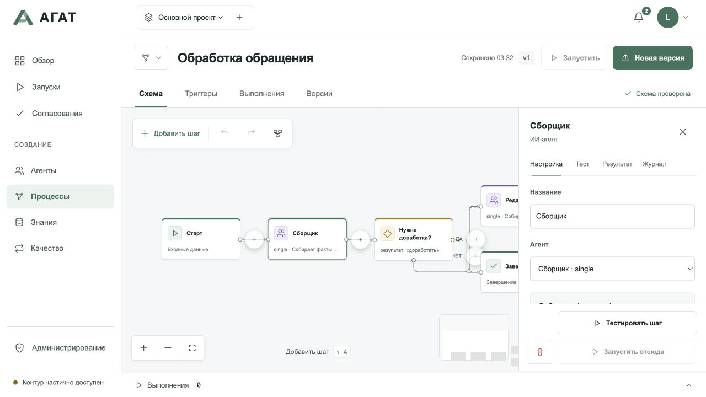

# Знакомство с АГАТ за минуту

Короткий обзор экранов приложения на тестовых данных.
[Первый сценарий](./first-run.md) помогает повторить запуск на своей модели.

**0–15 секунд: выберите исполнителя.** В каталоге видны роль агента, модель,
доступность узла и кнопка запуска. Из шаблона можно создать своего агента.

**15–35 секунд: соберите процесс.** Соедините агентов, условия, преобразования
и согласования. Перед запуском схема проверяется и публикуется.

**35–50 секунд: наблюдайте выполнение.** История показывает шаги и результаты.
Ожидание согласования останавливает дальнейший переход до решения человека.

На снимке — фактический ответ `llama3.2:latest`; [условия проверки](./releases/1.7.0-validation.md).

**50–60 секунд: перейдите к своему примеру.** [Создайте помощника и получите краткий отчёт](./first-run.md).
Расписания Temporal, HA и внешние инструменты настраиваются по отдельным руководствам
в [оглавлении](./index.md).
