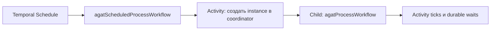

# Production hardening durable runtime

Этот документ фиксирует Temporal hardening релиза 1.0. Локальный `temporal server start-dev` остаётся удобным профилем разработки; production-профиль fail-closed требует TLS, аутентификацию, immutable build ID и Worker Deployment Versioning. Ограничение single-coordinator из 1.0 снято PostgreSQL Fleet/HA backend в 1.7, но HA state store имеет отдельные production gates в [Fleet и HA 1.7](./fleet-ha-1.7.md).

## Что изменилось

- сохранённые histories реальных выполнений проходят replay в CI против текущего workflow bundle;
- coordinator и worker поддерживают Temporal Cloud и защищённый self-hosted endpoint;
- новые worker builds раскатываются через `canary → ramp → current`, а не заменой task queue;
- долгоживущий process workflow по умолчанию закреплён за совместимой версией worker;
- изменение процесса отправляется как подтверждаемая Workflow Update; старые histories получают совместимый Signal fallback;
- интервальные Temporal Schedules запускают parent workflow, который создаёт экземпляр в coordinator и вызывает отдельный child process workflow;
- на момент 1.0 PostgreSQL был только спроектирован и fail-closed; реализованный 1.7 adapter описан отдельно.

Официальная модель Worker Deployment Versioning и ограничения версий описаны в [Temporal Worker Versioning](https://docs.temporal.io/production-deployment/worker-deployments/worker-versioning). Для self-hosted установки нужны как минимум Temporal Server 1.29.1, Temporal CLI 1.4.1 и TypeScript SDK 1.12; АГАТ закрепляет SDK 1.22.

## Профили подключения

| Профиль | `AGAT_TEMPORAL_TARGET` | TLS | Аутентификация | Versioning |
|---|---|---:|---|---:|
| Локальная разработка | `local` | необязателен | внутренний token coordinator↔activity | выключен по умолчанию |
| Temporal Cloud | `cloud` | обязателен | `AGAT_TEMPORAL_API_KEY` | обязателен |
| Production self-hosted | `self-hosted` | обязателен | bearer API key через auth gateway или mTLS cert/key | обязателен |

Одинаковые параметры подключения должны быть заданы coordinator и Temporal worker. TLS-файлы монтируются read-only и передаются путями, а не содержимым в environment.

```bash
export AGAT_TEMPORAL_ENABLED=true
export AGAT_TEMPORAL_TARGET=cloud
export AGAT_TEMPORAL_ADDRESS=REGION.PROVIDER.api.temporal.io:7233
export AGAT_TEMPORAL_NAMESPACE=NAMESPACE.ACCOUNT
export AGAT_TEMPORAL_TASK_QUEUE=agat-processes-v1
export AGAT_TEMPORAL_TLS=true
export AGAT_TEMPORAL_API_KEY='secret-from-runtime-store'
export AGAT_TEMPORAL_INTERNAL_TOKEN='independent-random-secret'

export AGAT_TEMPORAL_VERSIONING_ENABLED=true
export AGAT_TEMPORAL_DEPLOYMENT_NAME=agat-processes
export AGAT_TEMPORAL_BUILD_ID="git-${GIT_COMMIT_SHA}"
export AGAT_TEMPORAL_DEPLOYMENT_RING=canary
export AGAT_TEMPORAL_VERSIONING_BEHAVIOR=PINNED
```

`AGAT_TEMPORAL_API_KEY` не попадает в health snapshot или rollout command line. Не используйте один secret одновременно для Temporal API и внутреннего Activity API.

### Self-hosted mTLS

```bash
export AGAT_TEMPORAL_TARGET=self-hosted
export AGAT_TEMPORAL_ADDRESS=temporal.internal.example:7233
export AGAT_TEMPORAL_TLS=true
export AGAT_TEMPORAL_CA_CERT_PATH=/run/secrets/temporal/ca.pem
export AGAT_TEMPORAL_CLIENT_CERT_PATH=/run/secrets/temporal/client.pem
export AGAT_TEMPORAL_CLIENT_KEY_PATH=/run/secrets/temporal/client-key.pem
export AGAT_TEMPORAL_SERVER_NAME_OVERRIDE=temporal.internal.example
```

Cert и key задаются только парой. Любой production target без TLS, credentials, versioning или явного build ID завершает процесс при старте. `local-dev` запрещён как production build ID.

## Worker deployment rings

Build ID должен быть неизменяемым идентификатором образа: Git SHA или digest, но не `latest`, имя ветки или номер mutable tag. Все экземпляры одного build используют одинаковые `deploymentName`, `buildId`, workflow bundle и activities.

1. До публикации образа выполнить полный gate:

   ```bash
   npm run typecheck
   npm test
   npm run build
   ```

2. Запустить canary worker с новым build ID и `AGAT_TEMPORAL_DEPLOYMENT_RING=canary`.
3. Проверить регистрацию версии:

   ```bash
   AGAT_TEMPORAL_BUILD_ID=git-abc123 npm run temporal:version
   npm run temporal:status
   ```

4. Направить 5% новых совместимых executions на canary:

   ```bash
   AGAT_TEMPORAL_BUILD_ID=git-abc123 \
   AGAT_TEMPORAL_RAMP_PERCENTAGE=5 \
   npm run temporal:ramp
   ```

5. Сравнить error/retry rates, Workflow Task latency, Activity latency и coordinator `5xx`. Увеличивать процент следует отдельными наблюдаемыми шагами.
6. Сделать версию current только после успешного ramp:

   ```bash
   AGAT_TEMPORAL_BUILD_ID=git-abc123 npm run temporal:promote
   ```

7. Старый worker не удаляется, пока его pinned executions не завершились или безопасно не сделали Continue-As-New. Статус deployment проверяется до scale-to-zero.

Rollout-скрипт использует текущие команды `temporal worker deployment` и принимает те же TLS-параметры, что runtime. Скрипт требует установленный Temporal CLI; локальный Kubernetes-профиль намеренно работает без Worker Versioning.

### Rollback

Остановить ramp, снова назначить последнюю исправную версию current и оставить оба worker build доступными. Не переписывать history и не переиспользовать build ID для другого workflow bundle. Если несовместимый код уже обработал Workflow Task, сначала подтвердить replay на этой history, затем выпускать исправленный новый build.

## Replay gate

`npm run test:temporal` компилирует production workflow bundle и проигрывает каждую JSON history из `apps/temporal-worker/test/fixtures`. Fixture должна быть реальной history, экспортированной после исполнения workflow, а не вручную составленным списком событий.

```bash
temporal workflow show \
  --workflow-id agat-process-FIXTURE_ID \
  --namespace agat \
  --output json > history.json
```

Перед добавлением fixture нужно удалить payloads с персональными данными и secrets, обернуть history полями `workflowId`, `description`, `history`, а затем локально выполнить `npm run test:temporal`. Любая nondeterministic несовместимость останавливает CI.

Минимальный fixture-set для релиза содержит:

- обычное успешное завершение `agatProcessWorkflow`;
- ожидание состояния, acknowledged `processChangedV1` Update и последующее завершение;
- scheduled parent с Activity и child workflow command;
- при изменении control flow — history каждой затронутой старой ветки.

## Updates, Signals и Schedules

`processChangedV1` — подтверждаемая Update: coordinator дожидается принятия workflow и получает revision acknowledgement. Для executions, начатых до 1.0, coordinator повторяет уведомление старым `processChanged` Signal. Fallback нужен только для совместимости и не является причиной постоянно сохранять старый handler в новых API-клиентах.

Schedule API:

| Метод | Endpoint | Роли | Результат |
|---|---|---|---|
| `GET` | `/api/v1/processes/:id/schedule` | read roles | состояние и следующие запуски |
| `PUT` | `/api/v1/processes/:id/schedule` | admin, designer | создать или заменить interval schedule |
| `DELETE` | `/api/v1/processes/:id/schedule` | admin, designer | удалить schedule |
| `POST` | `/api/v1/processes/:id/schedule/trigger` | admin, designer, operator | немедленно инициировать один запуск |

Поддерживаемый interval — от 60 секунд до одного года. Политика overlap — `SKIP`, catch-up window — 5 минут, а повторная ошибка ставит schedule на паузу. Каждый запуск:



Parent использует `REQUEST_CANCEL`: его отмена запрашивает отмену child, но состояние бизнес-процесса всё равно сверяется через coordinator. Schedule хранит только ограниченный input и project-scoped collection IDs; секреты в args запрещены.

Подробнее о Temporal Client, Workflow handles и Updates: [Temporal TypeScript Client](https://docs.temporal.io/develop/typescript/client/temporal-client).

## Capacity и shutdown

Worker имеет явные границы:

- `AGAT_TEMPORAL_MAX_WORKFLOW_TASKS` — 20 по умолчанию;
- `AGAT_TEMPORAL_MAX_ACTIVITY_TASKS` — 8;
- `AGAT_TEMPORAL_SHUTDOWN_GRACE_SECONDS` — 30;
- `AGAT_TEMPORAL_WORKER_ID` — стабильная операционная identity; по умолчанию строится из deployment/build/host/pid;
- `AGAT_TEMPORAL_METRICS_ADDRESS` — отдельный metrics listener.

При rollout сначала прекратить подачу новых задач, дождаться graceful shutdown и только затем завершать pod. Нельзя одновременно останавливать все worker builds с pinned executions.

## Границы на момент релиза 1.0 и текущий статус

- SQLite и один coordinator были production-ограничением 1.0; этот backend по-прежнему допускает только одну replica.
- Temporal обеспечивает durable orchestration, но не превращает любой application state store в распределённую БД.
- Встроенный Docker Desktop Temporal и `start-dev` не являются production deployment.
- PostgreSQL driver реализован в 1.7 и допускает несколько coordinator replicas. Production всё ещё требует multi-AZ/PITR, restore/failover/load evidence, DDL-free runtime role и migration procedure: [PostgreSQL state-store](./postgresql-state-store-design.md).

## Приёмка

- [x] production transport отклоняет неполный TLS/auth config;
- [x] worker требует immutable version и deployment versioning;
- [x] canary/ramp/promote/status автоматизированы;
- [x] replay fixtures выполняются в обычном `npm test` и CI;
- [x] Workflow Update подтверждается, Signal fallback сохраняет старые executions;
- [x] interval Schedule создаёт parent и отдельный child workflow;
- [x] SQLite/one-coordinator boundary 1.0 была явно сохранена;
- [x] PostgreSQL activation оставалась заблокирована до реализации и была заменена проверенным 1.7 backend без dual-write.
