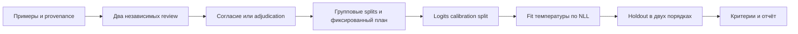

# Разметка, калибровка и независимая проверка

Исходный протокол: 26.09.2026, runtime `0.2.0`. Технический путь изолированного runtime `0.7.1` проверен [отдельно](./isolated.md). В `0.8.0` добавлена [фиксация полного профиля до измерений](./frozen-profile.md); команды ниже обновлены для плана v2 и preflight runtime 0.9.0. Второй технический этап [локального исполнителя](../../../local-decision-runtime.md): подготовка экспертной разметки, обучение температуры, применение её в CLI/HTTP и проверка фиксированных критериев на отдельной выборке. Реальные экспертные данные не предоставлены; сквозной запуск выполнен на явно синтетических fixtures.

Для предметной разметки подготовлен [пакет из реальных источников Агата](../source-review/README.md): 24 задания v2 с утверждёнными метками ассистента и пустыми пакетами двух рецензентов. Экспертный review этого пакета ещё не выполнен. В runtime 0.3.0 выполнено отдельное [development-сравнение двух кандидатов](../development/README.md) на 15 случаях, без обращения к holdout.

## Что реализовано

Новые команды: `prepare-review`, `finalize-review`, `freeze`, `calibrate`, `qualify`. Они работают без MLX; модель нужна для получения logits и обслуживания запросов. `score`, `serve`, `evaluate` принимают `--calibration PATH`. Температура не меняет веса и сохраняет argmax: ошибочное понимание текста этим способом не исправляется.



## Экспертная разметка

[pool.example.v1.json](./pool.example.v1.json) показывает входной формат: `id`, `family`, `groupId`, `provenance`, `request`. Правильной метки и предсказания модели в pool нет. `provenance.kind` явно равен `real` или `synthetic`; `sourceId` идентифицирует исходный документ, `reference` описывает происхождение. Синтетический пример не становится реальным после ручного просмотра.

`groupId` объединяет зависимые примеры: документ, шаблон, цепочку обращений или перефразы. Loader запрещает пересечение групп, source ID и одинакового текста после нормализации Unicode/регистра/пробелов между splits. Семантические перефразы требуют предметной проверки.

Из корня репозитория:

```bash
python3 -m decision_runtime prepare-review \
  --pool docs/qualification/local-decisions/calibration/pool.example.v1.json \
  --seed agat-review-v1 \
  --output docs/qualification/local-decisions/calibration/review.new.json
```

[Незаполненный пакет](./review.blank.v1.json) уже подготовлен как пример. Сделайте отдельные копии для двух рецензентов. Каждый заполняет `reviewerId`, `reviewedAt`, `expectedOptionId`, `rationale` для каждого case. Pool, input fingerprints и seed не редактируются. Имена экспертов и решения не подставляются автоматически. Разметчики видят исходные ID и тексты, но не получают gold labels и ответы модели.

```bash
python3 -m decision_runtime finalize-review \
  --first docs/qualification/local-decisions/calibration/review.first.json \
  --second docs/qualification/local-decisions/calibration/review.second.json \
  --output docs/qualification/local-decisions/calibration/reviewed.dataset.json
```

Разногласие останавливает сборку и выводит ID спорных случаев. Для разрешения используется `--adjudication PATH`: пакет с тем же pool/seed, отдельным reviewer ID и labels **только спорных случаев**, с объяснением итогового выбора. Согласие и adjudication сохраняют исходные review records. Одинаковые reviewer ID, незаполненные ответы, изменённый источник и потерянные cases отвергаются.

Фиксированный seed распределяет целые группы в development/calibration/holdout с долями 40/30/30 в ожидании. Маленький набор может оказаться несбалансированным или иметь пустой split; план без calibration/holdout не замораживается. Seed фиксируется до разметки, его нельзя подбирать по качеству модели. Для предметной оценки нужны достаточное число групп и представительство нужных классов.

Review IDs и timestamps — локальные декларации, не аутентифицированные подписи. Реальное участие экспертов и разрешённость источников подтверждаются организационно. Используйте разрешённые обезличенные данные и проектные правила хранения. Фиктивные expert IDs существуют только в unit fixtures и не экспортируются как evidence.

## План, fit и holdout

[criteria.example.v1.json](./criteria.example.v1.json) — пример параметров, не утверждённый SLA: accuracy ≥ 0.9, coverage ≥ 0.5, верхняя граница риска групп ≤ 0.01, совместный confidence 0.95, минимум 300 принятых групп суммарно и 30 в каждом семействе. Для предметного испытания значения выбирает владелец сценария до просмотра holdout.

Команды ниже воспроизводят инженерный smoke. Для реальной работы замените dataset на результат экспертной разметки. Выберите новый каталог результата; существующие артефакты не перезаписываются.

```bash
.venv/decision/bin/python -m decision_runtime profile \
  --manifest .local-models/decisions/decider-2b.json \
  --output docs/qualification/local-decisions/calibration/evidence/new-run/runtime-profile.json

python3 -m decision_runtime freeze \
  --dataset docs/qualification/local-decisions/calibration/smoke.v1.json \
  --manifest .local-models/decisions/decider-2b.json \
  --criteria docs/qualification/local-decisions/calibration/criteria.example.v1.json \
  --runtime-profile docs/qualification/local-decisions/calibration/evidence/new-run/runtime-profile.json \
  --output docs/qualification/local-decisions/calibration/evidence/new-run/experiment.json

.venv/decision/bin/python -m decision_runtime evaluate \
  --manifest .local-models/decisions/decider-2b.json \
  --dataset docs/qualification/local-decisions/calibration/smoke.v1.json \
  --split calibration \
  --plan docs/qualification/local-decisions/calibration/evidence/new-run/experiment.json \
  --output docs/qualification/local-decisions/calibration/evidence/new-run/calibration-scores.json

python3 -m decision_runtime calibrate \
  --dataset docs/qualification/local-decisions/calibration/smoke.v1.json \
  --scores docs/qualification/local-decisions/calibration/evidence/new-run/calibration-scores.json \
  --plan docs/qualification/local-decisions/calibration/evidence/new-run/experiment.json \
  --output docs/qualification/local-decisions/calibration/evidence/new-run/temperature.json

.venv/decision/bin/python -m decision_runtime evaluate \
  --manifest .local-models/decisions/decider-2b.json \
  --dataset docs/qualification/local-decisions/calibration/smoke.v1.json \
  --split holdout --reverse-options \
  --plan docs/qualification/local-decisions/calibration/evidence/new-run/experiment.json \
  --frozen-calibration docs/qualification/local-decisions/calibration/evidence/new-run/temperature.json \
  --output docs/qualification/local-decisions/calibration/evidence/new-run/holdout-scores.json

python3 -m decision_runtime qualify \
  --dataset docs/qualification/local-decisions/calibration/smoke.v1.json \
  --scores docs/qualification/local-decisions/calibration/evidence/new-run/holdout-scores.json \
  --plan docs/qualification/local-decisions/calibration/evidence/new-run/experiment.json \
  --calibration docs/qualification/local-decisions/calibration/evidence/new-run/temperature.json \
  --output docs/qualification/local-decisions/calibration/evidence/new-run/qualification.json
```

`freeze --runtime-profile` закрепляет dataset SHA, полный raw execution profile, конкретные веса/tokenizer, policy, критерии и схемы вопросов. Calibration scores должны быть получены после плана с тем же профилем и policy. План v1 без профиля может воспроизводиться, но не проходит новый gate `execution_profile_frozen`. `calibrate` принимает только calibration split, с полным набором случаев и без ошибок backend. Подмена gold labels, входа, модели или split отвергается. Температура минимизирует NLL посредством бисекции монотонной производной по обратной температуре; `T ∈ [0.05, 20]`, попадание на границу явно записывается. Основа метода — [temperature scaling, Guo et al.](https://proceedings.mlr.press/v70/guo17a.html); перенос на данные Агат требует проверки.

Artifact привязан к полной identity фактически исполнившегося backend: revision, tokenizer, quantization, MLX, prompt, token limit, implementation SHA. Изменение этих настроек или исходников требует нового fit/eval. Вопрос, primitive, описания/ID/значения вариантов определяют область применения. Перестановка тех же вариантов допустима и проверяется отдельно. Новый вопрос или состав вариантов дают `calibration_out_of_scope`, HTTP 422, до inference.

Holdout должен начаться после фиксации плана и fit: сравниваются timestamps. Это защита от случайного использования старого отчёта, не доказательство того, что человек никогда не видел файл. Локальный оператор обязан соблюдать границы эксперимента. Проверка нового семейства вопросов требует отдельного эксперимента.

Для `qualify` собираются **сырые logits без `--calibration`**: из одних измерений пересчитываются baseline и fitted probabilities, abstain и метрики. Cached `correct` и aggregate metrics не считаются истиной. Пересчёт вероятностей не выдаётся за новое измерение скорости inference.

Начиная с `0.9.0`, CLI `evaluate` проверяет calibration/holdout **до inference**: обязателен v2 `--plan`, для holdout также `--frozen-calibration` и `--reverse-options`. `--frozen-calibration` подтверждает наличие ранее зафиксированного fit, но не применяет температуру к logits. Флаг `--calibration` для этих двух splits отвергается. При загрузке backend его полный raw profile должен совпасть с планом; иначе ни один вход не оценивается и выходной отчёт не создаётся. Development-вызовы сохраняют прежний режим. Подробности и проверки: [preflight](./preflight.md).

Риск считается по группам: хотя бы одно ошибочное принятое решение делает группу ошибочной. Оригинал и перестановка не увеличивают число независимых групп. Используется односторонняя точная граница Clopper–Pearson; для общего и семейных bounds применяется Bonferroni. Смысл exact interval описан в [SciPy](https://docs.scipy.org/doc/scipy/reference/generated/scipy.stats._result_classes.BinomTestResult.proportion_ci.html); реализация на stdlib проверена по опубликованному числовому примеру. При отсутствии принятых групп верхняя граница равна 1.

Интерпретация границ предполагает независимо отобранные представительные группы. Программная проверка ID не доказывает эти предпосылки. Семейные bounds могут требовать существенно больше данных, чем номинальный `minAcceptedGroups`. [Расчёт для трёх семейств](../source-review/sampling-plan.md) даёт минимум 437 независимо принятых безошибочных групп на семейство при примерных критериях выше.

`pass` означает выполнение зафиксированных критериев на представленном наборе; требуются реальные источники и две согласованные экспертные записи либо отдельная adjudication. `routingEnabled` остаётся `false` даже при pass. `not_qualified` сохраняет полный отчёт и возвращает exit code **2**; ошибки входа/выполнения — **1**. SHA обнаруживает изменение содержимого и не является подписью.

## Фактический прогон 26.09.2026

[smoke.v1.json](./smoke.v1.json): 12 calibration + 12 holdout случаев трёх семейств. Это новые синтетические fixtures, не независимый экспертный gold. Старые 36 development-примеров не переименовывались в holdout.

Сохранены [план](./evidence/2026-09-26/experiment.json), [calibration scores](./evidence/2026-09-26/calibration-scores.json), [температура](./evidence/2026-09-26/temperature.json), [holdout scores](./evidence/2026-09-26/holdout-scores.json), [квалификация](./evidence/2026-09-26/qualification.json), [реальная HTTP-проверка](./evidence/2026-09-26/runtime-calibrated-http.json).

На calibration получено `T = 3.1929311809`; NLL снизился **1.3086 → 0.7505**. На holdout улучшение не подтвердилось:

| Метрика, исходный порядок | Без калибровки | С температурой |
|---|---:|---:|
| Верных меток | 11/12 | 11/12 |
| NLL | 0.2435 | 0.4615 |
| Brier | 0.1599 | 0.2474 |
| ECE10 | 0.1118 | 0.2951 |
| Принято при прежнем пороге | 7/12 — 58.3% | 3/12 — 25.0% |
| Ошибки среди принятых | 0/7 | 0/3 |

При обратном порядке: 10/12 верных меток, принято 2/12. Нулевое число ошибок среди трёх принятых групп не доказывает надёжность: общий upper bound при confidence 0.9875 равен 0.7679. Итог — **`not_qualified`**: нет реальной экспертной разметки, недостаточно групп, не пройдены риск, покрытие и accuracy для обоих порядков. Параметры после просмотра holdout не корректировались.

Прогон подтверждает работоспособность pipeline и отказ при недостаточных доказательствах. Именно эта температура не рекомендована как default: вероятностные метрики и покрытие на holdout ухудшились. Новый подбор по этим ответам потребует нового holdout.

## Применение и проверки

Для экспериментального HTTP-вызова после нового `freeze → evaluate calibration → calibrate` из примера выше:

```bash
.venv/decision/bin/python -m decision_runtime serve \
  --manifest .local-models/decisions/decider-2b.json \
  --calibration docs/qualification/local-decisions/calibration/evidence/new-run/temperature.json
```

Ответ содержит `calibration.status: fitted`, температуру, fingerprints и `qualifiedForRouting: false`; режим — shadow. Без `--calibration` сохраняется T=1, uncalibrated. Этот пример воспроизводит проверку, а не задаёт рекомендуемый default.

Сохранённый fit от 26.09.2026 привязан к исходникам **v0.2.0**. Более новые runtime, включая `0.8.0`, намеренно отклоняют его при загрузке модели из-за другого `implementationSha256`; новый fit создаётся отдельным экспериментом. Повторение синтетического smoke проверяет технический путь и не делает его новым независимым holdout. Пересчёт исторических logits без нового inference воспроизводит прежнюю температуру. На runtime 0.8.0 qualification дополнительно требует v2-план с заранее закреплённым профилем; исторические gates сохраняются в исходном отчёте.

`npm run test:decision` проверяет fit с известным аналитическим оптимумом, неизменность argmax, область применения, утечки между splits, подмену evidence, старый holdout, экспертные разногласия, CLI exit codes и HTTP API. Opt-in `test_calibrated_http_and_out_of_scope_error` запускает реальный MLX: нужны `AGAT_DECISION_TEST_MANIFEST` и `AGAT_DECISION_TEST_CALIBRATION`. Проверка фактически выполнена: HTTP-распределение совпало с прямым вызовом, вопрос вне области получил 422.

Финальная проверка 26.09.2026: 44 теста runtime прошли, 3 GPU-теста пропущены в обычном запуске; новый GPU/HTTP-тест отдельно выполнен успешно. `npm run docs:check` прошёл: 12 Node-тестов, 2 Python-теста, локальные ссылки и каталог процессов. Оба руководства прошли архитектурный аудит `generic` без ошибок и предупреждений; `git diff --check` чистый.

Следующий предметный шаг — разрешённый корпус с независимой разметкой. Недостаточную точность метки температура не исправит: потребуется разбор ошибок и сравнение более сильной основы или дообучения. Если метки качественны, но вероятности ненадёжны, имеет смысл продолжать калибровку. Решение о fine-tuning на этих 24 fixtures не принимается.
