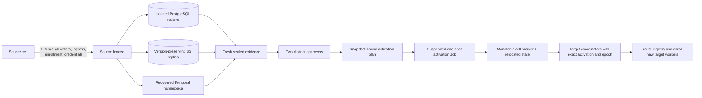

# Residency-aware region-loss DR

## Решение и границы

Agat восстанавливает потерянную Fleet HA-cell только как **whole-cell active/passive transition** внутри того же `residencyDomain`. Источник должен быть полностью fenced до любой активации target: database/object writes, inbound traffic и worker enrollment выключены, credentials отозваны или ротированы, число активных writers равно нулю. Active-active payload writes, частичный перенос проектов и автоматический failover по одному health signal запрещены.

Schema v24 ввела immutable ledger `region_loss_dr_activations` и singleton marker `agat_cell_runtime`; текущая schema v25 (`agat-worker-attestation-siem-dlq-v25`) сохраняет этот контракт и дополнительно инвалидирует issued runtime-attestation challenges при активации. Каждая активация увеличивает `write_epoch`; coordinator запускается только при exact совпадении configured region/residency, activation ID, epoch и target S3 bucket. Оживить старый source snapshot с устаревшим epoch нельзя.

Application gate проверяет HMAC-sealed evidence и атомарно меняет placement/control state в восстановленной PostgreSQL database. Он не может сам доказать, что недоступный регион физически fenced, создать provider restore, реплицировать S3 или восстановить Temporal. Эти действия выполняются provider automation и двумя ответственными людьми; их отчёты входят в evidence.

## Архитектура перехода



PostgreSQL, S3 и Temporal восстанавливаются к согласованным recovery points. Policy ограничивает RPO, время до решения об активации и maximum cross-system skew. S3 evidence обязано подтвердить versioning, сохранение exact version IDs, нулевые pending/failed operations и digest всех активных database references. S3 replication сохраняет object metadata и version IDs, но permanent delete конкретной source version не реплицируется автоматически; поэтому source delete/lifecycle остаются fenced до завершения перехода.

## Инварианты безопасности

- Разрешены только заранее перечисленные `sourceRegion → targetRegion` внутри exact residency domain.
- Source и target имеют разные cell/region, PostgreSQL cluster, bucket и Temporal namespace.
- Target coordinator replicas равны нулю во время restore, plan и activation.
- Все source writers остановлены до evidence; одновременная запись в source и target является split-brain incident.
- PostgreSQL target уже writable, но изолирован от application traffic и имеет текущую schema/contract.
- Artifact authority остаётся S3; recovered runtime не может стартовать с `postgresql` artifact driver или чужим bucket.
- Plan связан с policy/evidence hashes, исходным cell marker, exact project snapshot и exact active artifact reference snapshot.
- Activation выполняется `SERIALIZABLE` transaction под advisory lock, идемпотентна по activation ID и создаёт только один active ledger record.
- Runtime role может только читать DR marker/ledger; tenant role не имеет на них privileges. Запись доступна лишь break-glass migration identity в отдельной Job.
- Source worker credentials отзываются, leases истекают, delivering outboxes возвращаются в retry. Expired stage leases обрабатываются до MCP cleanup, поэтому неопределённый side effect не превращается в слепой повтор.
- Failback — новая обратная активация с новым restore/evidence/approvals и `write_epoch + 1`, а не запуск старого primary.

## Policy-as-code

Canonical пример находится в `deploy/k8s/production/region-loss-dr-policy.json`. Environment overlay обязан заменить example regions и objectives на утверждённые значения:

```json
{
  "schemaVersion": 1,
  "policyId": "agat-eu-region-loss-dr-v1",
  "transitions": [
    {
      "residencyDomain": "eu",
      "sourceRegion": "eu-west-1",
      "targetRegion": "eu-central-1"
    }
  ],
  "objectives": {
    "rpoSeconds": 900,
    "rtoSeconds": 3600,
    "maximumCrossSystemSkewSeconds": 300
  },
  "artifacts": {
    "requireVersioning": true,
    "requireVersionIdPreservation": true,
    "maximumReplicationLagSeconds": 900
  },
  "evidence": {
    "maximumAgeSeconds": 900,
    "requiredDistinctApprovers": 2,
    "requiredApprovalRoles": ["incident_commander", "data_owner"]
  }
}
```

`rtoSeconds` пересчитывается в момент `plan` и ещё раз в момент `activate`; старый passing report не замораживает RTO. Evidence также имеет отдельный freshness limit. Policy digest фиксируется в change record до инцидента:

```bash
export AGAT_DR_EVIDENCE_KEY_PATH=/secure/agat/region-loss-evidence.key
npm run fleet:region-loss-dr -- policy-digest \
  --policy deploy/k8s/production/region-loss-dr-policy.json \
  --report /secure/evidence/region-loss-policy-digest.json
```

## Что входит в evidence

Provider adapter формирует bounded JSON schema v1 и не включает connection URLs, access keys, KMS material, CA private keys или raw payload. Обязательные claims:

| Группа | Обязательное доказательство |
|---|---|
| incident/cells | incident ID/timestamps; distinct source/target cell и region; одинаковый residency domain |
| fencing | DB и artifact writes, ingress, enrollment выключены; credentials rotated; `activeWriters=0` |
| PostgreSQL | distinct cluster IDs; isolated target writable; recovery point/completion; exact schema v25 contract; restore report SHA-256 |
| artifacts | distinct versioned buckets; version IDs preserved; lag; pending/failed zero; count/bytes/reference digest; latest replicated point |
| Temporal | distinct namespaces; recovered history; recovery point и report SHA-256 |
| approvals | distinct OIDC subjects, required roles, common change/incident record и approval timestamps |

`databaseReferenceSha256` — SHA-256 canonical ordered list активных S3 references `(artifact id, bucket, key, version, payload SHA-256, size, state)` из восстановленной PostgreSQL. Plan также сохраняет этот digest. Это не доказывает provider durability само по себе: provider inventory/HEAD validation должна отдельно подтвердить, что каждая exact version существует в target и совпадает по metadata/bytes.

Evidence подписывается отдельным минимум 32-byte HMAC key:

```bash
chmod 0640 /secure/agat/region-loss-evidence.key
npm run fleet:region-loss-dr -- seal-evidence \
  --input /secure/evidence/region-loss-provider-raw.json \
  --report /secure/evidence/region-loss-provider-sealed.json
```

Key не передаётся coordinator Deployment и не хранится в Git. Output создаётся без перезаписи existing file и с mode `0600`.

## Подготовка до инцидента

1. Provision active/passive PostgreSQL, S3 и Temporal targets только в разрешённых policy transitions. Репликация source→target должна быть односторонней; two-way replication не означает разрешение concurrent writes.
2. Включите versioning, encryption, replication metrics/notifications и inventory для обоих buckets. Протестируйте сохранение exact version IDs на используемом S3-compatible provider.
3. Убедитесь, что target database/namespace/bucket недоступны target application identity до activation.
4. Храните provider fencing procedure и credential rotation независимо от source region; source-local control plane не подходит как единственный kill switch.
5. Ежеквартально выполняйте isolated rehearsal с synthetic cell, измеряйте RPO/RTO/skew и проверяйте failback как новую активацию.
6. Проверяйте production overlay: immutable coordinator image digest, suspended Job, default-deny egress и exact target PostgreSQL egress.

## Runbook инцидента

### 1. Объявить incident и полностью fence source

Остановите ingress/DNS/LB, coordinator/Temporal application workers, worker enrollment, source PostgreSQL writes и source bucket writes. Отзовите source workload identities, database/object credentials и enrollment tokens через control plane вне потерянного региона. Зафиксируйте provider audit IDs и убедитесь, что активных writers нет.

Если полное fencing нельзя доказать, **не активируйте target**. Восстановление доступности не оправдывает split-brain.

### 2. Восстановить PostgreSQL в изолированном target

Создайте новый target cluster из managed PITR/backup к выбранному recovery point. Не подключайте coordinator replicas. Проверьте TLS/checksums/WAL, schema v25/contract, catalog manifest, admission marker, FORCE RLS и privileges. Restore должен ссылаться на passing report из [managed PostgreSQL runbook](./managed-postgresql-resilience.md).

PostgreSQL не содержит встроенного кросс-регионального failure detector/orchestrator: fencing, выбор target и promotion остаются обязанностью внешнего HA control plane. Новый timeline не разрешает включать старый primary обратно.

### 3. Доказать S3 completeness

Дождитесь provider replication completion. Требуются versioning на обеих сторонах, exact version IDs, `pendingOperations=0`, `failedOperations=0`, lag в пределах policy и target inventory/HEAD verification для каждой active database reference. Current versions и Object Lock state не удаляются lifecycle. Не полагайтесь только на aggregate lag metric: она не доказывает наличие каждого referenced object.

### 4. Восстановить Temporal и согласовать recovery points

Восстановите отдельный target namespace/history механизмом выбранного deployment. Recovery point Temporal должен быть согласован с PostgreSQL и artifact replica в пределах `maximumCrossSystemSkewSeconds`. Не запускайте application workers до database activation.

### 5. Получить four-eyes approval и построить plan

Два разных OIDC subject с required roles проверяют provider evidence, RPO/RTO/skew, residency и change record. После sealing подключите **только** break-glass migration identity к изолированной target DB:

```bash
export AGAT_POSTGRES_MIGRATION_URL='postgresql://agat_migrator@target-private.example/agat'
export AGAT_POSTGRES_SSL_MODE=verify-full
export AGAT_POSTGRES_CA_CERT_PATH=/secure/agat/target-postgres-ca.crt
export AGAT_DR_EVIDENCE_KEY_PATH=/secure/agat/region-loss-evidence.key

npm run fleet:region-loss-dr -- plan \
  --policy deploy/k8s/production/region-loss-dr-policy.json \
  --evidence /secure/evidence/region-loss-provider-sealed.json \
  --report /secure/evidence/region-loss-plan.json
```

Review plan ID/activation ID, source/target, policy/evidence hashes, source/target epoch, project count/digest и artifact count/bytes/digest. Любое изменение database после plan приводит к отказу activation; соберите новый evidence/plan.

### 6. Выполнить one-shot activation

Production base содержит `agat-region-loss-dr-activation-v25` с `suspend: true`, `backoffLimit: 0`, non-root/read-only filesystem и default-deny egress. Overlay обязан:

- заменить `registry.invalid` на approved immutable image digest;
- задать target `artifact-bucket` и auditable `region-loss-activation-actor` в `agat-production-cell`;
- создать `agat-region-loss-dr-evidence` из reviewed sealed evidence, plan и HMAC key;
- добавить egress только к exact target PostgreSQL endpoint/port;
- проверить, что target coordinator Deployment всё ещё scaled to zero.

Только после этого снимите suspension:

```bash
kubectl apply -k deploy/k8s/production
kubectl patch --namespace agat job/agat-region-loss-dr-activation-v25 \
  --type merge --patch '{"spec":{"suspend":false}}'
kubectl wait --namespace agat --for=condition=Complete \
  job/agat-region-loss-dr-activation-v25 --timeout=5m
kubectl logs --namespace agat job/agat-region-loss-dr-activation-v25
```

CLI equivalent требует typed confirmation:

```bash
export AGAT_DR_ACTOR=oidc-subject
export AGAT_ARTIFACT_S3_BUCKET=agat-eu-recovery
npm run fleet:region-loss-dr -- activate \
  --policy deploy/k8s/production/region-loss-dr-policy.json \
  --evidence /secure/evidence/region-loss-provider-sealed.json \
  --plan /secure/evidence/region-loss-plan.json \
  --confirm SOURCE_FENCED_TARGET_ISOLATED \
  --report /secure/evidence/region-loss-activation.json
```

Transaction supersedes prior active activation, relocates all projects/active runs/rollouts, revokes source workers, expires leases, requeues delivering audit/artifact/A2A outboxes, rewrites active S3 bucket references и increments cell marker. `region_loss.activated` содержит только safe identifiers/hashes.

### 7. Проверить marker и запустить target runtime

Из plan/report возьмите exact values:

```bash
export AGAT_REGION=eu-central-1
export AGAT_RESIDENCY_DOMAIN=eu
export AGAT_REGION_LOSS_DR_ACTIVATION_ID='<activation-id>'
export AGAT_REGION_LOSS_DR_WRITE_EPOCH='<target-write-epoch>'
export AGAT_ARTIFACT_STORE_DRIVER=s3
export AGAT_ARTIFACT_S3_BUCKET=agat-eu-recovery
```

Verify выполняется runtime read-only identity:

```bash
export AGAT_POSTGRES_URL='postgresql://agat_system@target-private.example/agat'
npm run fleet:region-loss-dr -- verify \
  --policy deploy/k8s/production/region-loss-dr-policy.json \
  --evidence /secure/evidence/region-loss-provider-sealed.json \
  --plan /secure/evidence/region-loss-plan.json \
  --report /secure/evidence/region-loss-verification.json
```

Поднимите одну coordinator canary без ingress, проверьте startup marker, S3 exact-version downloads, queue counts/quotas, MCP uncertain calls, Temporal histories, RLS negative test и SIEM/artifact outbox. Затем постепенно scale coordinators/workers и только после health gates переключайте ingress/enrollment.

## Failback

Никогда не снимайте fencing со старого source. Для failback восстановите **свежий** isolated target в исходном регионе из текущей authority, разверните обратную S3 replication, восстановите Temporal, соберите новый evidence с reverse transition, получите новые approvals и активируйте `write_epoch + 1`. Предыдущая activation становится `superseded`; runtime со старым activation/epoch перестаёт проходить admission.

## Failure semantics

| Failure | Безопасное состояние | Действие |
|---|---|---|
| source fencing неполон | target не активирован | продолжить fencing или оставить outage |
| evidence stale/invalid HMAC | plan/activation rejected | пересобрать provider evidence и approvals |
| RPO/RTO/skew превышен | activation rejected | новый recovery point либо documented policy exception через новую policy version |
| S3 pending/failed/missing version | activation rejected | repair replication; не менять DB references вручную |
| DB изменилась после plan | transaction rollback | остановить writer, собрать новый snapshot/plan |
| target coordinator уже ready | activation rejected | scale to zero, расследовать premature startup |
| activation process crash до commit | PostgreSQL rollback | повторить exact sealed plan; idempotency проверит ledger |
| activation commit, report потерян | marker/ledger authoritative | выполнить `verify`, сохранить новый sealed verification report |
| target runtime с неверным region/epoch/bucket | startup rejected | исправить immutable deployment config; не редактировать marker |
| старый source снова доступен | остаётся fenced | forensic capture; восстановление/ failback только новым transition |

## Source и evidence register

| Источник | Версия / дата проверки | Claim scope |
|---|---|---|
| `apps/coordinator/src/region-loss-dr.ts` | evidence/plan schema v1 | policy evaluation, snapshot binding, atomic activation и verification |
| `apps/coordinator/src/database.ts` | PostgreSQL schema v25; DR contract introduced v24 | monotonic marker, immutable activation ledger, challenge invalidation, runtime/tenant grants |
| `deploy/k8s/production/region-loss-dr-activation.yaml` | Job v25 | suspended break-glass execution boundary |
| `scripts/test-region-loss-dr.sh` | PostgreSQL 17.6 | disposable activation, relocation, idempotency, admission и tenant denial |
| [PostgreSQL 17 warm standby](https://www.postgresql.org/docs/17/warm-standby.html) | проверено 2026-08-31 | promotion/timeline и отсутствие встроенного failure orchestration |
| [PostgreSQL 17 PITR](https://www.postgresql.org/docs/17/continuous-archiving.html) | проверено 2026-08-31 | continuous archive, recovery point и new timeline |
| [PostgreSQL 17 recovery target](https://www.postgresql.org/docs/17/runtime-config-wal.html) | проверено 2026-08-31 | target time/name/LSN и recovery action |
| [S3 Replication](https://docs.aws.amazon.com/AmazonS3/latest/userguide/replication.html) | проверено 2026-08-31 | async cross-region replica с metadata/version IDs |
| [S3 replication monitoring](https://docs.aws.amazon.com/AmazonS3/latest/userguide/replication-metrics.html) | проверено 2026-08-31 | pending bytes/operations, latency и failed operations |
| [S3 Replication Time Control](https://docs.aws.amazon.com/en_en/AmazonS3/latest/userguide/replication-time-control.html) | проверено 2026-08-31 | provider replication-time objective и missed-threshold events |

## Acceptance evidence

```bash
npm run typecheck
npm run fleet:test-region-loss-dr
npm run fleet:test-state-migration
npm run fleet:test-artifact-store
kubectl kustomize deploy/k8s/docker-desktop >/dev/null
kubectl kustomize deploy/k8s/production >/dev/null
python3 /Users/mdavliatshin/.codex/skills/it-architect/scripts/architecture_audit.py \
  --profile architecture-pack --allow-placeholders --pretty docs
```

Passing repository tests доказывают application contract на disposable PostgreSQL. Они не заменяют provider-specific fencing, region-loss restore, object inventory, Temporal recovery и timed production rehearsal.
