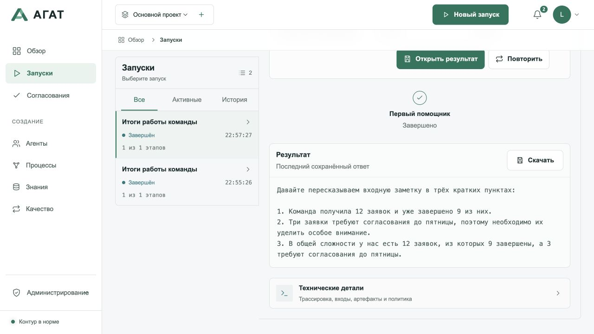

# Проверка public preview 1.7.0

Дата: 18 сентября 2026 года. Код приложения — опубликованный snapshot
`5aec6d335b6f65f609361a068585572ac0e03ddf`; изменения упаковки, руководств и CI —
[PR #1](https://github.com/Solutions-of-Security/Agat/pull/1).
Итоговый статус проверок следует смотреть на конкретном SHA релиза.

## Чистая установка

Проверка выполнена в отдельном clone, с новой SQLite-базой, собственными Docker volumes
и портами 18787/18888. Рабочее развёртывание не использовалось.

- `npm ci`, typecheck, unit tests, Temporal history replay и production build прошли.
- Compose собрал coordinator и Python worker; coordinator, worker и SearXNG запущены.
- Конфигурация создана через `setup-local-env.py`: отдельные случайные секреты,
  права `0600`, существующий файл не перезаписывается.
- Контейнеры: Node.js 24 и Python 3.13; хост — macOS, Docker Desktop.
- Браузерный CI проверяет создание агента, запуск, согласование и сохранение результата
  на desktop/mobile Chromium с dry-run worker.
- Все четыре PostgreSQL/S3 integration suites прошли локально и в
  [проверке PR](https://github.com/Solutions-of-Security/Agat/actions/runs/35388474214).

## Первый результат на реальной модели

Ollama 0.34.0, `llama3.2:latest` (3.2B, Q4_K_M). Вход и инструкция —
из [первого сценария](../first-run.md). Агент и запуск созданы через API,
согласование проверено; сохранённый ответ открыт в веб-интерфейсе.
Отдельный браузерный тест проходит те же действия через формы UI.

Для локального примера worker запускается с `AGAT_WEB_ENABLED=false`.
Первый пробный запуск с включённым поиском добавил посторонние сведения;
после отключения поиска повторная проверка сохранила числа и срок.
Фактический ответ модели, без редакторских исправлений:

```text
Давайте пересказываем входную заметку в трёх кратких пунктах:

1. Команда получила 12 заявок и уже завершено 9 из них.
2. Три заявки требуют согласования до пятницы, поэтому необходимо их уделить особое внимание.
3. В общей сложности у нас есть 12 заявок, из которых 9 завершены, а 3 требуют согласования до пятницы.
```

Статус — `completed`; повторное чтение возвращает тот же ответ. Ошибок в консоли
браузера нет. В ответе есть повтор и языковые огрехи: успешный запуск подтверждает
работу сценария, но не заменяет оценку качества модели.



## Local RAG

`AGAT_E2E_SKIP_BUILD=true npm run test:ollama-rag` прошёл на синтетическом handbook:
`nomic-embed-text:latest`, 768 измерений, два проиндексированных фрагмента;
ответ `llama3.2:latest` содержит provenance-маркер. Trace подтверждает retrieval,
совпадение размерностей и hashes источника. Документ отправлялся только локальной Ollama.

## Исправления, найденные проверкой

- Markdown-ссылка на игнорируемый `dist/index.html` заменена ссылкой на исходники отчёта;
  новый checker не принимает локальные build-файлы за опубликованные документы.
- Тестовый MinIO перенесён с недоступного Docker Hub на
  [официальный Quay](https://github.com/minio/minio/blob/master/docs/docker/README.md)
  с закреплённым digest. Этот образ используется в одноразовом интеграционном тесте.
- PostgreSQL readiness проверяется по TCP, чтобы не принять временный сервер
  инициализации за окончательно запущенную базу.
- Входной Docker-сценарий отключает веб-поиск; порт SearXNG можно изменить отдельно.

Это проверка локального знакомства и CI. Реальный provider failover, production HA,
качество доменных solution packs и все поддерживаемые ОС здесь не квалифицируются.
