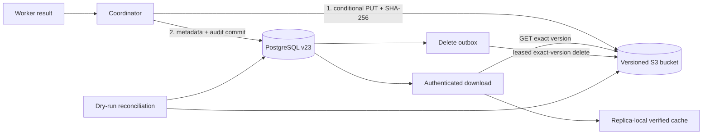

# S3-compatible Artifact Store и lifecycle

## Решение и границы

В PostgreSQL HA-cell metadata, retention state и delete intent остаются единственным transactional authority, а payload артефакта переносится в versioned S3-compatible bucket. Coordinator сначала загружает и проверяет object, затем одной PostgreSQL transaction сохраняет metadata и audit event. Успешный object upload без DB commit считается допустимым orphan и удаляется только отдельным reconciliation после grace period. Успешный DB commit без подтверждённого object невозможен.

Schema v23 вводит `agat-s3-artifact-lifecycle-v23`, `artifact_storage_outbox`, storage state артефакта и cascade-delete trigger. Runtime role остаётся DDL-free. Tenant role видит project artifacts через существующий FORCE RLS, но не имеет privileges на глобальный storage outbox.

Этап не делает локальный MinIO production-хранилищем и не обещает атомарную transaction между PostgreSQL и S3. Production bucket, replication/durability, KMS, Object Lock и workload identity принадлежат provider IaC и должны пройти отдельный deployment review. Следующий этап связывает object replication с residency-aware region-loss DR.

## AS-IS и TO-BE

До schema v23 PostgreSQL `BYTEA` был authority payload. Это позволяло любой coordinator replica восстановить локальный cache, но каждый artifact увеличивал primary storage, WAL, PITR объём и время restore.



## Authority и consistency contract

| Состояние | Authority payload | Разрешён download | Следующее действие |
|---|---|---|---|
| `ready/filesystem` | локальный файл, только SQLite single replica | да, после hash/size check | developer path |
| `ready/postgresql` | `content_blob` | да, cache восстанавливается из BYTEA | online backfill в S3 |
| `ready/s3` | exact bucket/key/version | да, cache не доверяется без SHA-256 | retention/legal hold |
| `delete_pending` | S3 до подтверждения outbox | нет | leased retry |
| `delete_failed` | неизвестно; last error сохранён | нет | incident/manual retry |
| `deleted` | payload отсутствует, metadata tombstone остаётся | нет | audit/metadata retention |
| `missing` | object отсутствует либо не совпал | нет | integrity incident |

Запись использует уникальный key:

```text
<prefix>/objects/v1/<residency-domain>/<sha256(project-id)>/<artifact-uuid>/<sha256(payload)>
```

Raw project ID в key не попадает. `PutObject` использует `If-None-Match: *`, precalculated SHA-256 checksum, bounded content length и metadata `agat-sha256`/`agat-size`. После PUT coordinator выполняет HEAD exact version и сравнивает hash/size до DB commit. Повтор с тем же key допустим только при полном совпадении.

## Download и cache integrity

API не отдаёт presigned URL: существующая project authentication остаётся единственной download boundary. Coordinator проверяет `project_id`, `storage_state`, безопасный relative path, отсутствие symlink и обычный file type. Даже найденный cache перечитывается и сверяется с DB SHA-256/size. Повреждённый cache для PostgreSQL/S3 удаляется и атомарно восстанавливается; повреждённый filesystem authority блокирует download.

S3 GET использует сохранённый `VersionId`. Provider metadata, полученные bytes и PostgreSQL metadata должны совпасть. Ошибка не деградирует на старый `content_blob`: silent dual-authority запрещён.

## Retention, legal hold и delete outbox

`retention_until` и `legal_hold` управляют постановкой delete intent. Lifecycle выбирает только `ready/s3`, `legal_hold=0` и истёкший retention, атомарно создаёт deduplicated outbox command и переводит artifact в `delete_pending`. Несколько replicas claim команды через `FOR UPDATE SKIP LOCKED`; lease истекает через 60 секунд. Delete выполняется по exact `VersionId`, затем outbox становится `delivered`, а artifact — `deleted`. Ошибки получают exponential backoff; десятая неудача переводит command в `dead`, artifact в `delete_failed` и требует incident.

Удаление parent run также не теряет object: `BEFORE DELETE` trigger с фиксированным `SECURITY DEFINER` переносит denormalized project identity и exact object version в глобальный outbox до cascade. Function имеет фиксированный `search_path`; `PUBLIC` execute отозван.

Если bucket создан с Object Lock и `AGAT_ARTIFACT_S3_OBJECT_LOCK_MODE=GOVERNANCE|COMPLIANCE`, команда `protect` сначала применяет provider retention/legal hold к exact version и проверяет HEAD, затем фиксирует DB policy/audit. Без Object Lock legal hold является application control: он защищает от lifecycle coordinator, но не от отдельной provider-admin identity. Для регулируемого WORM нужен Object Lock, включённый при создании bucket.

Bucket lifecycle намеренно не содержит expiration актуальных object versions. Managed rule `agat-storage-maintenance` только:

- aborts incomplete multipart uploads после bounded срока;
- удаляет noncurrent versions после bounded срока.

Configuration merge заменяет только известные Agat rule IDs и сохраняет чужие rules. Live object удаляется только DB outbox, поэтому lifecycle provider не обходит legal hold.

## Schema v23 и privileges

`artifacts` получает `project_id`, `storage_backend`, `storage_state`, bucket/key/version, retention/legal hold, deletion timestamp и storage error. `project_id` денормализован для безопасного cascade trigger; project access по-прежнему проверяется существующей RLS policy.

`artifact_storage_outbox` является global operational table без FK на artifact: команда должна пережить cascade-delete metadata. `agat_system` получает exact DML, `agat_tenant` — ни одного privilege. Catalog manifest включает новую function/trigger/index/columns, поэтому out-of-band изменение блокирует runtime startup. Schema применяется только Job `agat-postgres-schema-v23` владельцем `agat_migrator`.

## Конфигурация

Минимальный production profile:

```bash
export AGAT_STATE_STORE_DRIVER=postgresql
export AGAT_ARTIFACT_STORE_DRIVER=s3
export AGAT_ARTIFACT_RETENTION_DAYS=30
export AGAT_ARTIFACT_LIFECYCLE_INTERVAL_SECONDS=60
export AGAT_ARTIFACT_S3_ENDPOINT=https://s3.private.example
export AGAT_ARTIFACT_S3_REGION=eu-prod-1
export AGAT_ARTIFACT_S3_BUCKET=agat-prod-eu
export AGAT_ARTIFACT_S3_PREFIX=agat
export AGAT_ARTIFACT_S3_FORCE_PATH_STYLE=false
export AGAT_ARTIFACT_S3_REQUIRE_VERSIONING=true
export AGAT_ARTIFACT_S3_SSE=aws:kms
export AGAT_ARTIFACT_S3_KMS_KEY_ID=alias/agat-artifacts
export AGAT_ARTIFACT_S3_OBJECT_LOCK_MODE=GOVERNANCE
```

Production endpoint обязан использовать HTTPS и SSE `AES256`/`aws:kms`; HTTP и `SSE=none` разрешены только local MinIO profile. Static access/secret/session token поддержаны для локального контура и совместимых providers. В production предпочтительна default AWS credential chain/workload identity с bucket/prefix-scoped permissions; credentials не логируются и не сохраняются в PostgreSQL.

Required runtime permissions: `HeadBucket`, bucket versioning/encryption/lifecycle/Object Lock read, scoped `ListBucket`, object `Put/Get/Head/Delete`. Lifecycle admin дополнительно требует `PutBucketLifecycleConfiguration`; Object Lock protection — `PutObjectRetention` и `PutObjectLegalHold`. Provisioning bucket/KMS/replication не входит в runtime role.

`AGAT_ARTIFACT_S3_MAX_OBJECT_BYTES` — hard client/response bound. Текущий worker contract ограничивает stage artifacts сильнее; увеличение object bound не расширяет worker input автоматически.

## Provisioning и rollout

1. Provider IaC создаёт private bucket в разрешённом residency domain, включает versioning, encryption и при необходимости Object Lock до первого object.
2. Выдайте scoped workload identity и проверьте bucket policy: запрещены public access, unencrypted transport и cross-residency replication.
3. Примените schema v23 отдельной migration Job при остановленных coordinator replicas.
4. Запустите read-only inspect:

```bash
npm run fleet:artifact-store -- inspect --report /secure/evidence/artifact-inspect.json
```

5. Примените только Agat maintenance rule:

```bash
npm run fleet:artifact-store -- configure-lifecycle \
  --noncurrent-expiration-days 30 \
  --abort-multipart-days 1 \
  --confirm APPLY_LIFECYCLE \
  --report /secure/evidence/artifact-lifecycle.json
```

6. До переключения writes выполните dry-run reconciliation. Затем включите `AGAT_ARTIFACT_STORE_DRIVER=s3` на одном canary coordinator и создайте/download тестовый artifact.
7. Переносите legacy BYTEA bounded batches; команда idempotent по content-addressed key:

```bash
npm run fleet:artifact-store -- migrate \
  --limit 20 \
  --confirm MIGRATE_POSTGRES_ARTIFACTS \
  --report /secure/evidence/artifact-backfill.json
```

Повторяйте до `selected=0`, затем сверяйте `content_blob IS NULL` только для `storage_backend='s3'`. Не удаляйте BYTEA вручную до успешного PUT/HEAD и conditional metadata update.

## Reconciliation и операторские команды

Dry-run по умолчанию ничего не меняет и выводит только SHA-256 orphan keys:

```bash
npm run fleet:artifact-store -- reconcile \
  --grace-seconds 86400 \
  --maximum 10000 \
  --report /secure/evidence/artifact-reconcile-dry.json
```

Apply разрешён только после review отчёта и maintenance coordination:

```bash
npm run fleet:artifact-store -- reconcile \
  --grace-seconds 86400 \
  --maximum 10000 \
  --apply \
  --confirm DELETE_ORPHANS_AND_QUARANTINE_MISSING \
  --report /secure/evidence/artifact-reconcile-apply.json
```

Orphan моложе grace не удаляется. Missing/hash-mismatched authoritative row переводится в `missing`; `delete_pending` object, уже отсутствующий после crash, не карантинируется — идемпотентный outbox завершит его. Truncated scan fail-closed и требует меньшего prefix scope/operational partitioning.

Изменение protection:

```bash
npm run fleet:artifact-store -- protect \
  --artifact-id 00000000-0000-0000-0000-000000000000 \
  --project-id regulated-project \
  --retention-until 2027-08-31T00:00:00.000Z \
  --legal-hold true \
  --actor oidc-subject \
  --confirm UPDATE_ARTIFACT_PROTECTION
```

Reports создаются mode `0600`, не содержат credentials/endpoint URL и должны попадать в защищённый evidence sink, а не в Git.

## Local Kubernetes profile

Docker Desktop manifest поднимает single MinIO pod/PVC, versioned bootstrap Job `agat-artifact-store-bootstrap-v23` и выдаёт coordinator local static credentials из `agat-secrets`. Это проверочный профиль, а не HA/S3 durability claim. `npm run k8s:up` ждёт bucket bootstrap и schema v23 Job. Production overlay не должен наследовать local MinIO root credentials или single PVC.

## Failure, rollback и recovery

| Failure | Поведение | Recovery |
|---|---|---|
| PUT/HEAD failure | DB artifact не создаётся | исправить provider/network; безопасный retry |
| PUT success, DB rollback | orphan object | dry-run, grace, approved reconcile apply |
| DB metadata ready, GET mismatch/missing | download fail-closed | quarantine `missing`, provider integrity incident |
| delete timeout | outbox остаётся pending | idempotent exact-version retry |
| десять delete failures | `dead` + `delete_failed` | исправить Object Lock/IAM/provider, controlled retry/change |
| cache corruption | cache удаляется и восстанавливается | автоматический GET + SHA-256 |
| S3 outage | metadata и queue продолжают жить; artifact writes/download fail | восстановить S3; нет silent BYTEA fallback |

Application rollback допустим только на release, понимающий schema v23 и `s3` rows. Переключение обратно на `postgresql` не является rollback: reverse backfill S3→BYTEA не реализован, dual-write запрещён. При серьёзном rollout incident остановите новые artifact writes, сохраните PostgreSQL/S3 authority, откатите compatible code и восстановите доступ к bucket.

## Source и evidence register

| Источник | Версия / дата проверки | Claim scope |
|---|---|---|
| `apps/coordinator/src/artifact-object-store.ts` | contract v1 | synchronous bounded bridge, safe key и exact-version operations |
| `apps/coordinator/src/artifact-object-worker.ts` | AWS SDK S3 3.1121.0 | checksum/conditional PUT, lifecycle merge, Object Lock |
| `apps/coordinator/src/database.ts` | schema v23 | metadata state, trigger/outbox, backfill/reconcile/download |
| `apps/coordinator/src/artifact-store-admin.ts` | report schema v1 | typed confirmations и mode-0600 reports |
| `scripts/test-s3-artifact-store.sh` | PostgreSQL 17.6 + MinIO 2025-09-07 | disposable cross-replica/lifecycle/cascade acceptance |
| [S3 conditional writes](https://docs.aws.amazon.com/AmazonS3/latest/userguide/conditional-writes.html) | проверено 2026-08-31 | `If-None-Match` create-if-absent semantics |
| [AWS SDK JavaScript checksums](https://docs.aws.amazon.com/sdk-for-javascript/v3/developer-guide/s3-checksums.html) | проверено 2026-08-31 | request/response checksum support |
| [S3 lifecycle elements](https://docs.aws.amazon.com/AmazonS3/latest/userguide/intro-lifecycle-rules.html) | проверено 2026-08-31 | multipart/noncurrent/delete-marker semantics |
| [S3 Object Lock](https://docs.aws.amazon.com/AmazonS3/latest/userguide/object-lock.html) | проверено 2026-08-31 | retention и legal hold на versioned objects |
| [MinIO lifecycle contract](https://github.com/minio/minio/blob/master/docs/bucket/lifecycle/README.md) | проверено 2026-08-31 | S3-compatible noncurrent version lifecycle |

## Acceptance evidence

```bash
npm run typecheck --workspace @agat/coordinator
npm run fleet:test-artifact-store
kubectl kustomize deploy/k8s/docker-desktop >/dev/null
python3 /Users/mdavliatshin/.codex/skills/it-architect/scripts/architecture_audit.py \
  --profile architecture-pack --allow-placeholders docs
```

Disposable suite обязана подтвердить schema/admission v23, bucket versioning, lifecycle merge, BYTEA backfill с очисткой blob только после verification, cross-replica download, corrupt-cache repair, tenant outbox denial, exact-version deletion и cascade outbox под FORCE RLS.
