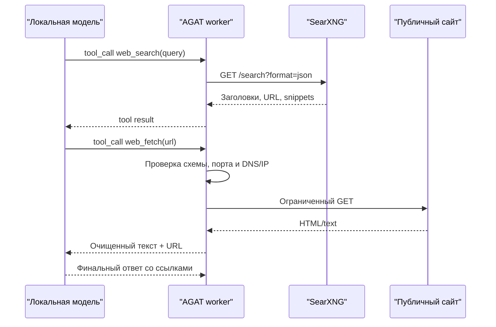

# Web-доступ локальных агентов

АГАТ предоставляет локальной модели интернет не как прямой сетевой доступ, а как два управляемых инструмента worker:

- `web_search` — поиск через отдельный SearXNG;
- `web_fetch` — чтение публичной HTTP(S)-страницы как ограниченного текста.

Модель вызывает инструмент через стандартный OpenAI-compatible `tools/tool_calls` контракт. Worker исполняет запрос, возвращает результат модели и повторяет цикл до финального ответа. После успешного поиска worker требует прочитать хотя бы один первоисточник перед итогом. Сетевой доступ модели и произвольный URL-клиент в prompt отсутствуют.



## Docker Desktop Kubernetes

В локальном Kubernetes web-доступ включён по умолчанию:

```bash
npm run k8s:up
```

Скрипт запускает `agat-search` как внутренний `ClusterIP`; наружу SearXNG не публикуется. Образ закреплён версией и multi-arch digest. Worker сообщает `web_search` и `web_fetch` в heartbeat, а раздел `Узлы` показывает их в карточке машины.

Отключение без удаления сервиса и данных:

```bash
AGAT_WEB_ENABLED=false npm run k8s:up
```

Проверка компонентов:

```bash
kubectl get deployment,pod,service -n agat
kubectl logs -n agat deployment/agat-search --tail=100
kubectl logs -n agat deployment/agat-worker --tail=100
```

Создайте запуск с формулировкой вроде: `Найди на официальных сайтах актуальную версию Ollama, проверь первоисточник и дай ответ со ссылкой`. В журнале этапа должны появиться события `web_search` и `web_fetch`, а итог должен содержать Markdown-ссылки.

## Docker Compose

Профиль worker автоматически поднимает SearXNG и включает инструменты:

```bash
docker compose --profile worker up --build
```

SearXNG доступен контейнерному worker по `http://search:8080/search` и только локальному host по `http://127.0.0.1:8888`.

## Worker на отдельной машине

На удалённом компьютере worker должен иметь доступ к SearXNG. Рекомендуемый вариант — запустить экземпляр рядом с worker и оставить порт только на loopback. Из корня репозитория с уже настроенным `.env`:

```bash
docker compose --profile web-search up -d search

AGAT_COORDINATOR_URL=https://agat.example.internal \
AGAT_ENROLLMENT_TOKEN="полученный-registration-token" \
AGAT_WORKER_MODELS=qwen3:8b \
AGAT_WEB_ENABLED=true \
AGAT_WEB_SEARCH_URL=http://127.0.0.1:8888/search \
python3 workers/agat_worker.py
```

Общий SearXNG тоже допустим, если его URL доступен worker по защищённой внутренней сети. Не публикуйте такой endpoint без аутентификации и rate limiting.

## Настройки

| Переменная | Значение по умолчанию | Назначение |
|---|---:|---|
| `AGAT_WEB_ENABLED` | `false` у standalone worker, `true` в Compose/Kubernetes | Включает объявления инструментов и tool loop |
| `AGAT_WEB_SEARCH_URL` | `http://127.0.0.1:8888/search` | SearXNG Search API с JSON format |
| `AGAT_WEB_TIMEOUT` | `12` | Таймаут одного search/fetch, секунды |
| `AGAT_WEB_FETCH_MAX_BYTES` | `1000000` | Максимум загружаемых байт страницы |
| `AGAT_WEB_FETCH_MAX_CHARS` | `12000` | Максимум текста, передаваемого модели |
| `AGAT_WEB_SEARCH_MAX_RESULTS` | `6` | Максимум результатов одного поиска, предел 8 |
| `AGAT_WEB_MAX_TOOL_ROUNDS` | `6` | Максимум раундов инструментов на этап, предел 12 |

CLI поддерживает эквивалентные флаги `--web`, `--no-web`, `--web-search-url` и остальные параметры из `python3 workers/agat_worker.py --help`.

## Совместимость моделей

Model server должен реализовывать OpenAI-compatible `tools` и `tool_calls`. Ollama поддерживает этот контракт в `/v1/chat/completions`; используемая модель также должна уметь function calling. Worker запрещает parallel tool calls, чтобы малая модель сначала получила результаты поиска и только затем выбрала URL. Для моделей, которые иногда печатают tool call как JSON вместо protocol field, поддерживается узкий fallback только для `web_search`/`web_fetch`; произвольные имена инструментов не исполняются. Если после дополнительного указания малая модель всё равно выдаёт список ссылок вместо `web_fetch`, worker автоматически читает первый результат после приоритизации вероятного first-party домена и ещё раз передаёт текст модели. Такое действие помечается `automatic: true` в событии tool call. Сквозная проверка выполнена с `llama3.2:latest`, а более сильный практичный вариант — актуальная Qwen 3. Модель без tool calling продолжит работать при `AGAT_WEB_ENABLED=false`, но не сможет пользоваться интернетом.

Официальные спецификации:

- [Ollama tool calling](https://docs.ollama.com/capabilities/tool-calling)
- [Ollama OpenAI compatibility](https://docs.ollama.com/api/openai-compatibility)
- [SearXNG Search API](https://docs.searxng.org/dev/search_api.html)

## Границы безопасности и приватности

`web_fetch` принимает только точный URL, который вернул `web_search` внутри текущего этапа либо который пользователь явно указал во входе запуска. Такой per-task allowlist снижает риск, что prompt injection со страницы незаметно перенаправит модель на произвольный домен. Далее разрешаются только `http`/`https` на портах 80/443, запрещаются credentials в URL, перед каждым запросом и redirect разрешается DNS и отклоняется ответ, если хотя бы один IP не является публичным. Loopback, LAN, link-local, metadata и служебные диапазоны недоступны. Принимаются только HTML, text, JSON и XML; scripts, styles, SVG и прочая разметка удаляются. Размер, число результатов, раунды и таймауты ограничены.

Текст страницы всегда помечается для модели как недоверенный, чтобы снизить риск prompt injection. В события записываются имя инструмента, домен и технический результат, но не поисковая строка и не содержимое страницы.

Это не полная песочница. В production дополнительно нужен egress firewall/proxy, запрещающий внутренние CIDR на сетевом уровне. Поисковые запросы видят SearXNG и внешние поисковые системы, а посещаемые сайты видят IP worker; локальным остаётся inference, но не web-трафик.

Текущая версия не исполняет JavaScript, не входит на сайты, не обходит CAPTCHA/paywall и не извлекает PDF. Такие возможности следует добавлять отдельными allowlisted tools с лимитами и approval, а не расширять `web_fetch` до произвольного браузера.
